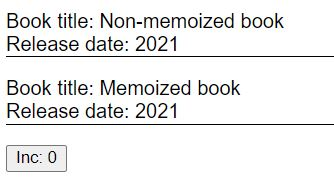
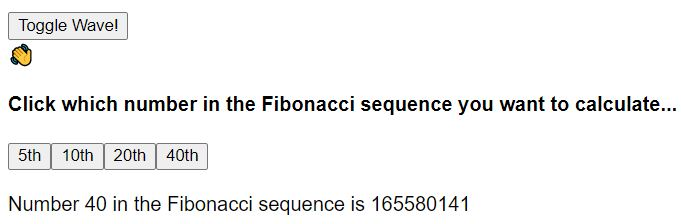

## React.memo

We can create a memoized component simply by wrapping it in `React.memo(YourReactComponent)`. When `React.memo` wraps a component, react memoizes the rendered output of the wrapped component then skips unnecessary renderings.

When deciding to update the DOM, React first renders your component, then compares the result with the previous render. If there's a difference, React makes the necessary updates to the DOM.

Below, `Book` is a standard React functional component, whereas MemoizedBook is a memoized React functional component.

```jsx
const Book = ({ title, releaseDate }) => {
  console.log("Book rendered: " + title)
  return (
    <div style={{ borderBottom: "1px solid", marginBottom: "16px" }}>
      <div>Book title: {title}</div>
      <div>Release date: {releaseDate}</div>
    </div>
  )
}

const MemoizedBook = React.memo(Book)
```

Let's create a parent component called `BookShelf`:

```jsx
const BookShelf = () => {
  const [count, setCount] = useState(0)

  return (
    <>
      <Book title="Non-memoized book" releaseDate="2021" />
      <MemoizedBook title="Memoized book" releaseDate="2021" />
      <button onClick={() => setCount(prev => prev + 1)}>Inc: {count}</button>
    </>
  )
}

export default BookShelf
```

Which looks like this:



Initially, both Book components are invoked and rendered:

```
// Initial render - both functions are invoked
Book rendered: Non-memoized book
Book rendered: Memoized book
```

But if we now click the "Inc" button, it will trigger the rendering of The non-memoized book; every time we click the button, a new function object is created.

In contrast, the memoized Book component is not invoked, and the function object is the same instance between renders. This is because React has memoized the component, so it knows that as long as it's props (`title` and `releaseDate`) don't change, it can skip the rendering process - React doesn't have to re-render the component, and do a comparison to the previous render, and can just reuse the memoized content.

```
// Every time count is updated, only the non-memoized component is re-rendered. Only the non-memoized function is invoked.
Book rendered: Non-memoized book
Book rendered: Non-memoized book
Book rendered: Non-memoized book
```

So, by memoizing a component, we are telling React that as long as the components props don't change, there is no need to re-render the component and compare the new render to the previous render - React can just reuse the memoized content.

This gives a performance boost: by reusing the memoized content, React skips rendering the component, and doesn't perform a virtual DOM difference check.

### When to use React.memo

- If your component renders often with the same props.
- If your component has lots of UI elements.
- If your component performs computationally-heavy calculations.

### React.memo example

Let's say you have a `BookPurchases` component acts as a parent to our `Book` component from earlier. `BookPurchases` takes `purchases` as a prop, which receives live updates every few seconds; this will trigger `Book` to re-render every few seconds, even if it's props (`title` and `releaseDate`) don't change.

```jsx
const BookPurchases = ({ title, releaseDate, purchases }) => {
  return (
    <div>
      <Book title={title} releaseDate={releaseDate} />
      Book Purchases: {purchases}
    </div>
  )
}
```

This could get computationally expensive, especially if we had a long list of `BookPurchases`.

This is a perfect use-case for memoization. The `Book` component should be wrapped in `React.memo()` to prevent unnecessary renderings.

```jsx
const BookPurchases = ({ title, releaseDate, purchases }) => {
  return (
    <div>
      <MemoizedBook title={title} releaseDate={releaseDate} />
      Book Purchases: {purchases}
    </div>
  )
}
```

### When to not use React.memo

If your component isn't computationally expensive (few UI components and no large calculations) and often renders with different props, you probably don't need `React.memo()`. React's virtual DOM comparison checks are so fast that, most of the time, the tiny potential performance gains from using `React.memo()` are not worth it.

If the component usually renders with different props, using `React.memo()` can actually harm performance - it has to check if the previous props equal the new props, _then_ render the component.

## React useCallback example

Now let's move on to the `React.useCallback()` hook, and discuss how it works and when you'd need it.

Below, we have a simple React functional component that accepts a title and an onClick callback function as props. We then tell React to memoize this component by wrapping it in `React.memo()` - so if it's props don't change, we skip unnecessary renders.

```jsx
function Button({ title, onClick }) {
  console.log(title + " invoked")

  return <button onClick={onClick}>{title}</button>
}

const MemoizedButton = React.memo(Button)
```

Now let's create a parent component called Counter:

```jsx
export default function Counter() {
  const [count1, setCount1] = useState(0)
  const [count2, setCount2] = useState(0)

  const handleClick1 = () => setCount1(prev => prev + 1)

  const handleClick2 = () => setCount2(prev => prev + 1)

  return (
    <>
      <h2>Count1: {count1}</h2>
      <h2>Count2: {count2}</h2>
      <MemoizedButton title="Button 1" onClick={handleClick1} />
      <MemoizedButton title="Button 2" onClick={handleClick2} />
    </>
  )
}
```

On initial render, both MemoizedButton components are invoked and rendered:

```
// console.log()
Button 1 invoked
Button 2 invoked
```

Now, both of our child Button components are memoized, so if we click "Button 1" then we'd expect only the first button to be re-rendered, and for React to reuse the same function object from the previous render for "Button 2".

But look, both buttons are invoked and re-rendered:

```
// console.log()
Button 1 invoked
Button 2 invoked
```

Strange - you may think! But it's not when you realise that, in JavaScript, functions are objects.

```js
// PRIMITIVE TYPES
1 === 1 // true
true === true // true
false === false // true
"hello" === "hello" // true


// OBJECTS
{} === {} // false
[] === [] // false
() => "hi" === () => "hi" // false

const a = {}
a === a // true
```

Every time a button is clicked, it causes a state update in the parent component (`Counter`), which triggers for `Counter` to be re-rendered. During the re-render, both the `handleClick` callback functions are invoked and re-instantiated - meaning that they are different objects from the previous render.

Now when React performs the shallow comparison check to see if the props to the `MemoizedButton` components have changed, it sees that the callback function props are different, and it triggers a re-render of both `MemoizedButton`s.

OUR MEMOIZATION IS BROKEN! Introducing `useCallback()`...

Let's wrap `handleClick1()` in `useCallback()`, but leave `handleClick2()` alone:

```jsx
// This callback IS wrapped in useCallback - and is now memoized
const handleClick1 = useCallback(() => setCount1(prev => prev + 1), [])

// This callback IS NOT wrapped in useCallback
const handleClick2 = () => setCount2(prev => prev + 1)
```

The `useCallback` hook accepts two arguments: `useCallback(inline callback function, dependencies array)`.

E.g. `useCallback(() => doSomething(a, b), [a, b])`

A memoized callback only changes if one of the dependencies has changed.

In our example, we passed an empty array of dependencies to `useCallback()`, meaning that our callback will always be the same function object between renders.

Now if we click button 1 or 2, only button 2 gets re-rendered:

```
Button 2 invoked
```

"Button 1" is now properly memoized 👍

In the above example, the performance gains of memoization would be so minimal that it's not worth the added code complexity. Save memoization for components with lots of UI, or complex calculations.

## React useMemo example

`useMemo` is similar to `useCallback`, but `useMemo` allows you to memoize any value type (not just functions). `useMemo`, like `useCallback`, accepts two arguments: a callback function and a dependencies array. The callback function returns a value, and is only called when the value needs to be retrieved - which will be when one or more of the dependencies has changed between renders.

Check out the simple component below that maps through an array and outputs them into a list. We also have a delete button to remove the last item from the list:

```jsx
function Component() {
  const initialState = ["item1", "item2", "item3"]

  const [state, setState] = useState(initialState)

  // Remove last item from state array
  const handleClick = () => {
    setState(prev => prev.slice(0, prev.length - 1))
  }

  return (
    <>
      <ul>
        {state.map((item, i) => (
          <li key={i}>{item}</li>
        ))}
      </ul>
      <button onClick={handleClick}>Delete item</button>
    </>
  )
}
```

Now, every time we click the delete button, it removes the last item from the state array, which triggers a re-render of the component. Every time the component is rendered, the `initialState` array is initialized. If we don't want to initialize the array on each render, we can wrap it in `useMemo`:

```jsx
const initialState = useMemo(() => ["item1", "item2", "item3"], [])
```

React will now return the memoized value upon every render, instead of intializing.

But the performance benefits of doing this here would be so minimal, that it's not worth the added complexity to the code.

In our example, it would be better to just move `initialState` outside of the Component:

```jsx
const initialState = ['item1', 'item2', 'item3'];

function Component() {
  const [state, setState] = useState(initialState);
  ...
```

But this isn't always possible - the value may be calculated from props or other variables initialized in the React component.

## When to use useMemo and useCallback

In the above sections, the examples we went through didn't require `useMemo` or `useCallback`. So let's discuss two scenarios where you'd actually need them...

### Referential equality checks

Here's a component that takes two props, has a `useEffect` function that checks if the props have changed from the previous render, and runs some code if true.

```jsx
function Child({ a, b }) {
  useEffect(() => {
    // doSomething(a, b)
  }, [a, b])

  return <div>I'm the child</div>
}
```

In the `useCallback` section above, we discussed how JavaScript has primary types (e.g. numbers & strings) and objects/reference types (objects, arrays, & functions). If `a` and `b` are primitive types, this would work fine; but if they are objects, every time the parent renders, `a` and `b` will be different instances, and so the `useEffect` function will always run. Not what we want.

Let's say the parent component passes down an array and a function to `Child`:

```jsx
function Parent() {
  const a = [1, 2, 3]
  const b = () => {}

  return <Child a={a} b={b} />
}

function Child({ a, b }) {
  useEffect(() => {
    // doSomething(a, b)
  }, [a, b])

  return <div>I'm the child</div>
}
```

We can prevent the `useEffect` function from running every time by ensuring that `a` and `b` are not initialized between renders - i.e. that we keep the same instances between renders. We can do this with `useMemo` and `useCallback`:

```jsx
const a = useMemo(() => [1, 2, 3], [])
const b = useCallback(() => {}, [])
```

Now the code inside `useEffect` will only run if `a` and `b` are updated - in our case, they never will be - so it will only run on initial render.

`useMemo` and `useCallback` can also be used to prevent unnecessary renders by keeping the same object instances between renders - as we discussed in the `useCallback` section. But again, this is only necessary for components with lots of UI and complex calculations - e.g. interactive graphs and animations - React's renderings and virtual DOM checks are very fast.

You will likely know when a component is large enough to think about adding optimizations, but until then - don't waste too much time on it!

### Preventing computationally expensive calculations

(This section only applies to `useMemo`, not `useCallback`.) I'm now going to walk through a slightly wacky example to demonstrate how `useMemo` can be used to prevent unnecessary computationally expensive calculations.

The Fibonacci sequence: [1, 1, 2, 3, 5, 8, 13, ...]. Each number is the sum of the two numbers that come before it. So the number at index four is 2 + 3 = 5.

```jsx
const DisplayNthFib = ({ n }) => {
  const calcNthFib = n => {
    if (n < 2) return 1

    return calcNthFib(n - 1) + calcNthFib(n - 2)
  }

  const fibNumber = calcNthFib(n)

  return (
    <div>
      Number {n} in the Fibonacci sequence is {fibNumber}
    </div>
  )
}
```

The `calcNthFib()` function has exponential time complexity - which basically means that as the input, `n`, gets large, the calculation time becomes very, very large. See my [Ultimate Guide to Big O Notation in JavaScript](https://www.doabledanny.com/big-o-notation-in-javascript) if your unfamiliar with Big O Notation.

Now, let's say we have a strange parent component called `WaveAndCalculateFib`:

```jsx
const WaveAndCalculateFib = () => {
  const [isWave, setIsWave] = useState(false)
  const [number, setNumber] = useState(0)

  return (
    <>
      <div>
        <button onClick={() => setIsWave(prev => !prev)}>Toggle Wave!</button>
        <div>{isWave && "👋"}</div>
      </div>

      <div>
        <h4>
          Click which number in the Fibonacci sequence you want to calculate...
        </h4>

        <button onClick={() => setNumber(5)}>5th</button>
        <button onClick={() => setNumber(10)}>10th</button>
        <button onClick={() => setNumber(20)}>20th</button>
        <button onClick={() => setNumber(40)}>40th</button>

        <br />
        <br />

        <DisplayNthFib n={number} />
      </div>
    </>
  )
}
```

Which looks like this:



As you may have spotted, the 40th number in the Fibonacci sequence is a big number, and requires lots of recursive calls to calculate. When we click the "Toggle Wave" button, we don't want to do that calculation again as it is visibly slowing down our app.

We can cache this big calculation between renders using `useMemo`:

```jsx
const fibNumber = useMemo(() => calcNthFib(n), [n])
```

Now, `calcNthFib` is only called if `n` changes. So, if the user presses "Toggle Wave", `n` doesn't change, and so React just reuses the previously calcualted `fibNumber`.

We have avoided computationally expensive calculations, and improved the UX of our app with `useMemo` 👍

## Todo:

- Summarize/clarify use cases
- When to use useRef over useMemo/callback?

## References

- https://stackoverflow.com/questions/66429202/what-are-production-use-cases-for-the-useref-usememo-usecallback-hooks
- https://kentcdodds.com/blog/usememo-and-usecallback
- https://dmitripavlutin.com/use-react-memo-wisely/
