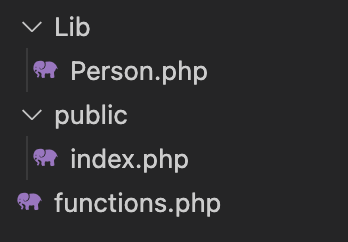
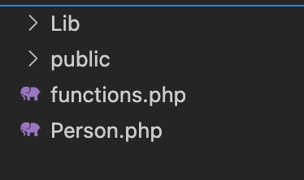

In this article, we discuss 3 different ways of importing classes in PHP:

1. Using the `require` statement
2. Php autoload without composer, using a custom autoload function
3. Autoload php generated by composer

You will also learn how to use namespaces and the `use` keyword to autoload classes.

## Project setup using `require`

Let's say I create a super simple web application with PHP. Folder structure:



The files:

```php
<?php
// Lib/Person.php

class Person {
  public function __construct(
    private string $name
  ) {

  }

  public function speak() {
    echo "Hi, my name is $this->name";
  }
}
```

```php
<?php
// functions.php

function dd($value) {
  echo '<pre>'; // respect line spaces in the $value
  var_dump($value);
  echo '</pre>';

  die();
}

function basePath($path) {
  return BASE_PATH . $path;
}
```

```php
<?php
// public/index.php

const BASE_PATH = __DIR__ . '/../';

require BASE_PATH . 'functions.php';

require basePath('Lib/Person.php');

$person = new Person("Danny");
$person->speak();
```

If we then serve our application on localhost at port 8888, setting the document root ("docroot") as the public folder:

`php -S localhost:8888 -t public`

And visit `http://localhost:8888/` in the browser, we get "Hi, my name is Danny" printed on the page.

Above, `public/index.php` is our web entry file, where all requests made to our app are first directed to. We can `require` any classes that our application needs at the top of the file. But as our app grows, manually requiring the files and classes that we need can quickly get messy, and lead to issues like naming conflicts.

This is where autoloading comes in. Let's see how it works...

## Php autoload without composer, using a custom autoload function with `spl_autoload_register()`

If I comment out the line that requires the `Person.php` file:

```php
// public/index.php
...
// require basePath('Lib/Person.php');
...
```

We get a fatal error in the browser:

"Fatal error: Uncaught Error: Class "Person" not found in /Users/dan/Documents/Code/php-test/public/index.php:9"

In PHP, there is a function called `spl_autoload_register()` that actually looks for classes that have been encountered in our application, but haven't explicitly been required. Let's see how it works:

```php
// public/index.php

<?php

const BASE_PATH = __DIR__ . '/../';

require BASE_PATH . 'functions.php';

// require basePath('Lib/Person.php');

spl_autoload_register(function($class) {
  dd($class);
});

$person = new Person("Danny");
$person->speak();
```

Above, the `Person` class is instantiated, but it hasn't been manually required at the top (we commented it out); so, the `spl_autoload_register()` function tries to find this class and passes it to the callback function that we have passed as an argument.

The result in the browser:

'string(6) "Person"'

The autoload function detected that we are using the `Person` class, but haven't required it, so it found it and passed it to our callback function. Inside our callback function, we logged the class name and exited the PHP script ("die and dump").

But what if we try to require this class from the autoload callback, thus "autoloading" our class? Let's see:

```php
<?php
...

spl_autoload_register(function($class) {
  require basePath("$class.php");
});
?>

...
```

Browser:

"Fatal error: Uncaught Error: Failed opening required '/Users/dan/Documents/Code/php-test/public/../Person.php' "

It's trying to import the `Person` class from `BASE_PATH . 'Person.php'`, but it's actually located at `BASE_PATH . 'Lib/Person.php'`

If all of our classes were located in our project's root, then our autoloader function would work perfectly:



But, this would be a super messy way to organize our project. So, we need to modify things a little and begin using "namespaces".

NOTE: what happens if we comment out the line where we instantiate the `Person` class?

```php
<?php
...

spl_autoload_register(function($class) {
  dd($class);
});

// $person = new Person("Danny");
// $person->speak();

...
?>
```

The autoloader function no longer looks for the `Person` class, as it has no reason to -- we are not using it.

## Autoload namespace in PHP

Namespaces provide a way of better organising our code. In `Person.php`, at the top of the file we will add the namespace `Lib`:

```php
<?php
// Lib/Person.php

namespace Lib;

class Person {
  public function __construct(
    private string $name
  ) {

  }

  public function speak() {
    echo "Hi, my name is $this->name";
  }
}
```

We can give all files inside of the Lib folder a namespace of Lib. The namespace should match the directory structure, so if we had a file at `Lib/Jobs/GetOrders.php`, we would give it a namespace of `namespace Lib\Jobs`, and the class should be called `GetOrders`.

Now when we want to instantiate our `Person` class, we need to specify it's namespace, as the `Person` class is now located under the `Lib` namespace:

```php
spl_autoload_register(function($class) {
  dd($class);
});

$person = new Lib\Person("Danny");
$person->speak();
```

The result in the browser:

'string(10) "Lib\Person"'

Our autoloader is now looking for the `Person` class under the `Lib` namespace. What happens if we try to dynamically autoload this class:

```php
spl_autoload_register(function($class) {
  require basePath($class . '.php');
});
```

Browser:

"Fatal error: Uncaught Error: Failed opening required '/Users/dan/Documents/Code/php-test/public/../Lib\Person.php'".

The `$class` value is using backslashes, but I'm on MacOS, which uses forward slashes for directories. So, let's modify our autoload function to replaces backslashes with your machines prefered directory separater:

```php
spl_autoload_register(function($class) {
  $path = str_replace('\\', DIRECTORY_SEPARATOR, $class);
  require basePath($path . '.php');
});
```

It now autoloads the class perfectly!

## The "use" keyword

Above, when instantiating the `Person` class, we called `new Lib\Person()`, specifying the namespace that the class is stored under before the class name. However, we can use the `use` keyword to require our class at the top of the file, and then just call the `Person` class as before, without specifying the namespace beforehand:

```php
<?php

const BASE_PATH = __DIR__ . '/../';

require BASE_PATH . 'functions.php';

use Lib\Person;

spl_autoload_register(function($class) {
  $path = str_replace('\\', DIRECTORY_SEPARATOR, $class);
  require basePath($path . '.php');
});

$person = new Person("Danny");
$person->speak();
```

Now if we turn our `index.php` entry file into a simple router (typical of a simple web app with vanilla php):

```php
<?php

const BASE_PATH = __DIR__ . '/../';

require BASE_PATH . 'functions.php';

spl_autoload_register(function($class) {
  $path = str_replace('\\', DIRECTORY_SEPARATOR, $class);
  require basePath($path . '.php');
});

$routes = [
  '/' => 'index',
  '/about' => 'about'
];

// Get the requested route from the URL
$requestUrl = parse_url($_SERVER['REQUEST_URI'])['path'];

// Check if the requested route exists and require the correct file
if(array_key_exists($requestUrl, $routes)) {
  $action = $routes[$requestUrl];
  include "../Http/controllers/$action.php";
} else {
  include "../views/404.php"; // Page not found
}
```

In `Http/controllers/index.php`, we use the `use` keyword to autoload the `Person` class:

```php
<?php

use Lib\Person;

$person = new Person("Joey");
$person->speak();
```

Pretty cool. Now, any file where we need to `Person` class, we can require it using the `use` keyword and specify it's namespace ahead of it.

But there's an even easier way to autoload classes, using composer autoload.

## Autoload php generated by composer

If I comment out the autoload function, our application stops working:

```php
// spl_autoload_register(function($class) {
//   $path = str_replace('\\', DIRECTORY_SEPARATOR, $class);
//   require basePath($path . '.php');
// });
```

To fix it, we're going to use composer autoloading, which will automatically autoload our classes without us having to create our own autoload function manually. It also autoloads our composer packages.

From the project root, run the following to initialise a `composer.json` file:

`composer init`

In `composer.json`, edit the "autoload" part so that classes stored under the `Lib` namespace are autoloaded from the `Lib` folder:

```json
{
  "name": "dan/php-test",
  "autoload": {
    "psr-4": {
      "Lib\\": "Lib"
    }
  },
  "authors": [
    {
      "name": "doabledanny"
    }
  ],
  "require": {}
}
```

We can now require the composer autoload.php file at the top of our public/index.php file:

```php
require BASE_PATH . '/vendor/autoload.php';
```

But the browser still gives us an error:

"Fatal error: Uncaught Error: Class "Lib\Person" not found in /Users/dan/Documents/Code/php-test/Http/controllers/index.php:5"

This is because whenever we map any new namespaces to files in the composer.json file, we need to regenerate our composer autoload.php file, using the command below:

`composer dump-autoload`

It now autoloads our classes perfectly:

"Hi, my name is Joey"

## More examples

Let's create a new class at `Lib/Animals/Dog.php`:

```php
<?php

namespace Lib\Animals;

class Dog {
  public function __construct()
  {
    echo "Whoof";
  }
}
```

Then `use` it in our home controller:

```php
<?php

use Lib\Person;
use Lib\Animals\Dog;

$person = new Person("Joey");
$person->speak();

$dog = new Dog();
```

It works!

What if we change the `Lib` folder name to `library`? Fatal error:

"Fatal error: Uncaught Error: Class "Lib\Person" not found in /Users/dan/Documents/Code/php-test/Http/controllers/index.php:6"

We need to tell the composer autoloader that the `Lib` namespace is now mapped to the `library` folder. In `composer.json`:

```json
"autoload": {
    "psr-4": {
      "Lib\\": "library"
    }
  }
```

And don't forget the regenerate the composer autoload file with `composer dump-autoload`.

And things work again!

What if we created a new folder in the project root called `jobs`? Then created the class `jobs/FetchOrders.php`:

```php
<?php

namespace Jobs;

class FetchOrders {
  public function __construct()
  {
    echo "Fetching orders from API...";
  }
}
```

Then used the class in the index controller:

```php
<?php

use Jobs\FetchOrders;

$ordersJob = new FetchOrders();
```

We get an error:

"Fatal error: Uncaught Error: Class "Jobs\FetchOrders" not found in /Users/dan/Documents/Code/php-test/Http/controllers/index.php:5"

We need to map the `Jobs` namespace to the folder that jobs are stored in -- in this case, it's the folder called `jobs`:

```json
"autoload": {
    "psr-4": {
      "Lib\\": "library",
      "Jobs\\": "jobs"
    }
  }
```

After running `composer dump-autoload`, all is good again:

"Fetching orders from API..."

## The advantages of autoloading classes vs explicitly requiring them

1. **Simplifies Code:** Autoloading eliminates the need for explicitly requiring classes in every file where they are used. This makes your code cleaner and less cluttered with `require` or `include` statements.

2. **Easier Maintenance:** Autoloading promotes better code organization. You can store your classes in directories that match their namespaces, making it easier to find and manage them.

3. **Flexibility:** Autoloading is more flexible and can adapt to changes in your project's class structure. You don't have to manually update all the `require` statements if you move or rename a class.

4. **Dynamic Loading:** Autoloading loads classes on-demand. Only the classes you actually use are loaded, which can lead to improved performance and reduced memory usage.

5. **Namespace Support:** Autoloading is especially useful when working with namespaces in PHP. It helps ensure that classes with the same name in different namespaces can coexist without conflicts.

6. **Third-Party Packages:** Autoloading is commonly used with package managers like Composer. It allows third-party libraries to provide their own autoloading mechanisms, making it easier to integrate and use external code.

7. **PSR Standards:** Autoloading follows PHP-FIG PSR standards, making it a widely accepted and consistent practice in the PHP community.

**Advantages of Explicitly Requiring Classes:**

1. **Control:** Explicitly requiring classes gives you more control over the loading process. You can ensure that classes are loaded exactly when and where you want.

2. **Visibility:** When you use explicit `require` statements, it's clear which classes are being used in a specific file, improving code readability.

3. **Debugging:** If there are issues with class loading, explicit `require` statements can make it easier to identify the problem, as you can see the precise location of each `require` statement.

4. **Avoiding Unintended Autoloading:** Autoloading can sometimes lead to unintended class loading if there are typos or errors in class names. Explicit `require` statements avoid this issue.

In practice, autoloading is the preferred method for managing classes in most PHP projects, especially with the popularity of Composer and the PSR-4 autoloading standard. However, there may be cases where explicit requiring of classes is still necessary or preferred, such as in small scripts or legacy codebases.

Choosing between autoloading and explicit requiring depends on the specific requirements and complexity of your project. In modern PHP development, autoloading is generally more efficient and maintainable, while explicit requiring can offer more control and transparency in specific situations.
