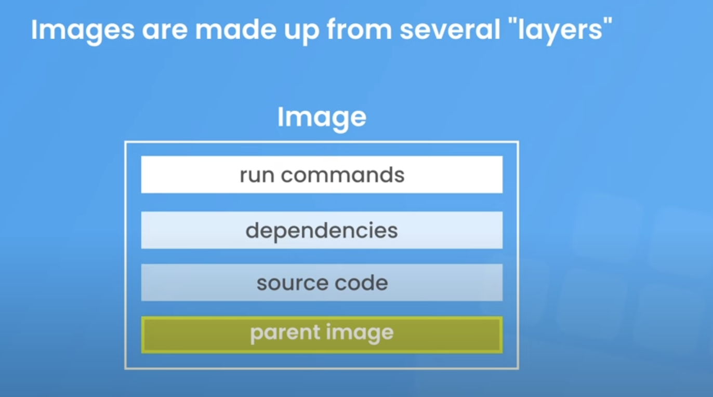
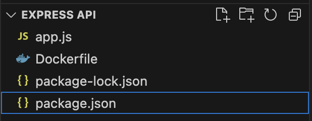
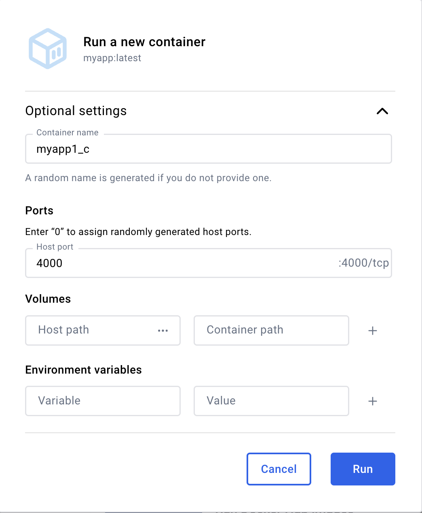

My notes from the fantastic [NetNinja YouTube Docker Crash Course series](https://www.youtube.com/watch?v=31ieHmcTUOk&list=PL4cUxeGkcC9hxjeEtdHFNYMtCpjNBm3h7&index=1)...

## What is Docker?

Makes managing apps much easier. It does that by using containers to run apps in isolated environments.
E.g. An app could have containers for:

- Node app
- React app
- Mongo DB

Say you are working on a Node app that requires a specific version of node -- e.g. node 17. Other team members would also need to install that version of node on their system, and install any project dependencies e.g. environment variables. Every time we want to run the app on a different machine, we have to set that machine's environment up so that it can run the app.

You can think of a container as a box that contains all of the things that our app needs to run: the source code, dependencies, runtime environment, correct versions of everything etc. This container can run our app in an isolated environment, away from any other processes on our computer. It doesn't matter what versions of Node, Python, etc. we have installed on our computer, because everything the app needs to run is inside the container.

**A container is a consistent, predictable and isolated environment.**

The only thing needed on each computer is Docker to manage those containers. Docker, at its core, is a tool for managing containers.

Containers can also improve the deployment of an app to a server as well, as they can be pulled onto the production server -- that way you dont need to configure your server as all the configuration and serup has been done already.

### Containers vs Virtual Machines

- Virtual Machines: each one has its own full operating system and kernal (running on top of your host's OS), and is typically slower.
- Containers: share the host's operating system and typically faster. Less memory. Containers do contain a slimmed-down version of the OS, but they still use the host machine's kernal under the hood.

But VMs are still very useful for many situations. One example:

**Full Isolation and Security**

- Use a VM if you need strong isolation between environments. VMs virtualize the entire operating system, which gives them complete isolation from the host machine. This is useful when security or isolation between applications is a priority, such as running untrusted code or dealing with sensitive data.
- Docker, by contrast, shares the host OS kernel and doesn’t provide the same level of isolation. If an attacker gains access to a Docker container, they might be able to affect the host system, depending on the configuration.

## Installation

Download Docker Desktop: https://www.docker.com/products/docker-desktop/

## Images and Containers

### Images

Images are like blueprints for containers. They store the following things inside them (but they don't have them running inside them):

- Runtime environemt e.g. a specific Node version
- App code
- Dependencies the app needs to run
- Extra config e.g. env variables
- Commands e.g. commands that need to be ran for the app to work

Images also have a file system of their own, which is independent from the rest of your computer.

Images are read-only, meaning once created, it cannot be changed. To make a change, you have to make new image.

### Containers

Containers are runnable instances of those images. So, we create an image, then when we run the image, it creates a container -- which is a process that can run our app exactly as outlined in the image.

Containers are an isolated process, meaning that they run independently from any other process on your comp.

So, a developer can share an image with teammates, teammates run the image to make a container to run the app. Easy.

## How Images are Made

Images are made from "layers", and the order of the layers does matter:

1. We start with the "Parent Image", that includes the OS and sometimes the runtime env. like Node/Python/PHP/Ruby/etc.

Can then add other layers e.g.:


Download parent images from hub.docker.com, e.g. Node.

To install Node parent image:

- Find it on dockerhub: https://hub.docker.com/_/node
- Check what version of Node we want to intall, as well as which Linux distribution Node should run on top of. Alpine is a really lightweight Linux dist. that is good to use. It's always good to specity a Node version (a tag) to lock that version into the image, otherwise it will always grab the latest one (default tag of "latest").
- Type `docker pull node`
- Open Docker desktop to see the image
- Run the image to create a container.

But this by itself isn't much use; so let's create our own image (with parent image as the base) with a DockerFile...

## Docker file



We can create this with a Docker File -- which is a set of instructions to create an image.

Here's a simple Node/Express app:



Here's how we create an image for it with a Dockerfile:

```dockerfile
# Layer 1
# First we pull the parent image into our image. Use `FROM` for parent image. If we don't have it locally, then it will be pulled from Dockerhub. 17-alpine is the "tag", stating we want node version 17 running on an alpine linux distribution OS.
FROM node:17-alpine

# Layer 2
# This tells Docker that our app is at /app in the image file structre, so that when docker runs commands (e.g. npm install), it will run them in our source code's route.
WORKDIR /app

# Layer 3
# `COPY` means to copy some files to the image. The first argument is `.` meaning we want to copy all files from the current directory (our Dockerfile is in our project route). If all the source code was in a source folder, then we'd write `./src`. Second arg is the path in the image that we want to copy our source code to -- remember that images have their own folder structure. Often we'd want to install the src code into a different folder than the image route, such as `/app`, to prevent source code files conflicting with other files in the image route. But this is relative to our WORKDIR, so we can just put `.` to copy into /app.
COPY . .

# Layer 4
# Run commands that we need to run when we build the image. Here, we can install our npm dependencies.
RUN npm install

# Our app is going to run on port 4000. This port will be owned/exposed by the container, not our computer. This container will listen on port 4000 (not our computer -- we can map a port on our computer/localhost to a port on a Docker container, e.g. localhost:5000 to docker_container:4000).
EXPOSE 4000

# Now we need a command to run our app. BUT, we cannot use another RUN command, as RUN commands run as the image is being built, at "build time". Remember: the image is not a running app, it's just a blueprint for a container. The container is the running instance of the image. So, we want to start our app ONLY once the image is built AND we have a running instance of the image ready to run our application in the container. `CMD` commands run at runtime when the container begins to run. Below, we state the executable (node) and the parameter (app.js).
CMD ["node", "app.js"]
```

Now to build the image: open terminal and navigate to dockerfile directory and run:

`docker build -t myapp .`

- `-t` means tag -- give the image a name.
- `.` relative path to the dockerfile from the directory we are in. Since we are in same directory as docker file -- `.`.

This builds the image layer by layer, as we specified. The image can be found in Docker Desktop.

## Dockerignore

Notice that there was no node_modules folder in our Express app earlier. Node modules will be installed via an isolated container later on. The app will run from a container, so no need for us to install here.

But, what if we have a node_modules folder containing all our dependencies while we are creating an image? It would get copied when we create the image with `COPY . .`. This is bad because:

1. We already have a command to create our node_modules folder directly on the image with `RUN npm install`. So, the `COPY` step will just replace the node_modules folder from the `RUN` command. This is bad because the modules might be out of date.
2. It'll take longer to build the image, as we're copying over a load of stuff that doesn't really need copying over.

So, to ignore node_modules when we copy over the source code into the image, we create a `.dockerignore` to the route and add `node_modules` You also may want to ignore other files, e.g. `*.md`.

## Running a container

Go to the image in Docker desktop and click run:



If you specified a port in Dockerfile, you get the option to map a localhost port to the container's port. Keep the same for simplicity.

## Docker terminal commands

View all images:

`docker images`

Running an image (creating a container):

`docker run <REPOSITORY_OR_IMAGE_ID>`

e.g. `docker run myapp` or `docker run 2671b1ecff41`

Give the container a name:

`docker run --name myapp_c1 myapp`

See list of running processes (running Docker containers):

`docker ps`

See all containers (including those not running): `docker ps -a`

Stopping a container:

`docker stop <CONTAINER_NAME_OR_ID>`

Mapping a port on our computer to a port exposed on the container. Use `-p` command to publish the containers port to the host computer. The port on the left is the host computer's port and right is the Docker container's. `-d` "detached command" is used to prevent the terminal that we run this command from from being blocked -- our terminal is detached from the process.

`docker run --name myapp_c2 -p 4000:4000 -d myapp`

Restarting an existing container (`docker run` runs an image to create a new container). No need to reconfigure stuff like port mapping or detached mode as it's already configured from when the container was created using `docker run` command

`docker start myapp_c2`

## Layer caching

When building a new image with `docker build`, docker will check to see if a layer has changed; if not, it will grab that layer from cache to save it from having to be executed again. E.g.

```dockerfile
# Layer 1
FROM node:17-alpine

# Layer 2
WORKDIR /app

# Layer 3
COPY . .

# Layer 4
RUN npm install
```

If we change the source code, then Docker will see that the `COPY . .` layer will need to be re-executed, and so that layer AND all layers after that will need to be rebuilt, as layers after `COPY . .` depend on that layer, because `npm install` depends on the package.json file copied over in the previous layer.

PROBLEM: we don't wanna `npm install` every time we build an image as it takes tiiiimmme... so, let's modify the dockerfile:

```dockerfile
# Layer 1
FROM node:17-alpine

# Layer 2
WORKDIR /app

# Layer 3
# Copy package.json into working dir
COPY package.json .

# Layer 4
RUN npm install

# Layer 5
COPY . .
```

Now, `npm install` will only be ran if the package.json file changes, but not if the source code changes, as that layer comes before it.

## Managing images and containers

Deleting an image:

View all images: `docker images`

Delete an image: `docker image rm <REPOSITORY_OR_IMAGE_ID>`

Add the `-f` flag to delete image even if it's being used by a container.

OR, we could delete the container before deleting the image:

List all containers: `docker ps -a`

Delete it: `docker container rm <NAME_OR_ID>`

Delete multiple: `docker container rm myapp_c1 myapp_c2`

**Delete all images, containers & volumes:**

`docker system prune -a`

**Building an image with a tag**

`docker build -t myapp:v1 .`

`:v1` -- tags are useful for versioning your images.

We can now run specific images with specific tags, e.g. to run version 1 of our app:

`docker run --name myapp_c -p 4000:4000 myapp:v1`

## Volumes

PROBLEM: every time we make a change to our src code, we have to build a new image, run the image (build a container), then start the container. Not fun.

A better solution is to map the src code in the container to the src code folder on our local machine.

First, install nodemon globally inside of the container, so that any changes to js or json files will be detected and the node server restarted:

```dockerfile
FROM node:17-alpine

RUN npm i -g nodemon

# ...
```

We can now execute nodemon commands inside of the container, as we installed it globally. First, define the script in the `package.json` file of the project:

```json
"scripts": {
  "test": "echo \"Error: no test specified\" && exit 1",
  "dev": "nodemon -L app.js"
}
```

`-L` tag is necesary when working on Windows with nodemon and docker.

Now, the command to run the app in the dockerfile will be:

```dockerfile
CMD ["npm", "run", "dev"]
```

Rebuild the image with a nodemon flag from the current terminal dir: `docker build myapp:nodemon .`

Run the image: `docker run --name myapp_c_nodemon -p 4000:4000 --rm myapp:nodemon`

The `--rm` option tells docker to delete the container when it's stopped. Useful for development.

Nodemon now runs inside of our container, watches for changes to the files in the container, then restarts the server if changed.

PROBLEM: nodemon is watching for changes to files inside of the container -- NOT to our computers local filesystem where we are editing code.

SOLUTION: volumes...

We want to map our app folder on our computer to the app folder in the container, so the our changes our propagated to the container.

So, stop that container and let's RUN a new one:

`docker run --name myapp_c_nodemon -p 4000:4000 --rm -v "/Users/danadams/Desktop/Express API":/app myapp:nodemon`

(Note: to get the path of your project, in VS code, right click the project route and "copy path")

Here, we are mapping our src code folder to the /app dir in the container. This is called a "volume mount". PROBLEM: if we delete the node_modules folder in our src code, then it will also be deleted in the container (we don't need node_modules folder in our src code to run our app with Docker via containers).

**SOLUTION:** create an "anonymous volume mount":

`docker run --name myapp_c_nodemon -p 4000:4000 --rm -v "/Users/danadams/Desktop/Express API":/app -v /app/node_modules myapp:nodemon`

**Anonymous Volume**: /app/node_modules is mounted inside the container but is not mapped to any specific directory on the host machine. Docker will create an internal volume to store this data.

**Purpose**: This is usually done to prevent the local node_modules folder from being overridden by the container's node_modules. Since Node.js modules are often platform-specific, mounting the entire host directory would replace the container's node_modules with the local version, which may cause issues. By using an anonymous volume, you ensure that the container manages its own node_modules without interference from the host machine.

Now, changing our src code results in changes at http://localhost:4000 in the browser.

However, "docker compose" makes this process much easier to manage...

## Docker compose

Makes it much easier to run images and specify how they should be ran, especially when you have multiple projects on the go.

Example `docker-compose.yaml` file:

```yaml
version: "3.8"
services:
  api:
    build: ./api
    container_name: api_c
    ports:
      - "4000:4000"
    volumes:
      - ./api:/app
      - /app/node_modules
```

- Version = what version of docker compose you wanna use (depreciated!)

When we execute the docker compose file, it will loop through each service and create an image, spin up a container, and create any specified volumes for each service:

`docker compose up`

To delete the container (but not the image and volumes):

`docker compose down`

To also delete all images:

`docker compose down --rmi all`

And also volumes: `docker compose down --rmi all -v`

## Sharing Images on Docker Hub

### How to upload an image to Docker Hub

1. Go to https://hub.docker.com/
2. Click "Create Repository"
3. Repo name convention with hyphens or underscores. Example: `netninja-api`.
4. Go back to your project's terminal. Navigate to the route folder of the project that you want to create an image for, e.g. `project/api` or `project/frontend`
5. Create the image: `docker build -t doabledanny/netninja-api .` apply a tag to the name if you want (otherwise default is `:latest`). Use your correct docker hub username (e.g. `doabledanny`) and name it the same as the docker hub repo name (e.g. `netninja-api`).
6. Check image exists with `docker images`
7. Login to Docker via terminal with `docker login`.

### How to pull an image from Docker Hub

1. Let's delete the image we made previosuly: `docker image rm doabledanny/netninja-api`
2. Let's pull the image back from Docker Hub: `docker pull doabledanny/netninja-api`
3. Check it's back with `docker images`
