Kubernetes is an open-source container orchestration tool, developed by Google. It helps you manage apps that are built from 100s or 1000s of containers, and helps you manage them in different environemnts, such as physical, cloud, virtual, hybrid deployment envs.

The trend from monolith apps to microservices increased the use of containers -- as containers are a great solution for small independent applications like microservices. Managing lots of containers across multiple environemnts using scripts and self-made tools can be very complex. Hence container orchestration technologies, like Kubernetes.

## Example Kubernetes Project

https://github.com/DoableDanny/Kubernetes-Basics

## Advantages of Orchestration tools

- High availability: no downtime. Users can always access app.
- Scalability/high performance. Loads fast and users get quick responses.
- Disaster recovery: if server explodes, backup and restore to latest state before disaster.

## Kubernetes basic architecture

The Kubernetes cluster is made up of at least one master node, and connected to it are a few worker nodes, where each node has a Kubelet process. Kubelet is a Kubernetes process that makes it possible for the cluster to talk to each other and execute tasks on those nodes, like running application processes.

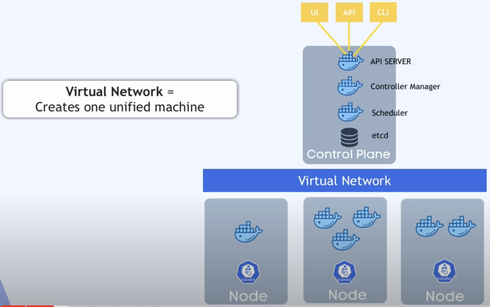

Each worker node has Docker containers of different applications deployed on it. Worker nodes are where your actual app is running. Worker nodes have higher load and have more resources as they will be running 100s of containers inside of them; master node much less, as it only runs a few processes. However, master node is more important because if you lose a master node, you can no longer access the cluster. Therefore, you NEED at lease one backup of the master at all times.

The Virtual Network allows the master nodes and worker nodes to talk to each other.

On Master node, important K8 processes are running that manage the cluster. One of such processes is the API Server, which is also a container and is the entry point to the K8s Kubernetes cluster.

Master node:

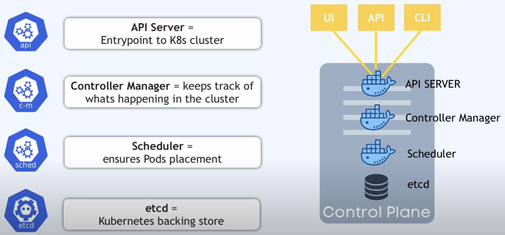

## Kubernetes in production vs local

In production, each node runs on a separate machine/VM:

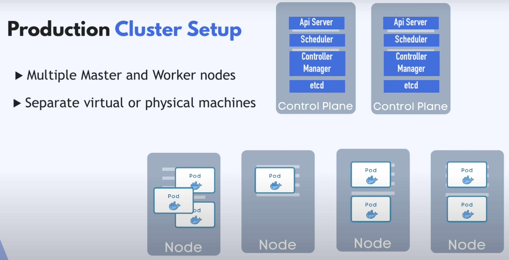

Locally, we probs don't have the resources for all these separate machines. So, we use MiniKube -- where all master and worker processes run on one machine/node which has a docker container runtime preinstalled so can run the pods with containers:

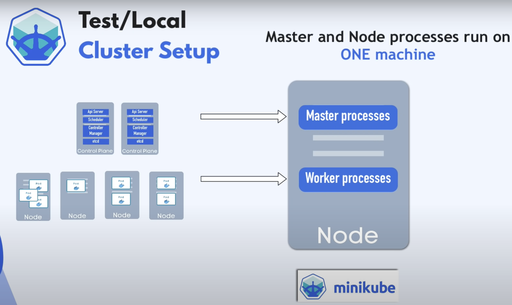

We can communicate with this cluster using Kubectl -- a command line tool for K8s cluster. kubectl submits commands to the API Server process on the master node. Can create/delete services, pods, config etc. Kubectl is used to interact with any Kubernetes cluster, whether minikube or cloud cluster.

## Getting started

- Install kubectl (allows you to run commands against Kubernetes clusters): https://kubernetes.io/docs/tasks/tools/

### MiniKube

- Install minikube (local Kubernetes, focusing on making it easy to learn and develop for Kubernetes without having to have a Kubernetes cluster deployed to a production env): https://minikube.sigs.k8s.io/docs/start/?arch=%2Fmacos%2Farm64%2Fstable%2Fhomebrew. Start with `minikube start --driver docker`.

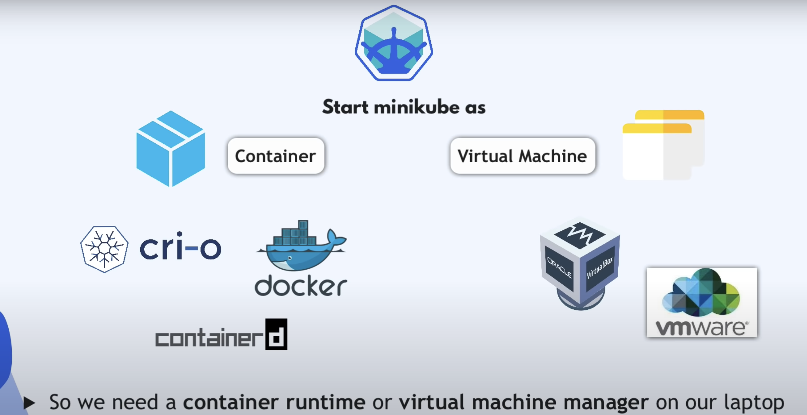

Minikube can create cluster as a container or VM, so ensure you have a necessary driver e.g. Docker (preferred). "Driver" means we are hosting MiniKube as a container on our local machine -- so we need to have it installed. But MiniKube also comes preinstalled with Docker for running containers in the pods, so there are 2 layers of Docker:

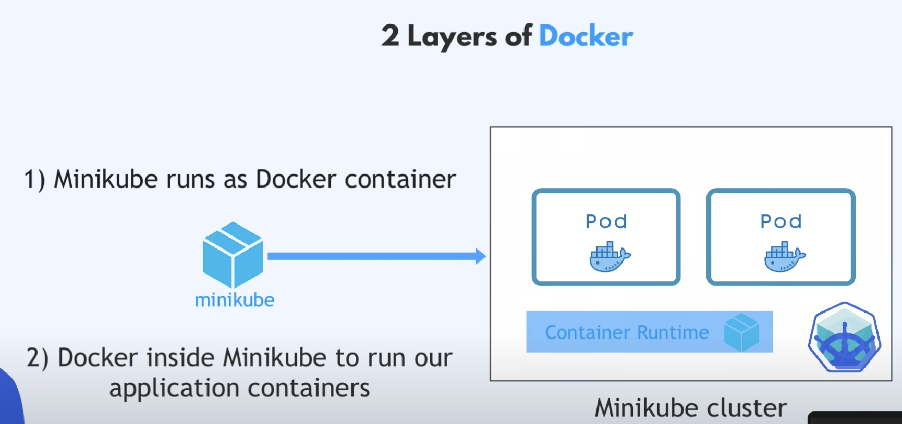

Check status:

`minikube status`

See all nodes in the cluster:

`kubectl get node`

- Install K9s (for managing Kubernetes clusters): https://github.com/derailed/k9s. Start with `k9s` to see interactive terminal UI for our minikube cluster that we just started.

We can then use kubectl to communicate with minikube.

## Kubernetes components

To learn the components, we'll build an app with a db:

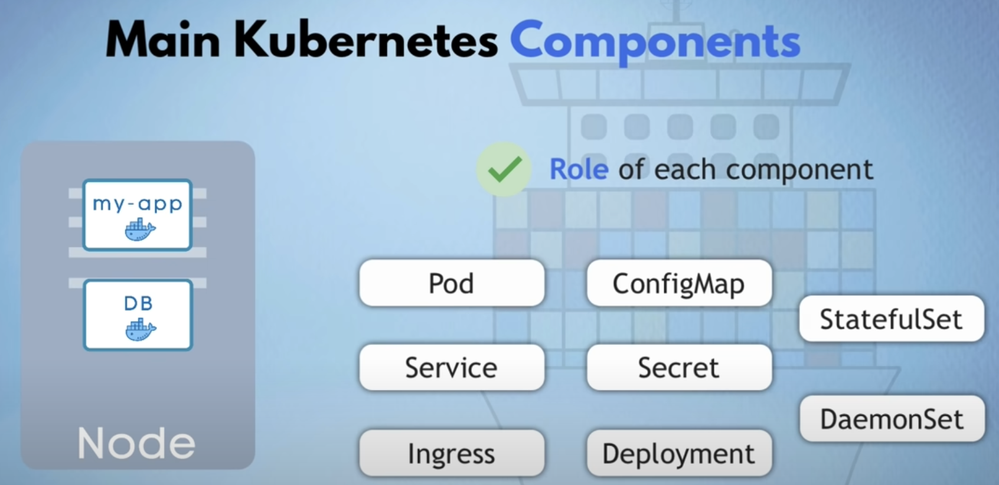

### Node and Pod

Node, or Worker Node: a simple server (virtual or physical machine)

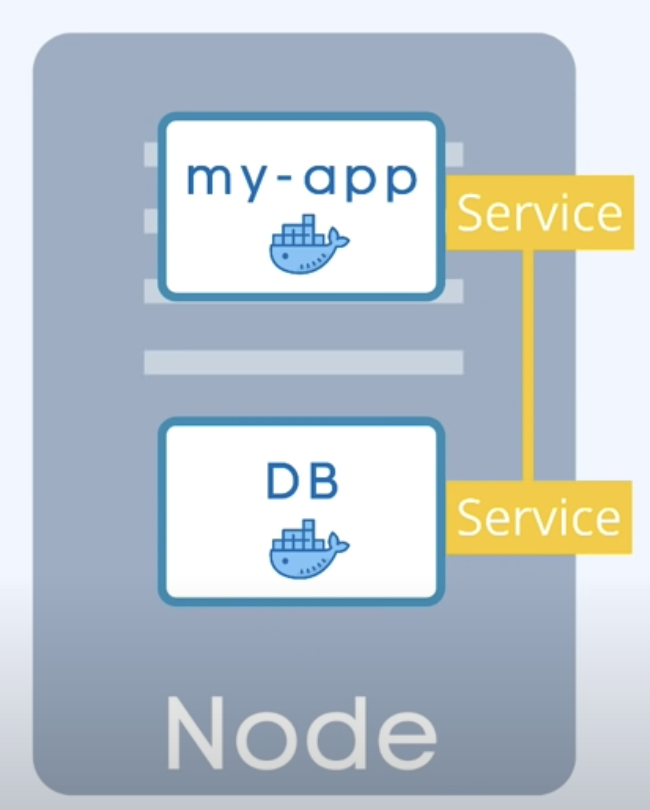

Nodes contain pods. A pod is:

- smallest unit in Kubernetes
- abstraction over container
- usually one application per pod
- each pod gets its own IP address (not the container) (The IP addresses are internal to the worker node)

Pods are "ephemeral", meaning that they die easily. They get replaced by a new pod with a new IP address -- not ideal if we are, for e.g., talking to the db via its IP.

### Service and Ingress

Service:

- is a static/permanent IP address that can be attached to each pod
- lifecycle of service and pod not connected, so if pod dies, service and ip stays.

Specify an external service for publically accessible IPs, and internal for not pub. acc. like dbs:

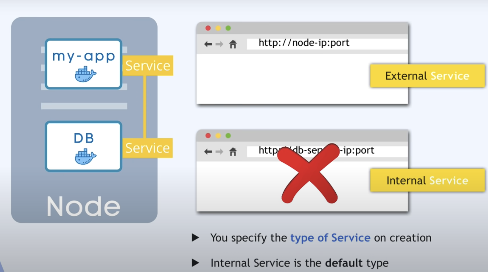

Usually, the IP address is to the worker, and the port is to the specific service.

BUT, in production we will use a proper domain name like doabledanny.com, so we use Ingress to forward to the correct service:

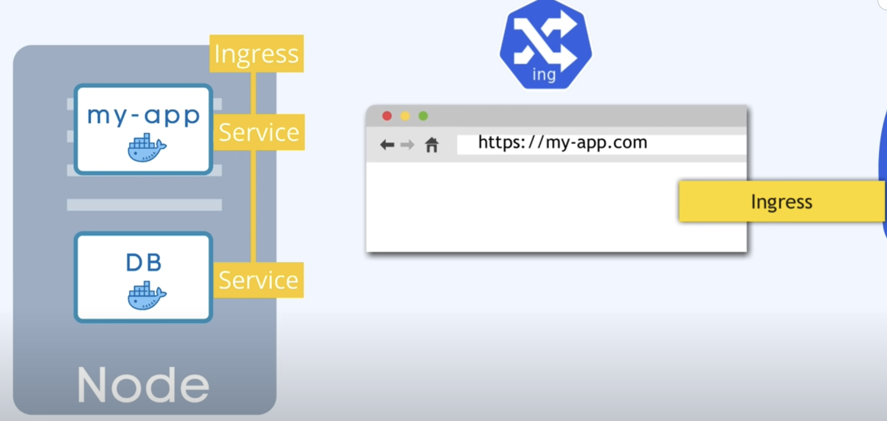

### ConfigMap and Secret

About ConfigMap:

1. Decoupling Configuration: ConfigMaps allow you to externalize configuration data from your container image, so the same container can be used in different environments with different configurations (e.g., development, testing, production).

2. Key-Value Pairs or Files: You can store configuration data in the form of key-value pairs or entire configuration files (e.g., JSON, YAML, or plain text files).

3. Consumption by Pods: Pods can consume ConfigMaps in three primary ways:

- Environment Variables: Inject the configuration data as environment variables into your containers.
- Command-Line Arguments: Pass configuration values as arguments to the container's entrypoint or command.
- Mounted Files: Mount configuration data as files inside the container, similar to Docker volumes.

But, storing sensitive stuff like db pw in plane text is dumb; so, use Secret component...

Data stored in secret is stored in base_64 encoded format. Kubernetes doesn't provide a way to encrypt, so you usually install a 3rd party tool to do it, or some cloud provider does it.

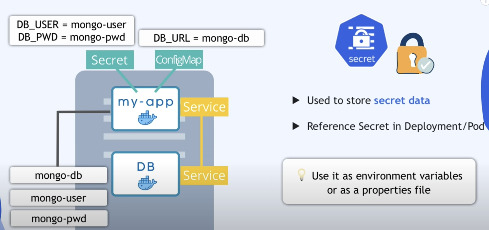

### Volume

With our current setup, if the db pod gets restarted, we lose all the data.

Solution: volumes. A Volume attaches a physical storage, on a hard drive, to your pod. That storage could be on a local machine on the same server node where the server is running, or on cloud storage (outside the kubernetes cluster). The data now persists.

Think of the external storage as being pluggin in to the cluster -- Kubernetes does not persist data. So, YOU are responsible for backing up data!

### Deployment and StatefulSet

What happens if pod dies? Or if we build a new image? We have downtime. This is the advantage of distrubuted systems and containers -- we can replicate everything, another node where our application can run. Replica nodes are connected to the Service.

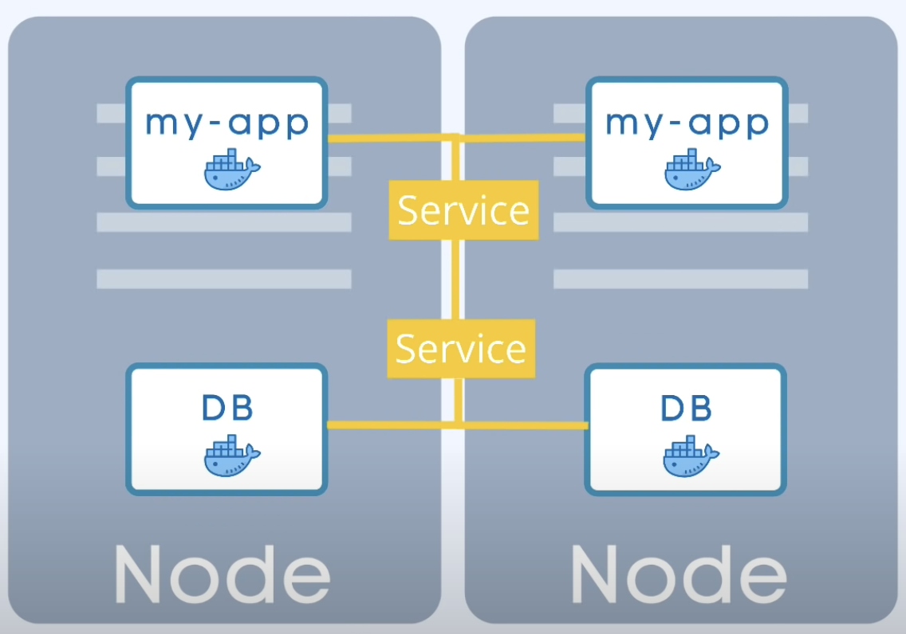

Service has load balancer, sending traffic to least busy pod. If a pod dies, it forwards to another pod.

In Kubernetes, you define the blueprint for a pod -- this is done by the Deployment Component. A deployment is an abstraction on top of a pod. So, in practice, you are mostly working with deployments rather than pods.

But what about DBs? Can't be replicated by Deployment components cus db has state, meaning if we have clones of db, they'd all need to access the same shared data storage, so you'd need something that could manage what pods are writing/reading to that storage in order to avoid data inconsistencies. This is done by a Kubernetes component called StatefulSet.

StatefulSet is for replicating/scaling apps like dbs: mongo, postgres, etc. It ensures reads/writes are synchronised so no inconsistencies.

BUT, deploying StatefulSets is challenging. So, it's common for dbs to be hosted outside of the Kubernetes cluster.

### Summary of Kubernetes components

- Pod: abstraction of containers
- Service: communication
- Ingress: route traffic into cluster
- ConfigMap/Secret: configuration (e.g. env vars)
- Volume: data persistence
- Deployment/StatfulSet: replication

## Configuration

All communication/config requests with the Kubernetes cluster goes through a process/component called APIServer.

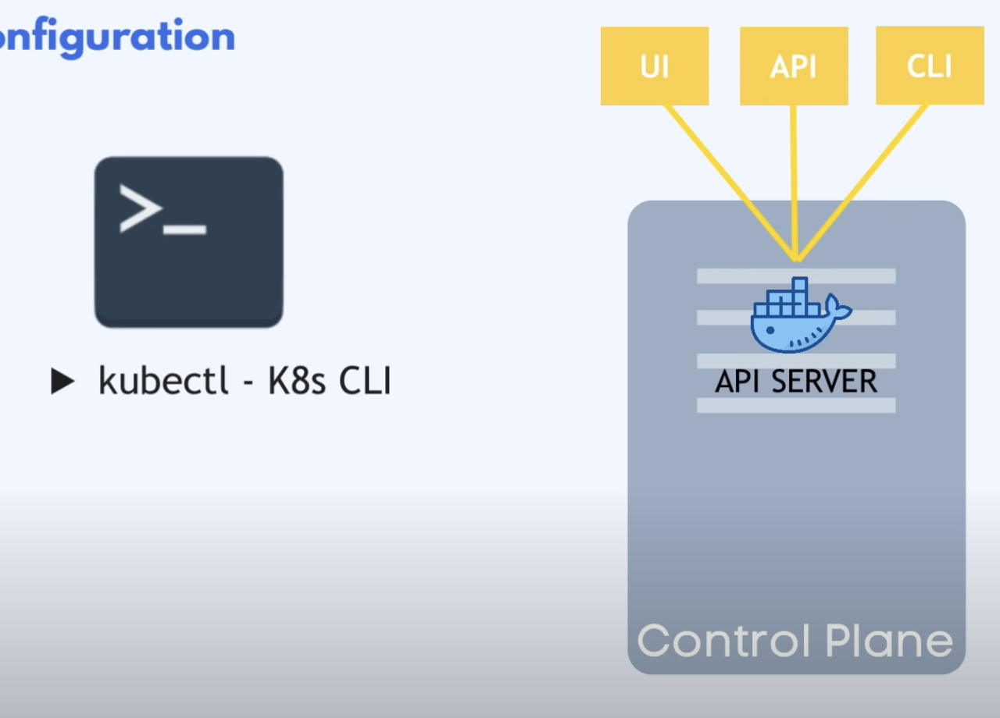

Config requests must be in YAML or JSON. E.g. here's a deployment config req. e.g.:

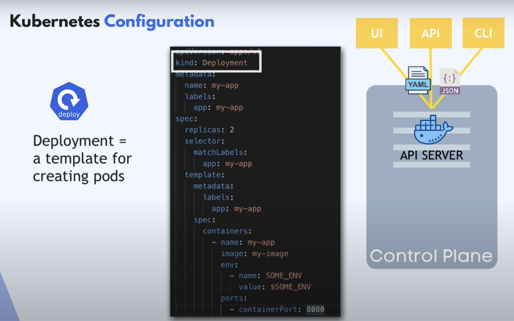

It is standard pracitce to store your config files with your code.

Where to find docs for structuring the YAML? Use the docs e.g.: https://kubernetes.io/docs/concepts/configuration/configmap/

## Example project

https://github.com/DoableDanny/Kubernetes-Basics

See the README for terminal commands required to get this running.
