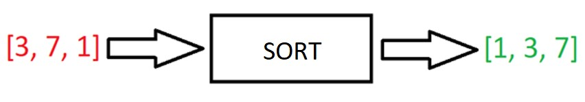
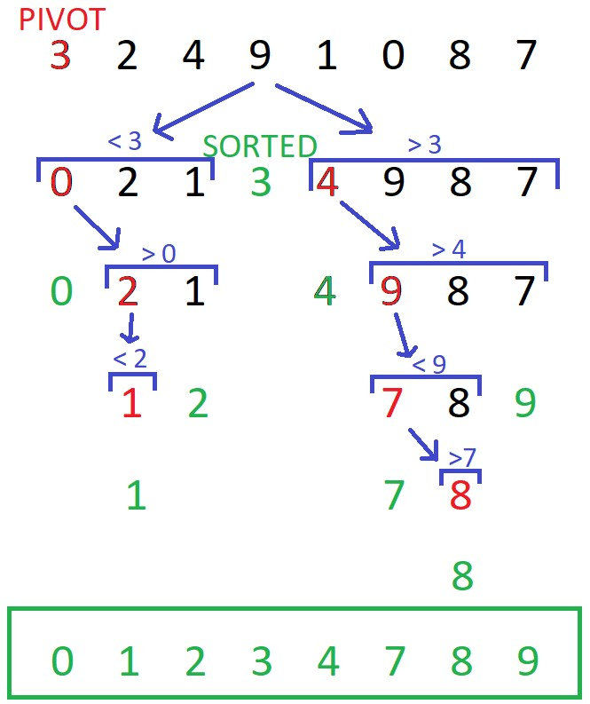
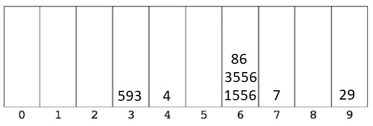
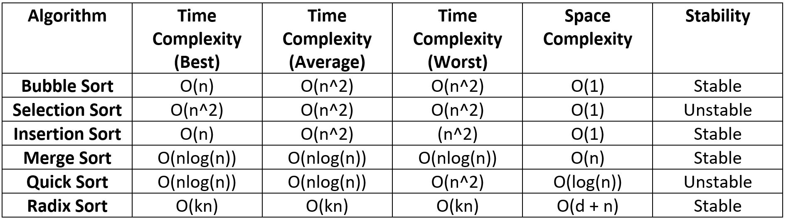

import FigureWithCaption from "../../components/FigureWithCaption.js"

## Intro

Learning sorting and searching algorithms is a fantastic way to improve your problem-solving skills. It will also help you to write better performing code.

In this article we’ll discuss:

1. Important algorithm concepts
   - [Big O Notation](#1)
   - [Algorithm stability](#2)
   - [In-place algorithms](#3)
   - [Comparison algorithms](#4)
2. Searching algorithms in JavaScript
   - [What is a Search Algorithm?](#5)
   - [Linear Search](#6)
   - [Binary Search](#7)
3. Sorting Algorithms in JavaScript
   - [What is a Sorting Algorithm?](#8)
   - [Bubble Sort](#9)
   - [Selection Sort](#10)
   - [Insertion Sort](#11)
   - [Merge Sort](#12)
   - [Quick Sort](#13)
   - [Radix Sort](#14)
4. [Sorting algorithms comparison table](#15)

For each algorithm we'll discuss the logic and the performance in terms of time and space.

At the end of each algorithm section, there is a link to the code implementation in JavaScript. The latter algorithms require a good explanation of the code to aid understanding, so instead of making this article too long by adding the code, I decided to provide them as links.

## Important algorithm concepts

<h3 id="1">Big O Notation</h3>

Big O Notation is used to analyse the performance of an algorithm. It specifically looks at the worst-case scenario of an algorithm.

It tells us how long a function will take to execute or how much space in memory will be taken up as the input to that function approaches infinity (becomes very large).

The Graph of Big O Notation is a useful way of comparing Big Os:

Algorithms with Big O(1) are as good as it gets: if we increase the size of the input, the execution time remains constant.

Algorithms with Big O(n!) are “horrible”: if we increase the input size even just a little, the execution time can rise dramatically.

Big O is a very important concept, and is fundamental to understanding algorithms. So, if your new to Big O, check out:

- [Big O Notation in JavaScript | The Ultimate Beginners Guide with Examples](https://www.doabledanny.com/big-o-notation-in-javascript)
- Or if you prefer video: [Big O in JavaScript](https://www.youtube.com/watch?v=lWldunWaLPs&t=351s)

<h3 id="2">Algorithm stability</h3>

Stable means that two elements with equal values will appear in the same order in the sorted output as they appear in the unsorted input array.

For example, if we wanted to sort:

`[“Cherries“, “Blackberries”, “Apples”, “Bananas”]`

into alphabetical order by first letter, using a stable algorithm the output would be:

`[“Apples”, “Blackberries”, “Bananas”, “Cherries”]`

As you can see, “Blackberries” and “Bananas” remained in the same relative positions in the input and output array because the algorithm is stable.

For an example showing why the stability of an algorithm can be important to know, check out: [Important Algorithm Concepts | Algorithm Stability, In-place Algorithms, and Comparison Algorithms](https://www.doabledanny.com/algorithm-concepts)

<h3 id="3">In-place algorithms</h3>

An in-place sorting algorithm is an algorithm which transforms input using no auxiliary data structures; however, a small amount of extra storage space is allowed for auxiliary variables.

In simple terms, “in-place” just means that the input is overwritten (via swapping or replacement) by the output as the algorithm executes.

In-place algorithms have good space-complexity (take up less space in memory).

The opposite of an in-place algorithm is an out-of-place algorithm, which does require auxiliary data structures.

<h3 id="4">Comparison algorithms</h3>

A comparison sorting algorithm is an algorithm that only reads a list of elements through a single abstract comparison operation (usually a “less than” or “equal to”) that determines which of the two elements should occur first in the final sorted output array.

## Searching Algorithms in JavaScript

<h3 id="5">What is a Search Algorithm?</h3>

Search algorithms are used to retrieve some information stored in a data structure.

For example, we could search an array (the data structure) for the value 8 (some information).

Usually, a searching algorithm will return the position of the found value, or if it isn’t found, it will return -1.

So, if we searched `[1, 2, 3]` for the value 2, then we’d get back 1 – the index of the found value.

If we searched the same array for 5, we’d get back -1; i.e. value not found.

<h3 id="6">Linear Search</h3>

Linear Search is a very common searching algorithm; It is implemented under the hood in the JavaScript built-in methods `indexOf()`, `includes()`, `find()`, and `findIndex()`.

Linear Search is also very straightforward and easy to implement: simply loop over each element in an array and stop if that element equals our target value, then return that element’s index.

**The best case time complexity of Linear Search is O(1) – constant time.** This occurs if the value we’re searching for is at the beginning of the array. The algorithm will always only have to make one comparison, no matter the size of the array.

If our target is the last element in the array, then the algorithm will have to make n comparisons (n being the length of the input array). This means that **the Big O notation of Linear Search is Big O(n) – linear time complexity.**

Linear Search has a space complexity of O(1) – constant space. It uses no auxiliary data structures to find the target value.

**Linear Search is the best we can do when searching unsorted arrays, such as [4, 2, 3].**

For sorted arrays, Binary Search is a more efficient option.

|                           |      |
| :-----------------------: | ---- |
|  Time Complexity (Best)   | O(1) |
| Time Complexity (Average) | O(n) |
|  Time Complexity (Worst)  | O(n) |
|     Space Complexity      | O(1) |

[Implementation of Linear Search in JavaScript](https://www.doabledanny.com/linear-search-in-javascript)

<h3 id="7">Binary Search</h3>

Binary Search can be used to search for values in **SORTED arrays only** – such as [1, 2, 3, 6, 9]. It is more performant that Linear Search for anything other than small arrays (< 10 elements). It is much more performant than Linear Search when the sorted array is large.

Binary Search is a “divide and conquer” type algorithm; it divides the array roughly in half every time it checks whether a value is the one we’re looking for.

**Here’s how Binary Search works:**

1. Start in the middle and check if the target is greater or less than that value.
2. If the target is greater, we will next look at the second half of the array (ignore the right)
3. If the target is smaller, we look at the first half of the array (ignore the left).
4. We pick the middle of that half and check if it’s greater or less than our target.
5. Repeat this process until we find our target.

<FigureWithCaption
  src={props.images[2].publicURL}
  alt="linear search vs binary search"
  caption="Linear Search vs Binary Search. Source: "
  a_text="codesdope.com"
  href="https://www.codesdope.com/course/algorithms-binary-search/"
/>

**The best-case complexity of Binary Search** occurs when the value we are searching for is in the middle of the array. Only one comparison will be needed – no matter the size of the array. Therefore, at best, Binary Search runs at constant time – O(1).

**The worst-case** occurs when our target value is at the beginning or end of the array. See the image below: if we have an array 32 elements long and our target is 32, then the array will be divided five times until we find 32. So, the Big O complexity of binary search is O(log(n)) – logarithmic time complexity: log(32) = 5.

<FigureWithCaption
  src={props.images[3].publicURL}
  alt="Binary Search steps"
  caption='32 elements = 5 "steps" at worst case. Image source: '
  a_text="JavaScript Algorithms and Data Structures Masterclass by Colt Steele"
  href="https://ad.admitad.com/g/05dgete24sfa55577a70b3e3b7aadc/?ulp=https%3A%2F%2Fwww.udemy.com%2Fcourse%2Fjs-algorithms-and-data-structures-masterclass%2F"
/>

Binary Search requires no auxiliary data structures; therefore, the **space complexity of Binary Search is O(1) – constant space**.

**When to use Binary Search?** Use Binary Search on medium to large sorted arrays.

|                           |           |
| :-----------------------: | :-------: |
|  Time Complexity (Best)   |   O(1)    |
| Time Complexity (Average) | O(log(n)) |
|  Time Complexity (Worst)  | O(log(n)) |
|     Space Complexity      |   O(1)    |

[Implementation of Binary Search in JavaScript.](https://www.doabledanny.com/binary-search-javascript)

## Sorting Algorithms

<h3 id="8">What is a Sorting Algorithm?</h3>

Sorting algorithms are used to organize an array of elements into a specific order. Usually, the sorting order is lexicographical – e.g. alphabetical (a-z) or numerical (0-9).

For example:

<h3 id="9">Bubble Sort</h3>

Bubble Sort is a straighthood, easy to understand sorting algorithm. It works by looping through an array and comparing neighbouring elements, then swapping them if they are in the wrong order. In this fashion, the largest number “bubbles” to the top. This is repeated until the array is sorted.

**The best-case complexity of Bubble Sort** occurs when the array is nearly sorted and only requires one run-through with swaps. The next run through will then require no swaps, so Bubble Sort will know that the array is sorted and can return it. Therefore, at best, Bubble Sort will require two runs through the array (2n comparisons), resulting in a best-case complexity of O(n) – linear time complexity.

**The worst-case complexity of Bubble Sort** occurs when the array is in reverse order. There are n elements in the array. For each of these elements, we have to make n comparisons. That’s n \* n = n2 operations, so **the Big O of Bubble Sort** is O(n2) – quadratic time complexity.

**The space complexity of Bubble Sort** is O(1) – constant space. This is because there are always only two additional memory spaces required: the two loop iterator variables, i and j.

**When to use Bubble Sort?** Probably never! There are usually always better options than Bubble Sort. For small arrays, or almost sorted arrays, [Insertion Sort](https://www.doabledanny.com/insertion-sort-in-javascript) is usually better. For large arrays, [Merge Sort](https://www.doabledanny.com/merge-sort-javascript) or [Quick Sort](https://www.doabledanny.com/quick-sort-in-javascript) will be much better.

|                           |            |
| :-----------------------: | :--------: |
|  Time Complexity (Best)   |    O(1)    |
| Time Complexity (Average) |    O(n)    |
|  Time Complexity (Worst)  |    O(n)    |
|     Space Complexity      |    O(1)    |
|   In-place/out-of-place   |  In-place  |
|        Stability?         |   Stable   |
|     Comparison Sort?      | Comparison |

[Implement Bubble Sort in JavaScript](https://www.doabledanny.com/bubble-sort-in-javascript)

<h3 id="10">Selection Sort</h3>

Selection Sort is similar to Bubble Sort, but instead of the largest values “bubbling” to the top, the smallest values are selected and placed at the beginning.

Selection sort works by going up an array and selecting the minimum value. The minimum value is then moved to the beginning of the array. The left side of the array becomes more sorted at the end of each pass through the array, until the whole array is sorted.

If the array is nearly sorted, e.g. [2, 1, 3, 4], or is sorted, then for each element in the array, Selection Sort will run through the array looking for the minimum, even if no swaps are necessary.

Even if the array is sorted, there will be roughly n \* n comparisons (but no swaps).

**So, at best-case** we’ll have O(n2) comparisons and O(1) swaps. Overall, this results in a very bad best-case time complexity of O(n2) – quadratic time.

If the array is in reverse order, e.g. [4, 3, 2, 1], then it will take just as many comparisons as if the array was almost sorted – O(n2). There will also be O(n) swaps. Total operations will therefore be O(n + n2).

As the n2 has the largest contribution, **the overall Big O of Selection Sort is O(n2) – quadratic time complexity.**

Like Bubble Sort, Selection Sort is simple, but inefficient. **It can outperform efficient algorithms like** [Merge Sort](https://www.doabledanny.com/merge-sort-javascript) **and** [Quick Sort](https://www.doabledanny.com/quick-sort-in-javascript) **for small arrays (< 20 elements), but Insertion Sort is usually more effective in these cases.**

|                           |                  |
| :-----------------------: | :--------------: |
|  Time Complexity (Best)   | O(n2) |
| Time Complexity (Average) | O(n2) |
|  Time Complexity (Worst)  | O(n2) |
|     Space Complexity      |       O(1)       |
|   In-place/out-of-place   |     In-place     |
|        Stability?         |     Unstable     |
|     Comparison Sort?      |    Comparison    |

[Implementation of Selection Sort in JavaScript](https://www.doabledanny.com/selection-sort-javascript)

<h3 id="11">Insertion Sort</h3>

Insertion Sort is another intuitive Sorting algorithm. It also has some interesting use cases.

Insertion Sort works by comparing an element with the elements to its left, until it reaches an element that is smaller than it; the element is then inserted in front of the smaller element.

**The best-case time complexity of Insertion Sort** occurs when the array is almost sorted; Insertion Sort will run at O(n) – linear time.

Example: [2, 1, 3, 4] will only need to do three comparisons and one swap to sort it.

**The worst-case time complexity of Insertion Sort** occurs when the array is in random, or reverse order; Insertion Sort will run at O(n2) – quadratic time complexity.

Why? For each element in the array, we would have to compare it with all of the elements to its left => this is roughly n \* n = n2. This is typical of most algorithms that implement nested for-loops.

So, the **Big O of Insertion sort** is O(n2) – quadratic time complexity.

In computer science terms, Insertion Sort is known as an “online algorithm”, meaning it can process its input piece-by-piece in a serial fashion, i.e., in the order that the input is fed to the algorithm, without having the entire input available from the start.

An example of this would be people submitting data to us live and we need to sort this data at a moment’s notice. The left side of the array will already be sorted so any new data can quickly find its place.

**This makes Insertion Sort a good choice when sorting real-time data.**

**Linear Sort also good for sorting small arrays and “almost sorted” arrays.**

**Don’t use Insertion Sort for large arrays that aren’t “almost sorted”.**

|                           |                  |
| :-----------------------: | :--------------: |
|  Time Complexity (Best)   |       O(n)       |
| Time Complexity (Average) | O(n2) |
|  Time Complexity (Worst)  | O(n2) |
|     Space Complexity      |       O(1)       |
|   In-place/out-of-place   |     In-place     |
|        Stability?         |      Stable      |
|     Comparison Sort?      |    Comparison    |

[Implementation of Insertion Sort in JavaScript](https://www.doabledanny.com/insertion-sort-in-javascript)

<h3 id="12">Merge Sort</h3>

Merge Sort is one of the most efficient sorting algorithms. It’s a “divide and conquer” style algorithm that exploits the fact that all arrays of length zero or one are naturally sorted.

Merge Sort first divides the input array up until we get arrays of zero or one item. This is the “base case” – we know these arrays are sorted.

<FigureWithCaption
  src={props.images[8].publicURL}
  alt="Merge sort steps - division steps"
  caption="The division steps of Merge Sort. Source: "
  a_text="JavaScript Algorithms and Data Structures Masterclass by Colt Steele"
  href="https://ad.admitad.com/g/05dgete24sfa55577a70b3e3b7aadc/?ulp=https%3A%2F%2Fwww.udemy.com%2Fcourse%2Fjs-algorithms-and-data-structures-masterclass%2F"
/>

These small sorted arrays are then merged together to create larger and larger sorted arrays at each step, until we end up with final sorted array:

<FigureWithCaption
  src={props.images[9].publicURL}
  alt="Merge sort steps - merging the sub-arrays back together"
  caption="Merging the sorted sub-arrays. Source: "
  a_text="JavaScript Algorithms and Data Structures Masterclass by Colt Steele"
  href="https://ad.admitad.com/g/05dgete24sfa55577a70b3e3b7aadc/?ulp=https%3A%2F%2Fwww.udemy.com%2Fcourse%2Fjs-algorithms-and-data-structures-masterclass%2F"
/>

Here’s a nice gif of Merge Sort from Wikipedia:

Check out this [awesome video of folk dancers demonstrating Merge Sort](https://www.youtube.com/watch?v=XaqR3G_NVoo&t=133s).

Unlike some other sorting algorithms, such as Bubble or Insertion sort, Merge Sort doesn’t care whether the data is almost sorted or not, it will always perform the same regardless.

Merge Sort will perform all of the steps from splitting the array up, to merging it back together, regardless of whether the input array is sorted, “random”, or in-reverse.

**The time complexity of Merge Sort will always be O(n \* log(n)) – linearithmic time complexity**

The log(n) coming from the divisions, and the n coming from the number of comparisons that have to be made when merging the arrays back together. For a more thorough explanation, [see the Big O of Merge Sort section of this article](https://www.doabledanny.com/merge-sort-javascript).

Merge Sort is very fast for a sorting algorithm, but as with most algorithms, the gains in speed come with the cost of taking up more space in memory. The larger the array, the more arrays that have to be stored in memory (from dividing them up). But in most cases, this isn’t a problem, usually we care more about time than space.

**The space complexity of Merge Sort is O(n).**

**Merge Sort one of the most efficient sorting algorithms for sorting large arrays.**

**However, if you know that the input array will be small, or sorted/almost sorted, you might be better off using an algorithm like insertion sort which is of O(n) at best case.**

|                           |              |
| :-----------------------: | :----------: |
|  Time Complexity (Best)   |  O(nlog(n))  |
| Time Complexity (Average) |  O(nlog(n))  |
|  Time Complexity (Worst)  |  O(nlog(n))  |
|     Space Complexity      |     O(n)     |
|   In-place/out-of-place   | Out-of-place |
|        Stability?         |    Stable    |
|     Comparison Sort?      |  Comparison  |

[Implementation of Merge Sort in JavaScript](https://www.doabledanny.com/merge-sort-javascript)

<h3 id="13">Quick Sort</h3>

Quick Sort is a popular and efficient sorting algorithm. It is also, however, one of the less intuitive!

**Here’s an overview of how Quick Sort works:**

1. Select the “pivot”. This can be any element in the array – in the example below, the pivot was always chosen to be the first element.
2. We loop over the array and place all of the numbers smaller than the pivot to the pivot’s left, and all of the numbers larger than the pivot to the pivot’s right. The pivot will then be in its correct place in the array.
3. There is then a subarray to the left of the pivot, and a subarray to the right of the pivot. We now need to sort these arrays, so a pivot is chosen in each of these arrays and placed in its correct place – as in steps 1 and 2.
4. This process is repeated until both the left and right subarrays are sorted, and each number is in its correct place.

Quick Sort isn’t the easiest to get your head around; I’d recommend reading through the “Quick Sort steps” section of my [Quick Sort in JavaScript](https://www.doabledanny.com/quick-sort-in-javascript) article if Quick Sort isn’t making sense right now!

**The best-case time complexity is of O(nlog(n)) – linearithmic time complexity.** The log(n) comes from the number of decompositions (divisions into subarrays) that have to be done. Then we have O(n) comparisons per decomposition.

**The worst-case time complexity is of O(n2) – quadratic time complexity.** The worst case is when we have a sorted array and we start from the smallest or largest value; this requires n decompositions, and with n comparisons per decomposition, this results in O(n2). So, the Big O of Quick Sort is n2 – quadratic time complexity.

**Quick Sort has a space complexity of O(log(n)).** If implemented recursively, this is due to the stack frames that have to be stored.

|                           |                  |
| :-----------------------: | :--------------: |
|  Time Complexity (Best)   |    O(nlog(n))    |
| Time Complexity (Average) |    O(nlog(n))    |
|  Time Complexity (Worst)  | O(n2) |
|     Space Complexity      |    O(log(n))     |
|   In-place/out-of-place   |     In-place     |
|        Stability?         |     Unstable     |
|     Comparison Sort?      |    Comparison    |

**Quick Sort is very good at sorting large arrays, but Insertion Sort is often a better choice for small arrays.** Knowing this, you could make an optimization: the input array length could be checked before sorting; if the array is small, perform Insertion Sort; if the array is large, perform Quick Sort.

[Implementing Quick Sort in JavaScript.](https://www.doabledanny.com/quick-sort-in-javascript)

<h3 id="14">Radix Sort</h3>

Radix Sort is a unique sorting algorithm: it sorts an array without making any comparisons between elements.

Radix Sort exploits the fact the size of a number is encoded in the number of digits – more digits means a bigger number.

Each digit in a number can be one of ten values: 0-9. So, we need to create ten buckets – one for each value:

<FigureWithCaption
  src={props.images[12].publicURL}
  alt="Radix Sort buckets"
  caption="Ten buckets for sorting base 10 numbers. Source: "
  a_text="JavaScript Algorithms and Data Structures Masterclass by Colt Steele"
  href="https://ad.admitad.com/g/05dgete24sfa55577a70b3e3b7aadc/?ulp=https%3A%2F%2Fwww.udemy.com%2Fcourse%2Fjs-algorithms-and-data-structures-masterclass%2F"
/>

First, Radix Sort looks at the right-most digit of each number, and puts each number in the correct bucket. If we are sorting the array [1556, 4, 3556, 594, 29, 86, 7], this would result in:

Putting these numbers back in there new order we’d get [593, 4, 1556, 3556, 86, 7, 29].

As you can see, the elements are now in order by their right-most digit.

Radix Sort would then look at the second digit from the right, put them in the correct buckets, and reorder. Here’s how it would look: [4, 7, 29, 1556, 3556, 86, 593]

Then after looking at the third digit from the right: [4, 7, 29, 86, 1556, 3556, 593]

And after looking at the fourth digit from the right: [4, 7, 29, 86, 593, 1556, 3556] => The array is sorted!

**The time complexity of Radix Sort** depends on the number of digits in the longest number, k, and the length of the input array, n.

For every loop iteration up to k, we have to loop over all of the numbers in the array; therefore, the time complexity of Radix Sort is O(k\* n).

**The space complexity of Radix Sort is O(n + d)**, where n is the length of the input array, and d is the amount of values each digit could be – in our case, 0 to 9, so d is 10.

Where does d come from? From the fact that we have to create an array of “buckets” at length d.

And n comes from the fact that we have to store each number in a bucket.

Radix Sort can outperform efficient sorting algorithms like Merge Sort and Quick Sort in some cases.

However, **Radix Sort is not as popular as Merge or Quick Sort due to it being more “specialized”**. You can throw integers, floats and numbers at Merge/Quick Sort and they will sort them without issue. But Radix Sort would need to be tweaked if, for example, we wanted to sort alphabetically, instead of just sorting numbers - 26 buckets to sort alphabetically, instead of 10 buckets for numbers.

|                           |                     |
| :-----------------------: | :-----------------: |
|  Time Complexity (Best)   |        O(kn)        |
| Time Complexity (Average) |        O(kn)        |
|  Time Complexity (Worst)  |        O(kn)        |
|     Space Complexity      |      O(d + n)       |
|   In-place/out-of-place   |    Out-of-place     |
|        Stability?         |      Unstable       |
|     Comparison Sort?      | Non-comparison Sort |

[Implementation of Radix Sort in JavaScript.](https://www.doabledanny.com/radix-sort-in-javascript)

<h2 id="15">Sorting algorithms comparison table</h2>

## Learning algorithms in JavaScript from scratch

If you’re a complete algorithm beginner, or want to further your knowledge of algorithms and data structures, check out: [JavaScript Algorithms and Data Structures Masterclass by Colt Steele](https://ad.admitad.com/g/05dgete24sfa55577a70b3e3b7aadc/?ulp=https%3A%2F%2Fwww.udemy.com%2Fcourse%2Fjs-algorithms-and-data-structures-masterclass%2F). It’s the best Udemy course I’ve ever taken 👌.

If you enjoyed this post, subscribe to [my newsletter](https://www.doabledanny.com/newsletter-signup/). I write on topics such as algorithms, UI design and freelancing. I’ll email you once per week with my latest article and bonus tips and tricks. I like to dive deeply into topics to give you all the information you need in one place!

Hope this post was helpful,

Thanks for reading!
