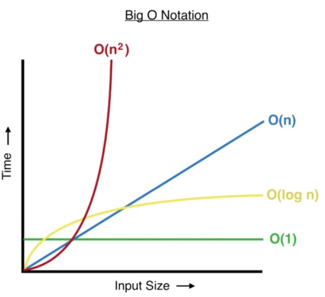
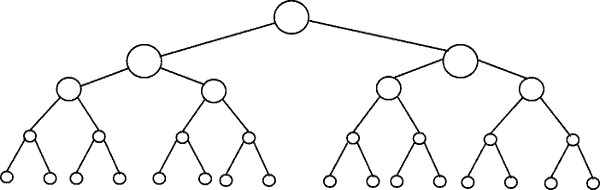
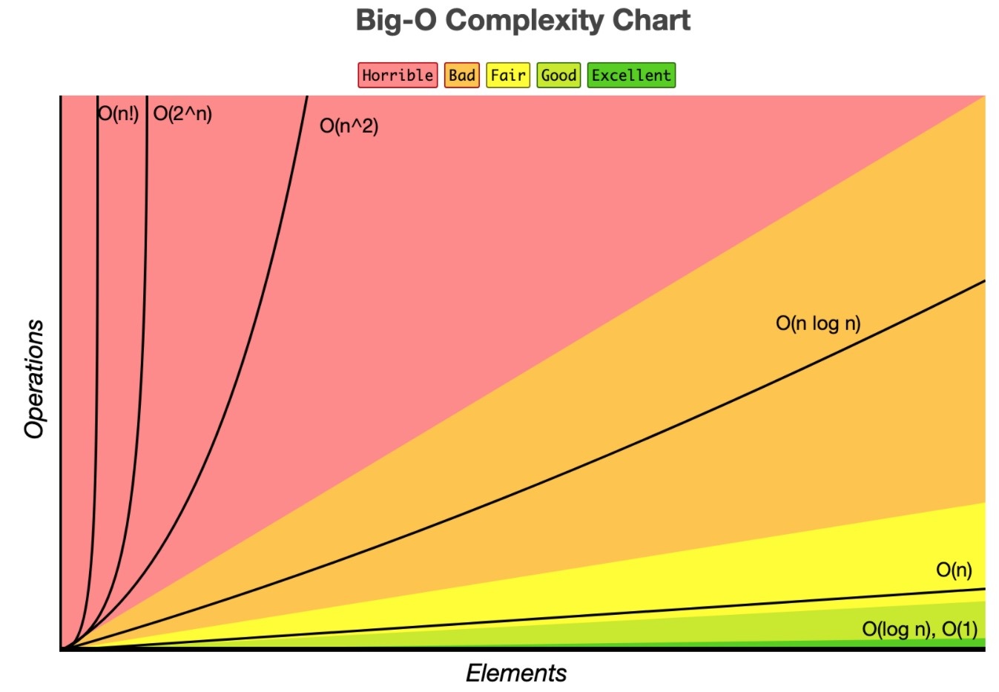
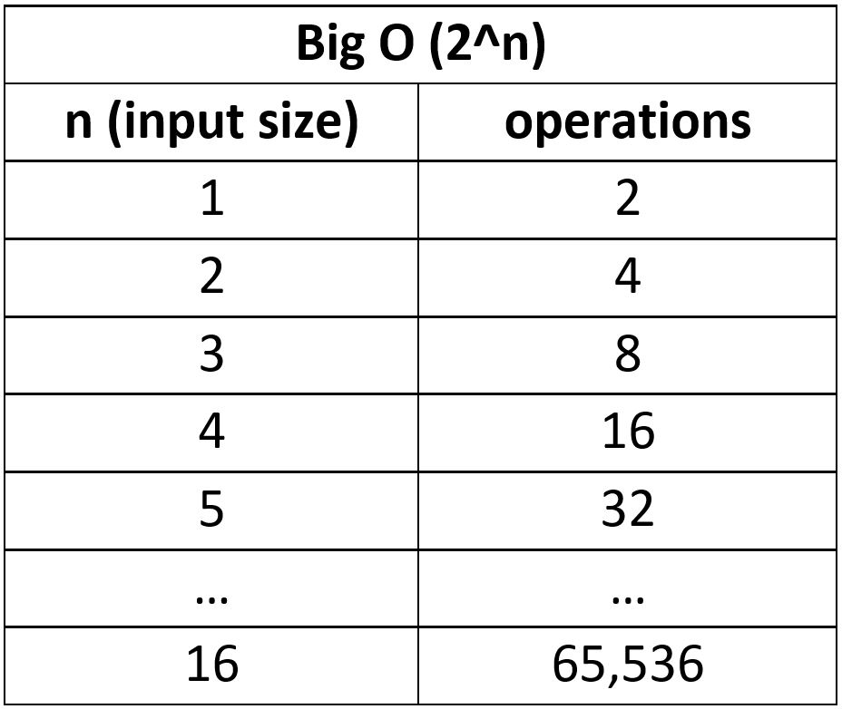
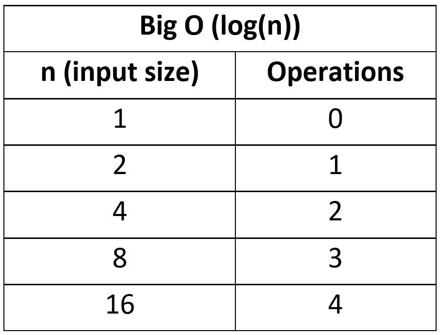
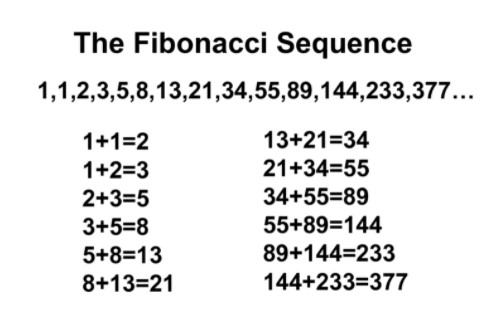
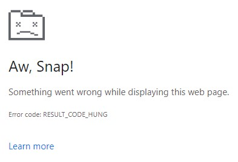
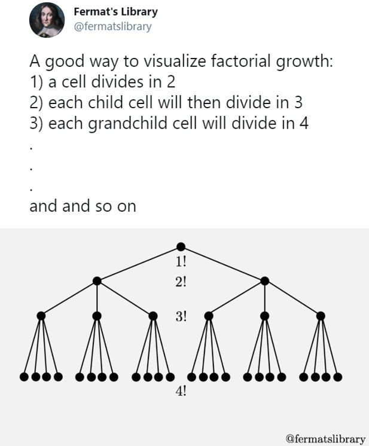
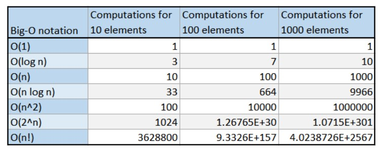

import FigureWithCaption from "../../components/FigureWithCaption.js"

## Intro

Big O Notation is a very important computer science concept that all developers should understand, because If you don’t, you could end up writing some very inefficient functions at the wrong time, resulting in a poor performing program.

Big O Notation is something that is taught to computer science students, so chances are, if you’re a self-taught developer (like myself), it’s something you won’t have come across in web dev courses.

Now, Big O Notation can look a little intimidating and mathsy, but don’t worry, I’ll fully explain everything as we go and use clear examples so anybody can follow along. My aim for this article was to include everything a beginner would ever need to know about Big O Notation in one place, explained clearly.

In this article, we'll cover:

1. [What is Big O Notation and why is it useful?](#1)
1. [Example 1 – Constant time complexity: Big O(1)](#2)
1. [What is space complexity and time complexity?](#3)
1. [Example 2 – Linear time complexity: Big O(n)](#4)
1. [The graph of Big O notation](#5)
1. [Example 3 – Quadratic time complexity: Big O(n2)](#6)
1. [Back to the graph of Big O Notation](#7)
1. [Using Big O to compare algorithms](#8)
1. [But What About Built in Methods?](#9)
1. [Example 4 – Logarithmic time complexity: Big O(log(n))](#10)
1. [The bigger graph of Big O Notation](#11)
1. [Example 5 – Linearithmic time complexity: Big O(n log(n))](#12)
1. [Example 6 – Exponential time complexity: Big O(2n)](#13)
1. [Example 7 – Factorial time complexity: Big O(n!)](#14)
1. [Summary - Big O comparison table](#15)
1. [What’s the best JavaScript data structures and algorithms course?](#16)

I also made an [animated YouTube video](https://www.youtube.com/watch?v=lWldunWaLPs&t=325s&ab_channel=DoableDanny) for those that like video. If you enjoy the video, consider subscribing to [my channel](https://www.youtube.com/channel/UC0URylW_U4i26wN231yRqvA?sub_confirmation=1) - it'd be much appreciated.

_Disclosure: I’m always looking for things I think my readers will value. This article contains some affilate links to products that I have used and found helpful. If you purchase these, then I may see a share of the revenue. This comes at no extra cost to you._

<h2 id="1">What is Big O Notation and why is it useful?</h2>

Big O Notation is used in computer science to analyse the performance of an algorithm (an algorithm is just another name for a function – a set of instructions).

Big O specifically looks at the worst-case scenario of an algorithm – looking at the big picture. It tells us how long a function will take to execute (execution time) or how much space (e.g., in memory or disk) the function takes up as the input to that function approaches infinity (i.e. becomes very large).

Now, there are tools that can measure the execution time of an algorithm; however, the execution time will depend on the computer being used and the size of the inputs. This might be useful, but it doesn’t give us an idea of the _scalability_ of an algorithm.

The scalability of an algorithm refers to how much the algorithm slows down when we increase the size of the input to the algorithm.

For example, the algorithm may compute very quicky with an input array of length of 10. But what if the array length increased to 1000. How much longer will the algorithm take? This is where Big O Notation comes in very handy.

Don’t worry if things don’t make perfect sense to you so far. I’ll now walk you through some Big O Notation Example problems. Things will start to become clear!

<h2 id="2">Example 1 – Constant time complexity: Big O(1)</h2>

Here is a simple function called timesTwo:

```js
function timesTwo(num) {
  return 2 * num
}

let result = timesTwo(5) // 10
let result2 = timesTwo(2000) // 4000
```

It takes a whole number as an argument, and then just returns 2 times that number. So, if we pass in 5, then it will return 2 times 5, which is 10. And if we pass in 2000, then it will return 2 times 2000, which is 4000.

Now, which of these do you think will take the longest to compute? 2 \* 5 or 2 \* 2000? You wouldn’t have been stupid to have guessed 2 \* 2000 takes longer than 2 \* 5, but you’d be wrong!

In JavaScript, both take the same time. It’s just one operation (one multiplication). 20 \* 2 billion takes as long as 2 \* 3.

No matter what number we input into this function, it takes the same amount of time to compute. The algorithm is said to have a Big O(1) – pronounced “Big O of 1” - which is known as **constant time complexity**; no matter the size of the input, the function takes the same amount of time to compute.

But say we had a function with two operations, like the one below, where we input a number, multiply it by 4, save it to a variable called `total`, and return `total` times 3. So, all together, we have two multiplications in this function.

```js
function manyTimes(num) {
  let total = 4 * num

  return total * 3
}
```

Now, we wouldn’t say this function has a Big O of 2, it’d still just be a Big O of 1 because we’re looking at the big picture (1 operation isn’t gonna take significantly longer than 2 for a computer so we can just ignore it). No matter what we put in, the number of operations won’t increase in the function, it’s constant time.

<h2 id="3">What is space complexity and time complexity?</h2>

Before we go through another example, let’s get some definitions down:

**“Time complexity”: analysing how the runtime of an algorithm changes as the input increases.**

The algorithms we went through above had constant Big O time complexity because the runtime of the algorithms did not increase as the input size increased.

**“Space complexity” (aka auxiliary space complexity): The space required by the algorithm, not including inputs.**

The algorithms above had constant space complexity. The function `timesTwo` didn’t store any values in memory. `manyTimes` only stored one value in memory: `total`. No matter what the input, both of these algorithms have a constant space complexity because if we increase the size of the input, the space in memory remains the same.

Constant time and space complexity is as good as an algorithm can get, but it’s not always possible.

There is usually a trade-off between space complexity and time complexity: to increase the speed of an algorithm, you’ll likely need to store more variables in memory.

In this article, I’ll mostly focus on time complexity as that is usually what you’ll be most concerned with.

Now for another example…

<h2 id="4">Example 2 – Linear time complexity: Big O(n)</h2>

Below, we have a function called `reverseArray`, which loops over the input array starting at the last item, and builds up a new array which ends up being the input array reversed.

```js
function reverseArray(arr) {
  let newArr = []
  for (let i = arr.length - 1; i >= 0; i--) {
    newArr.push(arr[i])
  }

  return newArr
}

const reversedArray1 = reverseArray([1, 2, 3]) // [3, 2, 1]
const reversedArray2 = reverseArray([1, 2, 3, 4, 5, 6]) // [6, 5, 4, 3, 2, 1]
```

If we input an array with the elements 1, 2, 3, it returns `[3,2,1]`. And if we input `[1, 2 , 3 ,4 ,5, 6]`, it returns `[6, 5, 4, 3, 2, 1]`. Now, which of these do you think will take longer to compute – if we input an array 3 items long, or an array 6 items long?

This time, you are correct if you said the longer array of 6 elements. And that is because in this algorithm, we are looping over each element in the array, and then pushing that element onto a new array. That’s 2 extra operations for every extra element we have in the array.

So, if we pass in the array with 3 elements, there will be 6 operations in total. If we pass in an array of 6 elements, there will be 12 operations. If we double the array length, we double the number of operations.

This technically has a Big O(2n), where n is the length of the input. But remember, Big O looks at the big picture – the worst-case scenario where the input size approaches infinity. If we pass in an array infinity items long, then here, there would be 2 \* infinity operations. 2 \* infinity is still just infinity – it’s just a very large number, so we can just ignore the 2 because in the grand scheme of things, that two isn’t all that significant.

We can describe this function as having a Big O(n) – “A Big O of n” - which is known as linear time complexity.

You have now seen two different Big O notations, Big O(1) and Big O(n). Now would be a good time to show you the graph of Big O Notation and compare these Big Os.

<h2 id="5">The graph of Big O Notation</h2>

Focus your attention on the green line which represents a Big O(1) and the two functions from [example 1](#2) (`timesTwo` and `manyTimes`).



You can clearly see that as we increase the input size, the time taken to compute does not increase – it remains constant. This is not the case for other Big Os which increase in computation time as we increase the input size.

A Big O(1) is as good as it gets for algorithms. It’s like, algorithm paradise. But many times, we can’t achieve this.

The best Big O we can achieve when reversing an array is Big O(n), where we can see from the blue line, the execution time (or number of operations the function has to do) increases linearly with input size.

Usually an algorithm with linear time (blue line) is good - in most cases it will be absolutely fine. Whilst not as efficient as constant time (green line), it is often the best we can do, and it’s a lot better than big O(n^2) (red line) which we’ll look at next.

<h2 id="6">Example 3 – Quadratic time complexity: Big O(n^2)</h2>

Here’s a function called `multiplyAll` which accepts two arrays. It first makes sure they’re of equal length; if they are then it will continue down and multiply every number in the first array with every number in the second array and return the sum of all these products.

```js
function multiplyAll(arr1, arr2) {
  if (arr1.length !== arr2.length) return undefined

  let total = 0
  for (let i of arr1) {
    for (let j of arr2) {
      total += i * j
    }
  }

  return total
}

let result1 = multiplyAll([1, 2], [5, 6]) // 33
let result2 = multiplyAll([1, 2, 3, 4], [5, 3, 1, 8]) // 170
```

It does this using two for-loops. The first for-loop loops over the first array. Then inside this for-loop, we have a second, nested for loop, which loops over every item in the second array. So, for every item we loop over in the first array, we have to loop over every item in the second array.

If we pass in two arrays of length two (`[1, 2]` and `[5, 6]`), then for the first run through the outer loop, i will point at 1. It will then loop through the second array starting with 5, and 1 \* 5 will be added to the total. It will then go to the second element in the second array and do 1 \* 6 and add it to the total.

Then we get to the end of that loop, so we go back to the outer loop, and increment to the second element which is 2. We then do 2 \* 5 and add it to the total, then, finally, 2 \* 6 and add it to the total.

As we can see, for every item in the first array, we have to loop over every single item in the second array and perform a multiplication. So the total number of operations will be the length of the first array, which is n, times the length of the second array, which is also n, because we checked to make sure they are the same length. This results in a Big O(n^2) - quadratic time complexity.

If you are incredibly astute, you may have noticed that technically this algorithm would have a Big O(3 \* n^2), because for every item in `arr1`, we:

- loop over every item in `arr2` (n^2 operations)
- multiply two numbers (another n^2 operations)
- add to the total (another n^2 operations).

Therefore, the total number of operations is n^2 + n^2 + n^2 which equals 3n^2 .

But remember again, with Big O Notation, we are looking at the big picture, the worst-case scenario as the input length approaches infinity, and 3 times infinity is still infinity – a humungous number. So as the input size grows, this 3 becomes insignificant in the grand scheme of things and we simplify to say that this algorithm has a Big O(n^2) - “quadratic time-complexity”.

Let’s reintroduce the graph of Big O Notation and discuss quadratic time complexity…

<h2 id="7">Back to the graph of Big O Notation</h2>


Looking at the red line representing quadratic time, we can see that as the input size increases, the number of operations grow at an ever-increasing/accelerating rate. The gradient, or steepness, of this line becomes steeper and steeper as we increase input size.

With small input size, this is no big deal - as we can see from the graph, all the Big Os will result in similar completion times. This means for small inputs, you could just choose the algorithm that was easiest to read or understand.

But as the input size grows, the efficiency of the algorithm can become critical to the runtime of a program. This is where it’s important to understand the Big O of your algorithms.

**A good rule-of-thumb:** If possible, avoid nested for-loops if the input size is large. Use two separate loops instead.

<h2 id="8">Using Big O to compare algorithms</h2>

Let’s talk through a scenario that you could encounter. Say you need to pull in some data from an API or a database. An array of 1000 users comes back and you now need to sort this array into alphabetical order e.g. [Adam, Andrew, Becky, …etc.].

If we use a sorting algorithm with linear time, a Big O(n), where n is the input size, then there will be around 1000 operations.

But if you use a sorting algorithm with a Big O(n^2), then there will be roughly 1000 \* 1000 operations. That’s 1 MILLION OPERATIONS!

That’s 999,000 more operations, just because you used a bad algorithm at an inappropriate time. This is why it’s important to understand Big O notation!

<h2 id="9">But What About Built in Methods?</h2>

So far, we’ve only looked at custom functions, but it’s important to realise Big O also applies to built-in JavaScript functions, such as the array methods push, pop, unshift and shift.

In the code snippet below, we have a 4-item array, `arr`. If we push 5 onto the end of this array, then all we have to do is create a new place at the end of the array, give it an index, and put the value of 5 there. It doesn’t matter what the length of the array is, it will always be constant time - Big O(1). The number of operations is always the same – constant.

```js
let arr = [1, 2, 3, 4]

// Adding and removing to the end of the array => Big (1) - constant time
arr.push(5) // [1, 2, 3, 4, 5]
arr.pop() // [1, 2, 3]
```

But say we want to add 0 to the front of the array with `unshift(0)`. We would have to re-index every item in the array, as the first index (index 0) would now point to our newly added value (0). We’d have to add 1 to every index in the array as the old first item is now the second, the old second index is now the third and so on…

So unshifting and shifting have linear time complexities - Big O(n) - because the longer the input array, the more items have to be re-indexed.

```js
// Adding and removing to front of array => Big O(n) - linear time
arr.unshift(0) // [0, 1, 2, 3, 4]
arr.shift() // [2, 3, 4]
```

<h2 id="10">Example 4 – Logarithmic time complexity: Big O(log(n))</h2>

### What are Logarithms?

Logarithms are a mathematical concept that many of you reading this article will have either forgotten from school, or have never studied at all. Let me briefly explain what a logarithm is…

First, here is the definition of “logarithm” from Oxford Languages:

“a quantity representing the power to which a fixed number (the base) must be raised to produce a given number.”

Let’s now walk through an example to make things clear:

Find the value of x:

Log<sub>2</sub>(16) = x

In this example, 2 is known as the “base” of the logarithm. I remember it’s called the base because it’s at the base (bottom) of the word “log”. From our definition, we know that we need to find what power to raise the base by in order to get 16.

So, we can rewrite our equation, Log<sub>2</sub>(16) = x, to the following:

2<sup>x</sup> = 16

From this, we can see that x = 4, because 2<sup>4</sup> = 16:

2<sup>4</sup> = 2 \* 2 \* 2 \* 2 = 16

Therefore:

Log<sub>2</sub>(16) = 4

Once again, a logarithm is the power to which a number (the base) must be raised in order to get some other number

**Please go through the above example until you get it. Writing it out is definitely a good idea! And please don’t use the excuse “I’m not good at maths”. Nobody is just “good” at maths, it requires mental effort!**

**N.B.** In mathematics, if the base isn’t specified, e.g. log(20), then the base is usually assumed to be 10. However, in computer science, if the base is unspecified, it is assumed to be 2, aka. “Binary Logarithm”. Remember not to fall for this trap when using a calculator!!

### A logarithmic algorithm

Now you understand what a logarithm is, let’s introduce a very simple algorithm with a “Big O of log n”. Recall that n is the input size to the algorithm/function.

```js
function logTime(arr) {
  let numberOfLoops = 0
  for (let i = 1; i < arr.length; i *= 2) {
    numberOfLoops++
  }

  return numberOfLoops
}

let loopsA = logTime([1]) // 0 loops
let loopsB = logTime([1, 2]) // 1 loop
let loopsC = logTime([1, 2, 3, 4]) // 2 loops
let loopsD = logTime([1, 2, 3, 4, 5, 6, 7, 8]) // 3 loops
let loopsE = logTime(Array(16)) // 4 loops
```

Notice that the post-operation of the for-loop multiplies the current value of i by 2, so i goes from 1 to 2 to 4 to 8 to 16 to 32 …

In other words, it doubles with each loop.

As we can see from the examples (loopsA, loopsB, etc…), every time we double the length of the input array, the number of operations increases linearly (by 1 each time).

In simple terms, the number of operations doesn’t increase very much when we increase the size of the input.

Stating it mathematically:

For the loopsA example, the input length is 1 ([1]), so:

log(1) = 0 operations (or 0 loops)

For the loopsE example, the input length is 16:

Log(16) = 4 operations

To conclude this example, if we increase the input length from 1 to 16, the number of operations (loops) only increases from 0 to 4. To increase the number of operations by 1, we have to double the size of the input.

Back to our graph of Big O Notation and looking at the yellow line, you can see that logarithmic time complexity is the second best performing Big O. It’s better than linear time (blue), but not quite as good as constant time (green).


### Visualising logarithmic time with the balanced binary tree

A great way to visualise log(n) time is via a “balanced binary tree”:



The number of nodes double with each single step down the binary tree.

[The Binary Search algorithm](https://www.doabledanny.com/binary-search-javascript) has a Big O (log(n)). If we input a sorted array of length 16 (i.e. the bottom level in the tree above), it would only take 4 steps (count to the top tree node) to find the number we were looking for.

Algorithms with logarithmic time are often “divide and conquer” style, meaning the data set is cut down/reduced upon each loop iteration. The algorithm has less data to deal with on each loop and so can find or sort things quickly.

<h2 id="11">The bigger graph of Big O Notation</h2>

So far, I’ve shown you four Big O examples, but there are a few more that are good to know! The graph below is a nice way of comparing the different Big O complexities, from “Horrible” (red section) to “Excellent” (green).



<h2 id="12">Example 5 – Linearithmic time complexity: Big O(n log(n))</h2>

Linearithmic time is simply a combination of linear time (n) and logarithmic time (log(n)).

n \* log(n) = n log(n)

You can easily spot if an algorithm has n log(n) time. Look for an outer loop that iterates through a list (n operations). Then look to see if there is an inner loop; If the inner loop is cutting down/reducing the data set on each iteration (log(n) operations), then the overall algorithm has a Big O (n log(n)).

Here’s a simple example of an algorithm with linearithmic time complexity:

```js
function linearithmic(n) {
  for (let i = 0; i < n; i++) {
    for (let j = 1; j < n; j = j * 2) {
      console.log("Hello")
    }
  }
}
```

The outer loop iterates through 0 to n linearly (n) and the inner loop is log(n) because j is getting doubled on each loop.

Looking at it another way, if we double the size of our input, n, the outer loop will have twice as many iterations, whereas the inner loop would only have 1 extra iteration.

Linearithmic time is worse than linear time, O(n), but better than quadratic time, O(n^2). It’s kinda like the worst of the best.

A common, practical example of a linearithmic time complexity algorithm is the sorting algorithm [Merge Sort](https://www.doabledanny.com/merge-sort-javascript) - a divide and conquer style algorithm.

<h2 id="13">Example 6 – Exponential time complexity: Big O(2^n)</h2>

An algorithm with exponential time complexity is one where the number of operations doubles every time we increase the input by one.

For example:

- If the input size is 1, then 2^1 = 2 operations
- If the input size is 2, then 2^2 = 4 operations



Exponential time is the opposite of logarithmic time. With log time, every time we double the input, the number of operations increases by just 1.



As you can see, the number of operations, and hence the run-time, can quickly get out of hand with exponential complexity algorithms.

Now for an example:

A Fibonacci number is the sum of its previous 2 neighbours.



With the following function, we pass in an index number to return the n<sup>th</sup> Fibonacci number in the sequence, using recursion. E.g. if we want to find the 4th number in the sequence, we say `fibonacci(4)` which returns 3.

Note: This is not the optimal solution to this problem (the Big O can be improved) but it’s a nice example to show exponential time.

```js
function fibonacci(num) {
  // Base cases
  if (num === 0) return 0
  else if (num === 1) return 1

  // Recursive part
  return fibonacci(num - 1) + fibonacci(num - 2)
}

fibonacci(1) // 1
fibonacci(2) // 1
fibonacci(3) // 2
fibonacci(4) // 3
fibonacci(5) // 5
```

Basically, our Fibonacci function will continue to recursively call itself, creating more and more branches until it hits the base case, from which it will start summing up each branch’s return values bottom up, until it finally sums them all up and returns a final integer.

The tree below shows all of the recursive function calls. At each step, the amount of calculations double!

<FigureWithCaption
  src={props.images[6].publicURL}
  alt="All of the recursive function calls for the fibonacci function"
  caption="Diagram from  "
  a_text="Stephen Grider’s “The Coding Interview Bootcamp“ course on Udemy.com"
  href="https://ad.admitad.com/g/05dgete24sfa55577a70b3e3b7aadc/?ulp=https%3A%2F%2Fwww.udemy.com%2Fcourse%2Fcoding-interview-bootcamp-algorithms-and-data-structure%2F"
/>

Exponential time algorithms scale very poorly, so they are best to be avoided (if possible). But this is not the worst Big O; next I bring you factorial time!

<h2 id="14">Example 7 – Factorial time complexity: Big O(n!)</h2>

And finally, the worst kind of algorithm – to be avoided at ALL costs: factorial growth.

A factorial is just the product of every number up to that number. So 5! (“five factorial”) is 1 x 2 x 3 x 4 x 5 = 120.

6! = 1 x 2 x 3 x 4 x 5 x 6 = 720.

As you can see already, things can quickly get out of hand!

### The Traveling Salesman Problem

The usual example of an algorithm with factorial growth is the Travelling Salesman Problem: Given a list of cities and the distances between each pair of cities, what is the shortest possible route that visits each city exactly once and returns to the origin city? The brute force method would be to check every possible configuration between each city, which would be a factorial, and quickly get crazy!

Say we have 3 cities: A, B and C.

How many permutations are there? Permutations is a maths term meaning how many ways can we order a set of items.

- A -> B -> C
- A -> C -> B
- B -> A -> C
- B -> C -> A
- C -> A -> B
- C -> B -> A

With 3 cities, we have 3! permutations. That’s 1 x 2 x 3 = 6 permutations.

Why? If we have three possible starting points, then for each starting point, we have two possible routes to the final destination.

What if our salesman needs to visit 4 cities? A, B, C and D.

We’d have 4! = 4 x 3 x 2 x 1 = 24 permutations.

Why? If we have four possible starting points, then for each starting point, we have three possible routes, and for each of those points we have two possible routes, and the final stop - So:

`4 * 3 * 2 * 1`

<FigureWithCaption
  src={props.images[7].publicURL}
  alt="The shortest route between cities for the Traveling Salesman Problem"
  caption="The Travelling Salesman Problem  - source: "
  a_text="coengoedegebure.com"
  href="https://www.coengoedegebure.com/understanding-big-o-notation/"
/>

Instead of confusing the life out of you, I’ll instead demonstrate factorial complexity with a short recursive function:

### Recursive factorial algorithm

_Note: this is definitely not the optimal solution to this problem; it’s just a short algorithm that demonstrates factorial time._

```js
function factorial(n) {
  let num = n

  if (n === 0) return 1

  for (let i = 0; i < n; i++) {
    num = n * factorial(n - 1)
  }

  return num
}
```

Every digit in our factorial will run its own function until it reaches 0, with each recursive layer adding its product to our original number. So, 3 is multiplied by 2, that runs the function to be multiplied by 1, that runs it again to be stopped at 0, returning 6. Actually, this is pretty confusing! I had to go over this function many times (very slowly) with a debugger just to get a feel for it, so don’t worry if you don’t fully understand it.

I measured how long it took for the factorial function to run with the following code:

```js
const t0 = performance.now()
// Add function here...
const t1 = performance.now()
console.log("The function took: " + (t1 - t0) + " milliseconds.")
```

Here are the results:

```js
factorial(1) // 0.02 ms
factorial(2) // 0.04 ms
factorial(10) // 42.08 ms
factorial(12) // 5231.54 ms => 5 seconds
factorial(13) // 69565.01 ms => 70 SECONDS!
factorial(14) // SMOKE & FLAMES!!
```

As you can see, factorial growth grows VERY quickly. An input of just 13 took Google Chrome 70 seconds to load the page. It couldn’t even handle an input of 14:



### Visualising factorial growth

Here’s a good way to visualise factorial growth, courtesy of [@fermatslibrary](https://twitter.com/fermatslibrary):



<h2 id="15">Summary - Big O comparison table</h2>

The Big O of an algorithm tells us about the worst-case scenario: how will the algorithm perform as the size of the input approaches infinity (becomes very large).

Here’s a table to summarise our discussion on the relationship between input size, the Big O of the algorithm, and the resulting number of operations:



<h2 id="16">
  What’s the best JavaScript data structures and algorithms course?
</h2>

I can attribute almost all of my knowledge of algorithms and data structures to one outstanding course:

[JavaScript Algorithms and Data Structures Masterclass by Colt Steele](https://ad.admitad.com/g/05dgete24sfa55577a70b3e3b7aadc/?ulp=https%3A%2F%2Fwww.udemy.com%2Fcourse%2Fjs-algorithms-and-data-structures-masterclass%2F)

Colt is a phenomenal teacher. He has a way of breaking things down and making them easy to understand. This course will get you prepared for any job interview algorithm questions and make you a MUCH better problem solver and programmer. Probably the best 14 quid I’ve ever spent!

And if you prefer books:

[JavaScript Data Structures and Algorithms: An Introduction to Understanding and Implementing Core Data Structure and Algorithm Fundamentals by Sammie Bae](https://www.amazon.co.uk/gp/product/1484239873/ref=as_li_qf_asin_il_tl?ie=UTF8&tag=doabledanny-21&creative=6738&linkCode=as2&creativeASIN=1484239873&linkId=445fcf63f9402faf2b2b0ef6c5c2f5d8)

I’ve only skimmed through a few chapters of this as I personally prefer video for learning algorithms, but it covers everything you’ll need to master the topic.

If you enjoyed this post, subscribe to [my newsletter](https://www.doabledanny.com/newsletter-signup/). I write on topics such as algorithms, UI design and freelancing. I’ll email you once per week with my latest article and bonus tips and tricks. I like to dive deeply into topics to give you all the information you need in one place!

You can also find me on:

- [Twitter](https://twitter.com/doabledanny)
- [YouTube](https://www.youtube.com/channel/UC0URylW_U4i26wN231yRqvA?sub_confirmation=1)

Thanks for reading,

Have a great day!
