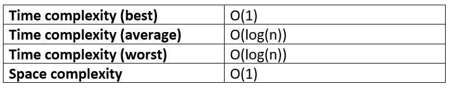
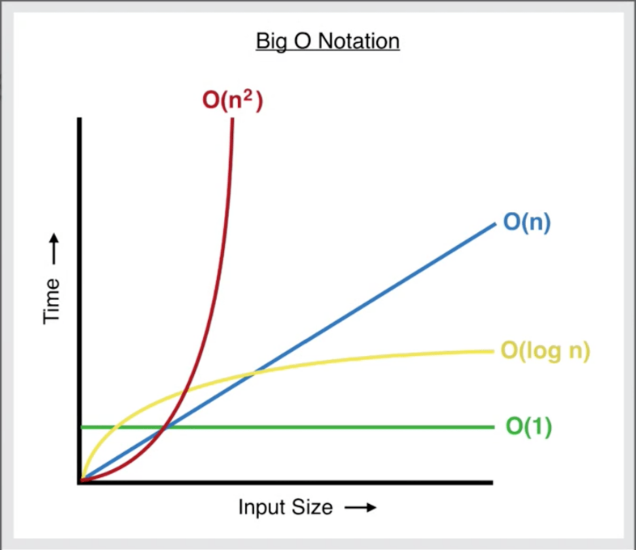

import FigureWithCaption from "../../components/FigureWithCaption.js"

The Binary Search algorithm is used to search for any element in a _sorted_ array. If the element is found, it returns the element’s index. If not, it returns -1.

Binary Search is a simple and intuitive algorithm that also has great performance; it can find the value fast – much faster than the [Linear Search algorithm](https://www.doabledanny.com/linear-search-in-javascript) (e.g. the built in method, `indexOf()`) when the array is large.

_Disclosure: I’m always looking for things I think my readers will value. This article contains some affilate links to products that I have used and found helpful. If you purchase these, then I may see a share of the revenue. This comes at no extra cost to you._

## Binary Search Steps

Binary search is a “divide and conquer” type algorithm, meaning it divides the array roughly in half every time that it checks whether a value is the one we are looking for.

Why? It means that upon every check, the data the algorithm has to work with gets halved upon each comparison, allowing the value to be found much faster.

See the gif below demonstrating Binary and Linear Search. The target is the value 9.

<FigureWithCaption
  src={props.images[0].publicURL}
  alt="Binary search steps gif"
  caption="Source: "
  a_text="codesdope.com"
  href="https://www.codesdope.com/course/algorithms-binary-search/"
/>

With Linear Search, if the target is at the end of the array, every single element has to be looped over and checked if it equals the target.

With Binary Search we:

1. Start in the middle and check if the target is greater or less than that middle value.
2. If the target is greater than the middle value, we will next look at the second half of the array (ignore the left side)
3. If the target is smaller, we look at the first half of the array (ignore the right side).
4. We pick the middle of that half and check if it’s greater or less than our target.
5. Repeat this process until we find our target.

Example: [1, 2, 5, 9] with target= 5

1. Start at middle (even length array, so middle – 1): [1, **2**, 5, 9]
2. Is 5 greater than, smaller than, or equal to 2?
3. Greater, so 5 must be in the right half of the array: [5, 9].
4. Pick new middle: [**5**, 9]
5. Is 5 greater than, smaller than, or equal to 5?
6. Equal! Return the index of that element, 2.

So, with Binary Search, the data set keeps getting divided in half until we find our target. This tremendously decreases time complexity!

## Binary Search in JavaScript

Now we understand the logic of Binary Search, let’s implement it in JavaScript.

```js
function binarySearch(arr, target) {
  let start = 0
  let end = arr.length - 1

  while (start <= end) {
    let middle = Math.floor((start + end) / 2)

    if (arr[middle] < target) {
      // Search the right half
      start = middle + 1
    } else if (arr[middle] > target) {
      // Search the left half
      end = middle - 1
    } else if (arr[middle] === target) {
      // Found target
      return middle
    }
  }

  // Target not found
  return -1
}

console.log(binarySearch([1, 2, 3, 4], 1)) // 1
console.log(binarySearch([1, 2, 3, 5, 9], 4)) // -1
console.log(binarySearch([1, 2, 3, 4, 5], 5)) // 4
console.log(binarySearch([0, 3], 3)) // 1
```

Here’s what’s going on:

1. The function accepts a sorted array and a target value.
2. Create a left pointer at the first element of the array, and a right pointer at the last element of the array.
3. While the left pointer comes before the right pointer:

- Create a pointer in the middle.
- If the target is greater than the middle element, move the left pointer up.
- If the target is less than the middle element, move the right pointer down.
- If the target equals the middle, return the index.

4. If the value isn’t found, return -1.

On each iteration of the while loop, we are effectively discarding half of the array, until we find our value or until we’ve exhausted the array.

## Binary Search time complexity

### Best case complexity of Binary Search

The best case complexity of Binary Search occurs when the first comparison is correct (the target value is in the middle of the input array).

This means that regardless of the size of the array, we’ll always get the result in constant time. Therefore, the best case time complexity is O(1) - constant time.

### Worst case complexity of Binary Search

The worst case complexity of Binary Search occurs when the target value is at the beginning or end of the array.

See the image below: if we have an array 32 elements long and our target is 32, then the array will be divided five times until we find 32. So, the [Big O complexity](https://www.doabledanny.com/big-o-notation-in-javascript) of binary search is O(log(n)) – logarithmic time complexity: log(32) = 5.

<FigureWithCaption
  src={props.images[1].publicURL}
  alt="Binary search steps"
  caption="32 elements = 5 “steps” at worst case. Image Source: "
  a_text="JavaScript Algorithms and Data Structures Masterclass by Colt Steele"
  href="https://ad.admitad.com/g/05dgete24sfa55577a70b3e3b7aadc/?ulp=https%3A%2F%2Fwww.udemy.com%2Fcourse%2Fjs-algorithms-and-data-structures-masterclass%2F"
/>

### Average case complexity of Binary Search

The average case is also of O(log(n)).

## Space complexity of Binary Search

Binary Search requires three pointers to elements (start, middle and end), regardless of the size of the array. Therefore the space complexity of Binary Search is O(1) – constant space.

## Performance summary table



## Linear Search vs Binary Search

Binary Search has much better time complexity than [Linear Search](https://www.doabledanny.com/linear-search-in-javascript), which has a Big O(n) – linear time.

From the graph of Big O Notation below, we can see that with larger input arrays, Binary Search (yellow line) will take a lot less time to compute than Linear Search (blue line).



**It should be noted that Binary Search only works on sorted arrays.** The sorting step, if using an efficient algorithm, will have a time complexity of O(nlog(n)). Since Linear Search can work on sorted arrays, if the array is small, or if we need to search the array just once, then Linear Search might be a better choice.

Binary Search is a great choice if we have to make multiple searches on large arrays. For example, if we have a large 10,000 element array, Linear Search would require 10,000 comparisons at worst case. Binary Search would require log(10,000) = 14 comparisons. That’s a lot less!

## If you Want to Master Algorithms...

If you want to further your knowledge of algorithms and data structures, check out: [JavaScript Algorithms and Data Structures Masterclass by Colt Steele](https://ad.admitad.com/g/05dgete24sfa55577a70b3e3b7aadc/?ulp=https%3A%2F%2Fwww.udemy.com%2Fcourse%2Fjs-algorithms-and-data-structures-masterclass%2F). It’s the best Udemy course I’ve ever taken 👌.

If you enjoyed this article, you can say thanks by subscribing to my [YouTube channel](https://www.youtube.com/channel/UC0URylW_U4i26wN231yRqvA) or signing up to [my blog](https://www.doabledanny.com/blog/) to be notified of new posts 🙏

Also, feel free to connect with me on [Twitter](https://twitter.com/DoableDanny)!

Thanks for reading!
