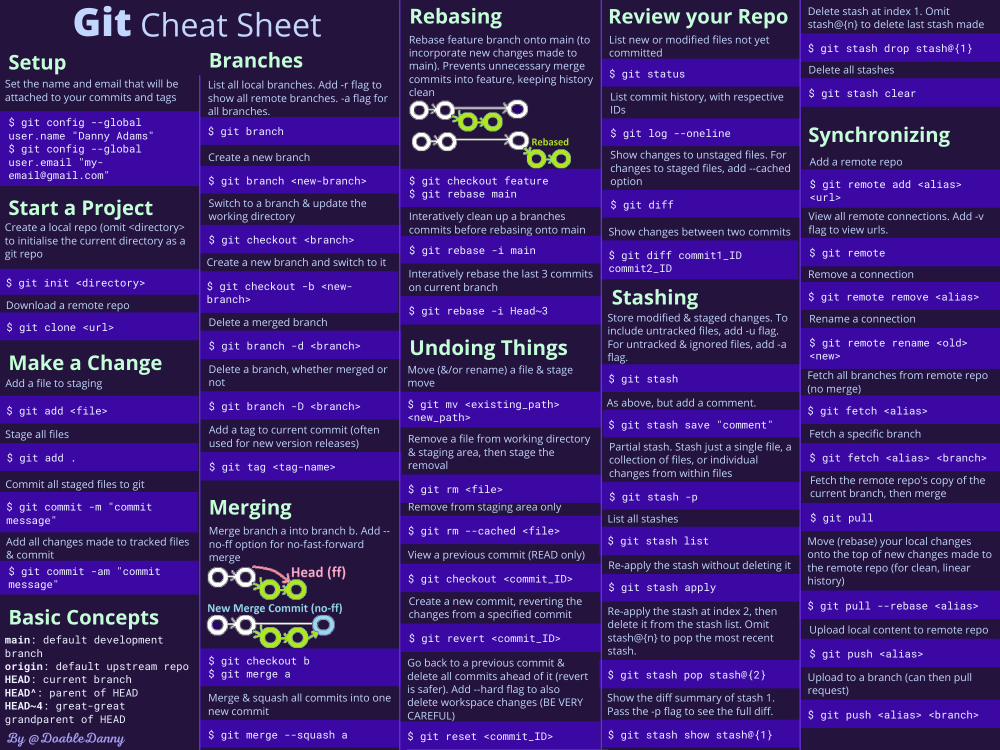
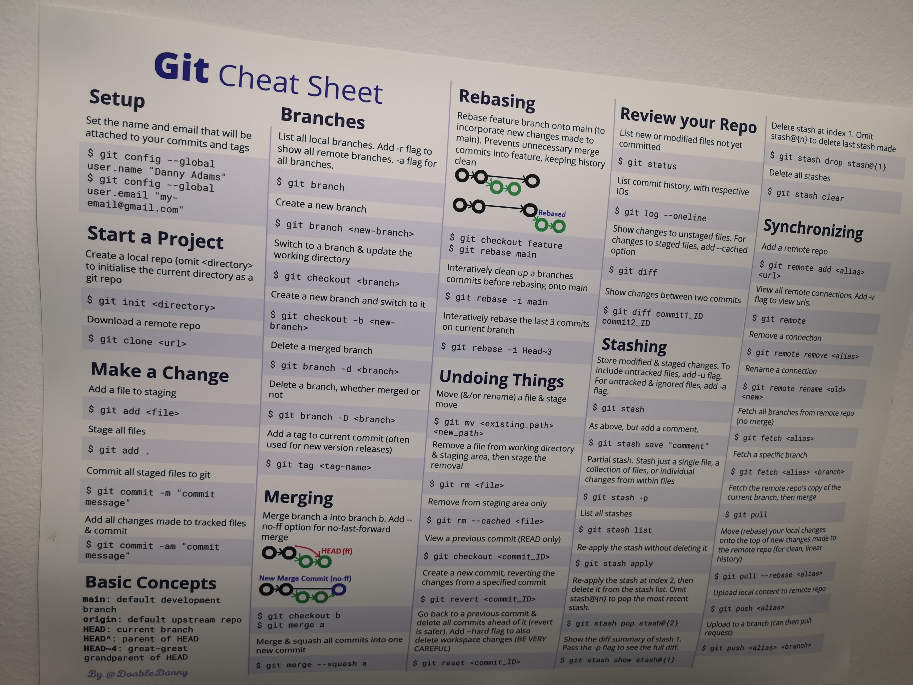

I was tired of looking up the same common Git commands - so I made a cheat sheet that I could print and put on my office wall.

This cheat sheet contains 50 commonly used Git commands on the following topics:

- Setting up Git
- Starting a project
- Making a change
- Basic concepts
- Branching
- Merging
- Rebasing
- Undoing things
- Reviewing your repo
- Stashing
- Synchronising local and remote repositories

Available in Light Mode and Dark Mode to suit any office wall!

Light mode:

Dark mode:

It comes in thick durable A3 paper, with a matte light-absorbing finish.

I have the light mode version on my office wall:

[Order your Git cheat sheet poster here](https://doabledanny.gumroad.com/l/git-cheat-sheet-poster).

Cheers!
