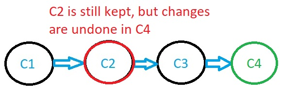
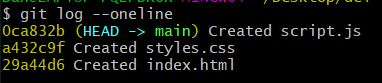
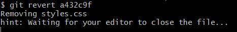
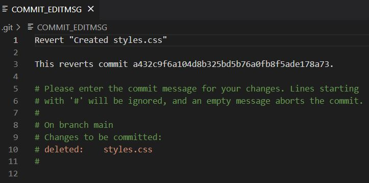
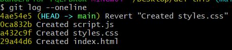
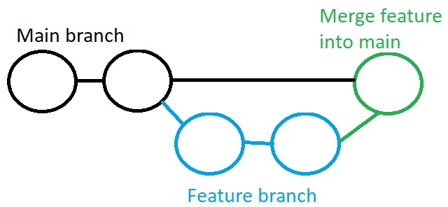

In this article, I give my workflows for almost everything that you will ever need to do with Git:

- Basic Git commands
- Setting up a remote repository and pushing to Github
- Undoing things in Git
- Ignoring things in Git
- Git branches for new features
- Working solo vs in a team
- Forking and contributing to open source

## Basic Git Commands

These are the commands you will use in every single project.

1. Initialise Git

`git init <project-name>`

2. Add files to the staging area

To add all files:

`git add .`

To add all files in a specific folder:

`git add src/posts/Git_Commands_Post`

To add one file:

`git add styles.css`

To add all files with a specific extension (in this case, all html files):

`git add *.html`

3. Check the staging area is correct before committing to Git

`git status`

4. Committing the changes to Git

`git commit -m "A short message describing the changes here"`

5. Push to remote repository (see below for how to set up remote repository)

`git push`

## Setting up a remote repository and pushing to Github

First we need to set up the repository on Github:

1. Go to github.com
2. Sign in or create an account
3. Select "New" to create a new repository
4. Type in your repository information. I always leave the "Add a README file", "Add a .gitignore" and "Choose a license" checkbox unchecked.
5. Click "Create repository"

Now we need to connect up our local repository to the just-created Github repository:

6. Add the remote repository

`git remote add origin https://github.com/YourUsername/Your-remote-repo-name.git`

7.  Ensure we are in the main branch

`git branch -M main`

8. Push your committed local code to Github

`git push -u origin main`

## Changing your username and email in Git

```
git config --global user.name "Danny Adams"
git config --global user.email "my-email@gmail.com"
```

## Undoing things in Git

### Remove a file from staging

The below command removes the file only from the Git repository. The local, working directory copy of the file will remain intact - this is ensured by adding the `--cached` option.

`git rm --cached <filename>`

To remove all files in a folder, add the recursive flag:

`git rm --cached <filename> -r`

### Going back to a previous commit to READ ONLY

To see how things looked at a particular commit, without re-writing history or deleting things, we can simply:

1. Log the commit history and copy the ID of the commit we want to go back to

`git log --oneline`

2. Go back in time to the commit

`git checkout <commit_ID>`

3. Once done, go back to where we were

`git checkout main`

### Reverting a commit

Revert commit creates a new commit, where the changes made in a specific commit are undone.

Let's say we wanted to undo what we did in commit 2 of the below branch:


Using Revert, a new commit would be made, where the changes made in C2 are undone - but C2 is still kept in history so we could still go back and keep the changes if we decide we want them again:



Let's go through an example. Below, I have 3 commits in my project - with the latest at the top:



Let's say I wanted to undo the changes I made with the "Created styles.css" commit only. I can simply revert this commit:

`git revert a432c9f`

Git will then open up a file in your text editor (if your using VS code) and ask you to create a message for the new commit:





By default, the commit message reads 'Revert "Created styles.css"', but this can be changed to whatever you want. I usually just leave it as is.

Once you're happy with the message, simply close the file and Git will add the new commit where the "Create styles.css" changes are undone.

But here's the beauty of using revert to undo things: the commit history is all still there.



As you can see, the "Created styles.css" commit is still there. Revert has simply made a new commit where the changes made in "Created styles.css" are reverted (undone). This is MUCH safer than using Reset - the next section - which deletes commits.

### Reset commit

Reset commit goes back in time to a previous commit and permanently deletes all commits that happened ahead of it.


1. Get the Id of the commit you want to go back to

`git log --oneline`

2. Reset

`git reset <commit_ID>`

Note: all the code changes will still remain in the workspace files - but they'll be uncommitted. To remove from Git AND your workspace, use:

`git reset <commit_ID> --hard` (Very dangerous - be very careful!)

## Tell Git to ignore certain files

Some files in your project will contain private information, such as passwords and keys. It's very important that this information isn't pushed to Github. Also, folders like the node_modules folder can take up lots of disc space, and there is no need for them to be pushed to Github as they can be reinstalled any time via the project's package.json file.

1. Create a `.gitignore` file in the root of your project
2. Add the names of the folders and files you want to ignore:

```
node_modules
secret-password.txt
```

It's important to add these files to .gitignore as soon as they are made. But if you have accidentally committed them to git, you can untrack them with the following commands:

1. Remove everything from the repository

`git rm -r --cached .`

2. Re add everything

`git add .`

Now everything apart from the files in your .gitignore will be added to the staging area.

3. Commit

`git commit -m ".gitignore fix"`

The local repository is now clean. Push the changes to Github to see the changes effective there too.

## Git branches

A common Git paradigm is to always keep the main branch deployable. This means that whenever you're working on a new feature, you should create a new branch and make your commits to that. Then once the feature is complete, you can merge it back into main.



### When working solo

If you're the only one contributing to a repo, then you can safely merge a feature into main without creating a pull request.

1. Create new branch and go into it

`git checkout -b <branch-name>`

2. Make your changes in this branch. Add and commit your changes as many times as necessary.

3. Checkout to main and merge the feature branch into main

`git checkout main`

`git merge <branch-name> --no-ff`

The no-fastforward flag creates a new merge commit and maintains history of the feature branches. Without this flag, the head will simply fastforward to the end of the feature without a new merge commit.

### When working in a team

Let's say someone has added you to a Github repository, so that you can now contribute as part of the team.

To contribute, you will need to make a pull request. A pull request is for communicating and reviewing code, before merging it to main. Merging directly, and merging with a pull request are identical - the only difference is that a pull request creates a dedicated forum on Github for discussion - this allows team members to review your code before merging it.

1. Clone the Github repository

`git clone <repo-url>`

2. Ensure our code is up to date

Before making any changes, you should always make sure your local copy is up to date with the remote repo - as other devs may have contributed. Pull the latest code from remote repo.

`git pull origin main`

3. Create and checkout to new branch

`git checkout -b <branch-name>`

4. Make desired changes

5. Add and commit changes

`git add .`

`git commit -m "some message"`

6. Push the code in this branch to a branch in Github

`git push origin <name-of-branch-for-Github>`

7. Create a pull request

Go to the Github repo main branch and click "compare and pull request".

8. Leave a comment to explain exactly what you've done, then "create pull request".

Other team members will get an email for the request to pull your code into main. They can see changes, see commits, leave comments, and (if happy) merge the code into main.

Feature branch can be deleted once merged.

** But what if people make changes to main while your still working on the feature branch? **

1. `git checkout main`
2. `git pull origin main`
3. `git checkout <feature-branch-name>`
4. Merge the latest main branch into your feature branch

`git merge main`

You can now incorporate the latest changes by other devs into your feature.

Note: you may need to iron out merge conflicts. This is normal and part of working with Git.

### Forking and contributing to open source projects

If you don't have write access to a repo, but still want to contribute to it, you can Fork the project:

1. Find an open source public repo
2. Fork the repo (create a copy to your own Github account)
3. `git clone <url-of-your-fork>`
4. Make changes (could also create a new branch for the changes then push to a new branch)
5. `git add .` `git commit -m "message"` `git push origin main`
6. Go to your forked copy on Github and click "New pull request"
7. "Create pull request" - this pulls your code into the parent repo to be reviewed for merging. YOU CAN'T MERGE THIS - only the repo owners are allowed.

## Thanks for reading

Hopefully that was helpful.

For more from me, you can:

- [Follow me on twitter](https://twitter.com/DoableDanny)
- [Subscribe to my YouTube channel](https://www.youtube.com/channel/UC0URylW_U4i26wN231yRqvA)

👋
