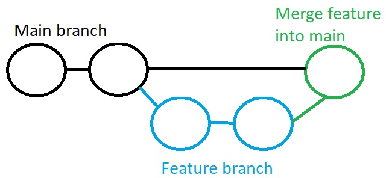

In this article, I give my workflows for almost everything that you will ever need to do with Git:

- Basic Git commands
- Setting up a remote repository and pushing to Github
- Undoing things in Git
- Ignoring things in Git
- Git branches for new features
- Working solo vs in a team
- Forking and contributing to open source

## Basic Git Commands

These are the commands you will use in every single project.

1. Initialise Git

`git init <project-name>`

2. Add files to the staging area

To add all files:

`git add .`

To add all files in a specific folder:

`git add src/posts/Git_Commands_Post`

To add one file:

`git add styles.css`

To add all files with a specific extension (in this case, all html files):

`git add *.html`

To add parts of a file:

`git add -p` (y=yes, n=no, s=split into smaller chunks, e=manually edit chunk, q=quit)

3. Check the staging area is correct before committing to Git

`git status`

4. Committing the changes to Git

`git commit -m "A short message describing the changes here"`

To add all changes to tracked files and commit in one line:

`git commit -am "commit message"`

To add staged changes to the previous commit (you are given the option of renaming the commit):

`git commit --amend`

5. Push to remote repository (see below for how to set up remote repository)

`git push`

## Setting up a remote repository and pushing to Github

First we need to set up the repository on Github:

1. Go to github.com
2. Sign in or create an account
3. Select "New" to create a new repository
4. Type in your repository information. I always leave the "Add a README file", "Add a .gitignore" and "Choose a license" checkbox unchecked.
5. Click "Create repository"

Now we need to connect up our local repository to the just-created Github repository:

6. Add the remote repository.

`git remote add origin https://github.com/YourUsername/Your-remote-repo-name.git`

7.  Ensure we are in the main branch

`git branch -M main`

8. Push your committed local code to Github

`git push -u origin main`

## Syncing with remote repositories

### git remote

Records registered through the `git remote` command can be used in conjunction with the git fetch, git push, and git pull commands. The git remote command is really just an easier way to pass URLs to these "sharing" commands.

`git remote add <name> <url>`

`<name>` can be used as a shortcut in the other sharing commands.

_Note: When you clone a repository with git clone, it automatically creates a remote connection called origin pointing back to the cloned repository._

To view all connections to remote repos:

`git remote`

To view the urls:

`git remote -v`

Remove connection to a repo:

`git remote rm <name>`

Rename a remote connection:

`git remote rename <old-name> <new-name>`

### git fetch

You can fetch commits, files, and refs from a remote repo into your local repo with `git fetch`. It is safer than `git pull` as it doesn't automatically merge the content into your local repo's working state.

Fetch all branches from remote repo (`<remote>` is what you called the connection with `git remote`):

`git fetch <remote>`

Fetch specified branch (e.g. coworkers-feature):

`git fetch <remote> <branch>`

Once we have the content we want, we need to integrate it into our local copy.

** If you want to synchronize your local repository with the central repository's main branch: **

1. `git fetch origin`
2. See what commits have been added:

`git log --oneline main..origin/main`

3. `git checkout main`
4. `git merge origin/main`

** If you fetched a remote branch and want to continue working on it: **

1. List all the remote branches:

`git branch -r`

2. Checkout the branch we want to integrate

`git checkout origin/coworkers-feature`

3. Create a new local branch and checkout.

`git checkout -b local_feature_branch`

We can now contunue working on the feature from our local copy.

### git pull

A combination of two things: `git fetch` followed by `git merge`. Not as safe as `git fetch` as it alters your local copy.

`git pull <remote>`

This fetches the specified remote's copy of the current branch, then merges it into the local copy.

It's equivalent to:

```
git fetch ＜remote＞
git merge origin/＜current-branch＞
```

Without a commit:

`git pull --no-commit <remote>`

It's very common to synchronize with the central remote repo's main branch using a rebase.

`git checkout main`

`git pull --rebase origin`

This simply moves your local changes onto the top of what your team has contributed. It keeps a nice linear history by preventing unnecessary merge commits. But rebasing re-writes history - beginners are safer using merge.

### git push

Used to upload local content to a remote repository.

`git push <remote> <branch>`

This creates a local branch in the destination repo. To prevent you from overwriting commits, git won't let you push when it results in a non-fast-forward merge in the destination repo. Non-fast-forward merges are a result of remote history diverging from your local history. You can pull the remote branch and merge it into your local one before pushing.

To force the push, even if it results in a non-fast-forward merge (delete any upstream changes that occurred since your last pull):

`git push <remote> --force`

Push all local branches:

`git push <remote> --all`

Delete a local branch:

`git branch -D <branch-name>`

Delete a remote branch:

`git push origin :<branch-name>`

## Changing your username and email in Git

```
git config --global user.name "Danny Adams"
git config --global user.email "my-email@gmail.com"
```

## Rename a file

`git mv old_filename new_filename`

## Undoing things in Git

### Remove a file from staging

The below command removes the file only from the Git repository. The local, working directory copy of the file will remain intact - this is ensured by adding the `--cached` option.

`git rm --cached <filename>`

To remove all files in a folder, add the recursive flag:

`git rm --cached <filename> -r`

### Going back to a previous commit to READ ONLY

To see how things looked at a particular commit, without re-writing history or deleting things, we can simply:

1. Log the commit history and copy the ID of the commit we want to go back to

`git log --oneline`

2. Go back in time to the commit

`git checkout <commit_ID>`

3. Once done, go back to where we were

`git checkout main`

### Reverting a commit

Revert commit creates a new commit, where the changes made in a specific commit are undone.

Let's say we wanted to undo what we did in commit 2 of the below branch:


Using Revert, a new commit would be made, where the changes made in C2 are undone - but C2 is still kept in history so we could still go back and keep the changes if we decide we want them again:


Let's go through an example. Below, I have 3 commits in my project - with the latest at the top:


Let's say I wanted to undo the changes I made with the "Created styles.css" commit only. I can simply revert this commit:

`git revert a432c9f`

Git will then open up a file in your text editor (if your using VS code) and ask you to create a message for the new commit:


By default, the commit message reads 'Revert "Created styles.css"', but this can be changed to whatever you want. I usually just leave it as is.

Once you're happy with the message, simply close the file and Git will add the new commit where the "Create styles.css" changes are undone.

But here's the beauty of using revert to undo things: the commit history is all still there.


As you can see, the "Created styles.css" commit is still there. Revert has simply made a new commit where the changes made in "Created styles.css" are reverted (undone). This is MUCH safer than using Reset - the next section - which deletes commits.

### Reset commit

Reset commit goes back in time to a previous commit and permanently deletes all commits that happened ahead of it.


1. Get the Id of the commit you want to go back to

`git log --oneline`

2. Reset

`git reset <commit_ID>`

Note: all the code changes will still remain in the workspace files - but they'll be uncommitted. To remove from Git AND your workspace, use:

`git reset <commit_ID> --hard` (Very dangerous - be very careful!)

## Tell Git to ignore certain files

Some files in your project will contain private information, such as passwords and keys. It's very important that this information isn't pushed to Github. Also, folders like the node_modules and build output directories can take up lots of disc space, and there is no need for them to be pushed to Github as they can be reinstalled or built any time.

1. Create a `.gitignore` file in the root of your project
2. Add the names of the folders and files you want to ignore:

```
node_modules
secret-password.txt
```

It's important to add these files to .gitignore as soon as they are made. But if you have accidentally committed them to git, you can untrack each one with the following commands:

1. Add the file to .gitignore
2. `git rm --cached <filename>`
3. `git commit -m "Start ignoring <filename>"`

Or if you have lots of files you need to untrack:

1. Add files to .gitignore
2. Remove everything from the repository

`git rm -r --cached .`

3. Re add everything

`git add .`

Now everything apart from the files in your .gitignore will be added to the staging area.

4. Commit

`git commit -m ".gitignore fix"`

The local repository is now clean. Push the changes to Github to see the changes effective there too.

## Merging a feature branch into main

A common Git paradigm is to always keep the main branch deployable. This means that whenever you're working on a new feature, you should create a new branch and make your commits to that. Then once the feature is complete, you can merge it back into main.



### When working solo

If you're the only one contributing to a repo, then you can safely merge a feature into main without creating a pull request.

1. Create new branch and go into it

`git checkout -b <branch-name>`

2. Make your changes in this branch. Add and commit your changes as many times as necessary.
3. Checkout to main and merge the feature branch into main

`git checkout main`

`git merge <branch-name> --no-ff`

The no-fastforward flag creates a new merge commit and maintains history of the feature branches. Without this flag, the head will simply fastforward to the end of the feature without a new merge commit.


### When working in a team

Let's say someone has added you to a Github repository, so that you can now contribute as part of the team.

To contribute, you will need to make a pull request. A pull request is for communicating and reviewing code, before merging it to main. Merging directly, and merging with a pull request are identical - the only difference is that a pull request creates a dedicated forum on Github for discussion - this allows team members to review your code before merging it.

1. Clone the Github repository

`git clone <repo-url>`

2. Ensure our code is up to date

Before making any changes, you should always make sure your local copy is up to date with the remote repo - as other devs may have contributed. Pull the latest code from remote repo.

`git pull origin main`

3. Create and checkout to new branch

`git checkout -b <branch-name>`

4. Make desired changes
5. Add and commit changes

`git add .`

`git commit -m "some message"`

6. Push the code in this branch to a branch in Github

`git push origin <name-of-branch-for-Github>`

7. Create a pull request

Go to the Github repo main branch and click "compare and pull request".

8. Leave a comment to explain exactly what you've done, then "create pull request".

Other team members will get an email for the request to pull your code into main. They can see changes, see commits, leave comments, and (if happy) merge the code into main.

Feature branch can be deleted once merged.

** But what if people make changes to main while your still working on the feature branch? **

1. Commit or stash your changes made to the feature branch.
1. `git checkout main`
1. `git pull origin main`
1. `git checkout <feature-branch-name>`
1. Merge the latest main branch into your feature branch

`git merge main`

You can now incorporate the latest changes by other devs into your feature.

Note: you may need to iron out merge conflicts. This is normal and part of working with Git.

### Forking and contributing to open source projects

If you don't have write access to a repo, but still want to contribute to it, you can Fork the project:

1. Find an open source public repo
2. Fork the repo (create a copy to your own Github account)
3. `git clone <url-of-your-fork>`
4. Make changes (could also create a new branch for the changes then push to a new branch)
5. `git add .` `git commit -m "message"` `git push origin main`
6. Go to your forked copy on Github and click "New pull request"
7. "Create pull request" - this pulls your code into the parent repo to be reviewed for merging. YOU CAN'T MERGE THIS - only the repo owners are allowed.

### Squashing

A feature branch may have lots of commits. You might not want all of these commits to show on the main branch after merging. You can squash all of the commits into one:

`git git merge --squash <feature-branch>`

This will merge all of your feature branch changes, but not commit them (unlike a regular merge which creates an automatic merge commit). You can then add and commit the changes. It will appear as if the work for your feature had happened in just a single commit.

"Squash and merge" and "Rebase and merge" are also options on Github to close a pull request.

Note: If you want to clean up a branch without merging, use interactive rebasing (see below).

## Incorporating upstream changes into a feature branch

Let's say you've created a new feature branch and have made a few commits. While working away, you coworkers have pushed changes to the main branch in the remote repo. It looks like this:


You can incorporate the latest changes by your coworkers into your feature by one of two ways: merging or rebasing. (Even if the changes have nothing to do with your feature, incorporating the latest changes into the feature branch at this point can make it easier to merge the feature into main when it's finished - it can prevent a large build up of merge conflicts.)

### But first, we need to get the latest changes

1. Commit or stash your changes made to the feature branch.
1. `git checkout main`
1. `git pull origin main`

Now we can either merge or rebase to incorporate these new changes into our feature branch...

### Merging

Here's what things would look like if you merged main into your feature branch:

```
git checkout feature
git merge main
```


The advantage of merging is that it's non-destructive. The existing branches aren't changed in any way (unlike rebasing).

The problem with this is that if the main branch gets updated frequently, it will make your feature's commit history muddy. If this is a concern, rebasing might be a good option.

### Rebasing

Here's what things would look like after rebasing:

```
git checkout feature
git rebase main
```


The entire feature branch has been moved to begin on the tip of the main branch, effectively incorporating all the new changes in main. But, instead of using a merge commit, rebasing re-writes the project history by creating brand new commits for each commit in the original branch.

Rebasing results in a much cleaner project history, as there are no merge commits every time we want to include new changes to main.

But, rebasing can be dangerous as it rewrites project history. Always follow **The Golden Rule: NEVER REBASE ON PUBLIC BRANCHES.** Main, for example, is a public branch as other team members have access to it and can build from it. Changing it's history could lead to mass confusion. Your feature branch, local on you PC, can be rebased - but once you submit it for a pull request, it is a public branch, so don't rebase.

## Local cleanup - Interactive Rebasing

If you want to clean up you feature branch's commits before rebasing onto main, you can use interactive rebasing:

```
git checkout feature
git rebase -i main
```

Git will then open up a file in your text editor:


In this file, we can alter the commit history of our feature branch before rebasing to main. For example, if the 2nd commit fixes a small problem in the 1st commit, you can condense them into a single commit with the fixup command:


When we close the file, git will perform the rebase as we requested.

Eliminating insignificant commits makes the feature's history easier to understand. This is something merge can't do.

If you don't need to incorporate upstream changes, or you don't need to change the history of the whole feature branch, you can specify how many commits you want to rebase:

```
git checkout feature
git rebase -i HEAD~3
```

This allows you to interactively re-write the last 3 commits.

## Stashing

Stashing temporarily stores the changes you've made to your working copy so you can safely switch to another branch and work on something else, then come back and re-apply the changes later on. It's useful if you are not yet ready to commit your code change.

`git stash`

This stashed both staged and unstaged changes, but not new local files that haven't yet been staged or gitignored files.

It's good practice to describe your stashes when saving:

`git stash save "half of nav hamburger is complete"`

`git stash -u` (or `--include-untracked` includes untracked files)

`git stash -a` (or `--all` includes ignored and untracked files)

To re-apply the stash without deleting it (useful if want to apply to multiple branches):

`git stash apply`

Or we can pop the stash off the stack:

`git stash pop`

### Multiple stashes

List all stashes:

`git stash list`

Choose which stash to re-apply:

`git stash pop stash@{2}`

### Viewing stash diffs

To see the diff of the last stash you made:

`git stash show`

Show the diff of a particular stash:

`git stash show stash@{1}`


To view the full diff of a stash, pass `--path` or `-p`:

`git stash show -p`


### Partial stashes

To stash just a single file, a collection of files, or individual changes from within files:

`git stash -p`

This will iterate through each changed "hunk" in your working copy and ask whether you want to stash it.


### Creating a branch from your stash

Check out a new branch and pop your stashed changes onto it:

`git stash branch <branch-name> stash@{2}`

This is useful if changes on your branch diverge from the changes in your stash - you may result in conflicts when popping or applying a your stash.

### Removing stashes

`git stash drop stash@{1}`

To delete all:

`git stash clear`

## Diffing

The diffing function takes two input data sets, and outputs the differences between them. These data sources can be commits, branches, files and more.

`git diff`

VS Code makes it easy to view differences between files in the _Source Control_ tab.

[More on diffing commands here](https://www.atlassian.com/git/tutorials/saving-changes/git-diff).

## Awesome Git Resources

- [Merging VS Rebasing in-depth](https://www.atlassian.com/git/tutorials/merging-vs-rebasing)
- [git stash in-depth](https://www.atlassian.com/git/tutorials/saving-changes/git-stash)

## Thanks for reading

Hopefully that was helpful.

For more from me, you can:

- [Follow me on twitter](https://twitter.com/DoableDanny)
- [Subscribe to my YouTube channel](https://www.youtube.com/channel/UC0URylW_U4i26wN231yRqvA)

👋
