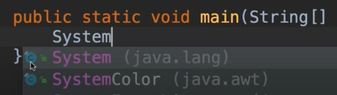
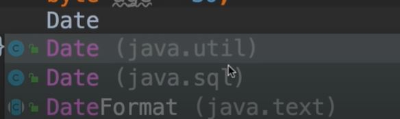
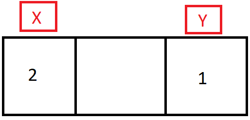
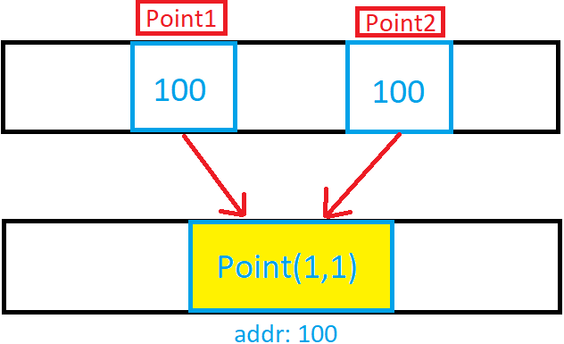

## Intro

In this article you will learn how to set up Java on your machine, and learn the basics of the Java programming language - how code is executed, types, control flow, write basic programs, classes & methods, etc...

The aim of this article is to allow people to pick up the basics of Java quickly. This means I don't explain basic programming concepts (such as how a for-loop works) in depth; therefore it would be beneficial to have some experience with another programming language before reading this article.

This article was written following [Mosh's Java for Beginners tutorial](https://www.youtube.com/watch?v=eIrMbAQSU34&ab_channel=ProgrammingwithMosh).

## Setting up Java

### 1. Download the Java Development Kit (JDK)

[Download the JDK from Oracle](https://www.oracle.com/java/technologies/java-se-glance.html). The JDK has a compiler, runtime environment, code we can use, and a bunch of other stuff. Here, we are downloading Java SE (standard edition). I downloaded the 64-bit Windows installer version.

### 2. Download a Java text editor

Popular Java text editors include NetBeans, Eclipse, and IntelliJ. I'll be using [the community edition of IntelliJ](https://www.jetbrains.com/idea/download/#section=windows).

## Functions in Java

In Java, we have to specify the return type of a function. If the function returns nothing, this will be `void`.

```java
ReturnType sendEmail(params) {
  // send the email...
}
```

### Java main function

Every Java program should have at least one function - that function is called `main`. `main` is the entry point to our programs; whenever we execute a Java program, this function gets called executed.

The `main` function doesn't belong on its own - it has to belong to a `Main` class. The `Main` class contains the `main` method.

```java
class Main {
  void main() {
    ...
  }
}
```

In Java, all classes and methods should have an access modifier (e.g., `public` and `private`). An access modifier is a special keyword that determines if other classes and methods in the program can access these classes and methods. Public is probably used more often than private.

```java
public class Main {
  public void main() {
    ...
  }
}
```

## Your first Java program

Open up IntelliJ, start a new project, select 'Java', and make sure 'project SDK' isn't left blank. Then select 'Create project from template'. Select 'Command Line App' if the Java app doen't have a graphical user interface (GUI) - a mobile or desktop app would have a GUI.

The Base package is usually your company name backwards, e.g, com.doabledanny. Classes help to organise code and keep releated methods together. A package is a group of classes - important as a project grows to 100s or 1000s of classes. So in my case, com.doabledanny will become a namespace for the classes I create in this project.

In our main folder/src, we have our base package folder (com.doabledanny). In this package we have the `Main` class. At the top, we specify what package this class belongs to - so the `Main` class belongs to com.doabledanny.

```java
// Main.java
package com.doabledanny;

public class Main {
  public static void main(String[] args) {
    // write your code here
  }
}
```

The main method must be static. Static methods are the methods in Java that can be called without creating an object from the class. They are referenced by the class name itself, or referenced by an object of that class.

Below, IntelliJ is telling us that System is a class. System will give us the members, or methods, (red circle with 'm') of the System class. 'System.out' is a field of type PrintStream - another class defined in Java. We can then select the `println` method from the PrintStream class - System.out.println("Hello World") - to print a line.

In IntelliJ, we can type "sout" as a shortcut for System.out.println().



We can then run the following code:

```java
package com.doabledanny;

public class Main {

    public static void main(String[] args) {
	    System.out.println("Hello World");
    }
}
```

## How Java code gets executed

Execution involves two steps: compilation and execution.

In the compilation step, IntelliJ uses the Java Compiler to compile our code into a different format, called Java Byte Code. Java Compiler comes with the JDE that we dowloaded earlier.

Source Code (_.java) -> Java Compiler -> Byte Code (_.class)

In IntelliJ, right-click the Main.java tab, then "open in terminal".

We can now invoke the Java Compiler with the command `$javac Main.java`.

Now enter `$ls` or `$dir` to see the contents of the folder. We have a new file called Main.class; this is the byte-code representation of the Main.java file.

Also, we have the byte-code in root/out/production/ProjectName/com/doabledanny/Main. Note: our top-level package is called "com".

(Note: IntelliJ will decompile the code back to Java when viewing the file.)

Byte-code is platform independent: it can run on Mac, Windows, Linux, or any operating system (OS) that has a Java runtime environment (JRE). You can [download JRE for various OS](https://java.com/en/download/).

The JRE has a software component called Java Virtual Machine (JVM). JVM takes our Java Byte Code, and translates it to the native code for the underlying operating system. So if you're on a Windows machine, the JVM will translate the Byte Code into code that Windows can understand.

This architecture is why Java applications are portable, or "platform independent" - we can write a Java program on a Windows machine, and execute it on Mac, Linux, or any other OS that has a JRE. C# and Python also have the same architecture.

Byte Code (\*.class) -> JVM -> Native Code (Windows, Mac, ...)

### How to invoke the JVM to run a Java program

We are currently in the com/yourmainpackagename file. Lets go back two levels to the src folder with `$cd ..` and `$cd ..`.

To invoke the Java Virtual Machine, we type Java followed by the path to your Main class: `$Java com.yourmainpackagename.Main`. The JVM will look at the Byte Code and convert it to the Native Code of the operating system you're using.

Our program will print "Hello World" to the terminal.

## Java Editions

There are four Java editions:

1. Standard Edition (SE) - this has all the libraries every Java dev must learn.
2. Enterprise Edition (EE) - Built on top of SE. Used for building very large-scale and distributed systems.
3. Micro Edition (ME) - a subset of SE. Designed for mobile devices. It has libraries specific to Mobile devices.
4. Java Card - used in smart cards.

Currently, 3-billion mobiles run Java, as well as 120-million TV sets and every blue-ray player.

## Java Variables

First we specify the type (int - whole numbers, e.g. 1, 2, -33, -128), then the identifier (age), then we assign it (initialise) to the value of 30 using the assignment operator (=).

```java
int age = 30;
age = 38; // change the value to 38
int herAge = age; // Copying the value of one variable into another
```

There are two types of variable in Java:

- Primitive Types - for storing simple values (numbers, characters, booleans)
- Reference Types - for storing complex objects (date, mail message)

### Primitive Types

A byte is a unit of memory size, and is 8-bits. A bit can either be 0 or 1. So, a byte can have 2^8 = 256 values. Using [Two's Complement](https://stackoverflow.com/questions/3621067/why-is-the-range-of-bytes-128-to-127-in-java), this is represented as 128 negative values, and 127 positve values.

There are 8 primitive types in Java.

Floats and Doubles are numbers with decimal places. Chars take 2-bytes so they can support international letters.

| Type    | Byte | Range       |
| ------- | ---- | ----------- |
| byte    | 1    | [-128, 127] |
| short   | 2    | [-32k, 32k] |
| int     | 4    | [-2B, 2B]   |
| long    | 8    |             |
| float   | 4    |             |
| double  | 8    |             |
| char    | 2    | A,B,C,...   |
| boolean | 1    | true/false  |

Earlier, we stored a persons age as an int. We don't need 4-bytes to store someone's age. Instead, use a byte.

```java
byte age = 30;
int youtubeViews = 10_000_000; // use underscores to separate every three digits for clarity.

long peopleInWorld = 7_000_000_000; // Error: integer number too large. Java thinks this is an int.
long peopleInWorld = 7_000_000_000L; // Values need an L suffix if they are longs.

float price = 10.99; // Error: by default, Java thinks that all decimal numbers are doubles.
float price = 10.99F;
```

### Reference Types

Reference Types are used for storing complex objects.

We can see below that Java has two classes called Date. These classes don't conflict because they are in different packages. Packages create namespaces for our classes.



Below, _Date_ is the type and _now_ is the identifier. We use the _new_ operator to alocate memory for this variable; with primitive types, we don't have to do this - memory is allocated and released by JRE. With reference types, we have to allocate memory, but we don't have to release it - Java takes care of that.

The variable _now_ is an instance (object) of the Date class. Because it is a reference type, we can access its members (methods) like this: `now.getTime();`. Primitive type vars have no members.

```java
package com.doabledanny;

import java.util.Date; // We are currently in com.doabledanny package, so we have to import the Date class from the java.util package (or "namespace")

public class Main {

  public static void main(String[] args) {
    Date now = new Date();
    System.out.println(now);
  }
}
```

### Primitive Types vs Reference Types

With primitive types, variables are stored at different memory locations. So, changing _x_ won't change the value of _y_.

```java
byte x = 1;
byte y = 1;
x = 2;
System.out.println(x);
```

The variables are at unique locations in memory:



This is not the case with reference types. With reference types, point1 and point2 don't store actual values - they store references to the Point object (the memory address of the Point object).

This means that the point1 and point2 variables are not independent of each other: if we change point2, we also change point1.

```java
Point point1 = new Point(1, 2);
Point point2 = point1;
point1.x  = 2;
System.out.println(point2); // java.awt.Point[x=2,y=2]
```



**Summary: reference types are copied by their references; primitive types are copied by their value - they are independent of each other.**

## Strings

In Java, strings are reference types. We don't need to import the _String_ class, as it's done automatically.

Shortcut: We don't need _new String_ - we can just set it to "Hello World". The string value ("Hello World") is called a string literal.

```java
String message = new String("Hello World");
System.out.println(message + "!!"); // Hello World!!
```

Because String is a reference type, we have access to methods such as _length()_ and _indexOf()_. Below, we pass in the argument 'e' - arguments are the values we pass to methods; parameters are the holes that we define in our methods.

```java
message.length(); // 11
message.indexOf('e'); // 1
```

In Java, strings are immutable - any methods that modify a string will always return a new string object.

### Escape sequences

Main ones to remember:

- "\t" -> tab
- "\n" -> new line
- "\\\" -> escape backslash
- "\"" -> escape quote

## Arrays

Arrays are reference types, in Java.

```java
int[] numbers = new int[5]; // create new array of integers of length 5
numbers[0] = 1;
numbers[1] = 2;
numbers[10] = 3; // Exception: Index 10 out of bounds for length 5
```

Above is an old, tedious way of initialising an array. If we know the values ahead of time, we can do as below.

Java arrays have a fixed length - once they are created, we can't add or remove items. If you want to add or remove items, you should use one of the Collection classes.

```java
int[] numbers = {2, 3, 5, 1, 4};
System.out.println(numbers); // [I@e9e54c2
```

Above, when we print our array, we get a weird string. By default, when we print an array, Java returns a string which is calculated based on the address of the object in memory. Below, we can see that numbersCopy references the same memory location as numbers.

```java
int[] numbers = {2, 3, 5, 1, 4};
int[] numbersCopy = numbers;
int[] differentNumbers = {7, 7, 6};
System.out.println(numbers); // [I@e9e54c2
System.out.println(numbersCopy); // [I@e9e54c2
System.out.println(differentNumbers); // [I@65ab7765
```

To see the values of an array, we have to import the java.util.Arrays class. The Arrays class contains many array methods such as _binarySearch()_ and _sort()_. These methods are implemented many times for different parameter types (int, byte, char,...); this is called method overloading.

```java
int[] numbers = {2, 3, 5, 1, 4};
System.out.println(Arrays.toString(numbers)); // [2, 3, 5, 1, 4]
```

### Multi-dimensional Arrays

To create a matrix with two rows (nested arrays), and three columns (the length of each nested array):

(Note: we have to use Arrays.toDeepString() for printing multi-dimensional arrays)

```java
int[][] numbers = new int[2][3];
numbers[0][0] = 1;
system.out.println(Arrays.deepToString(numbers)); // [[1, 0, 0], [0, 0, 0]]
```

Three dimensional array:

```java
int[][][] threeD = new int[2][2][2];
threeD[0][0][1] = 45;
System.out.println(Arrays.deepToString(threeD)); // [[[0, 45], [0, 0]], [[0, 0], [0, 0]]]
```

We can also initialise an array this way:

```java
int[][] numbers = {{1, 2, 3}, {4, 5, 6}};
System.out.println(Arrays.deepToString(numbers)); // [[1, 2, 3], [4, 5, 6]]
```

## Constants

Use _final_ keyword, and by convention we should capitalize the identifier.

```java
final float PI = 3.14F;
```

## Arithmetic Expressions

An "expression" is a piece of code that produces a value.

In Java, we use the usual +, -, \*, and /.

Division is a trickier one because the division of two whole numbers is a whole number:

```java
int result = 10 / 3;
System.out.println(result); // 3
```

To get a float as the result, we have to convert 10 and 3 to floats. We could also do the same with _double_.

Below, we are **casting** (converting) the **operands** (10 and 3) into doubles.

```java
double result = (double)10 / (double)3;
System.out.println(result); // 3.3333333333333335
```

We can increment a value with _++_ as a prefix or postfix:

```java
int x = 1;
++x;
x++;
System.out.println(x); // 3
```

But if it's on the right side of an assignment operator, there's a difference between prefixing and postfixing.

Postfixing: x is copied to y, _then_ x is incremented.

```java
int x = 1;
int y = x++;
System.out.println(y); // 1
```

Prefixing: x is incremented, _then_ x is copied to y.

```java
int x = 1;
int y = ++x;
System.out.println(y); // 2
```

**Augmented (or "compound") assignment operators**:

```java
int x = 2;
x += 4; // 6
x /= 2; // 3
x *= -1; // -3
System.out.println(x); // -3
```

## Type Casting

### Implicit Casting

Implicit (automatic) casting: whenever we have a value that can be converted into a data type that is bigger, casting happens implicitly.

Below, a short (x) is added to an int (2). x is converted into an int automatically, so the result will be an int.

```java
short x = 1;
int y = x + 2;
System.out.println(y); // 3
```

But what about floating point numbers? Below, a double (x) is added to a whole number (2). Java converts 2 into a double, 2.0, then adds it to x.

```java
double x = 1.1;
double y = x + 2;
System.out.println(y); // 3.1
```

In short, implicit type-casting happens when we know there will be no data loss - e.g. converting an int into double just means adding a decimal point. Double to int could mean data loss - we'd lose all the numbers after the decimal point.

byte -> short -> int -> long -> float -> double

### Explicit Casting

If we wanted _y_ from above to be an int, we'd have to explicitly cast x from type double to type int:

```java
double x = 1.1;
int y = (int)x + 2;
System.out.println(y); // 3
```

Explicit casting can only happen between compatible types. The above types are all compatible because they are numbers.

```java
String x = "1.1";
int y = (int)x + 2; // java: incompatible types: java.lang.String cannot be converted to int
```

We'd have to use a Wrapper class (_Integer_ is the wrapper class for the _int_ primitive type):

(There are also _Float.parseFloat_, _Short.parseFloat_, etc... Wrapper classes.)

```java
String x = "1";
int y = Integer.parseInt(x) + 2;
System.out.println(y); // 3
```

We often get user input as a String, so these Wrapper classes are used often.

## The Math class

```java
int result = (int) Math.round(Math.random() * 100);
System.out.println(result); // Random integer between 0 & 100
```

## Formatting Numbers

E.g. 55 -> £55.00

Can use the _NumberFormat_ abstract class. Abstract classes cannot be instantiated with the _new operator_. _NumberFormat_ has a number of methods that begin with _get_; when we call one, it will create a specialized instance of the NumberFormat class, and return it.

[More on Java abstract classes.](https://docs.oracle.com/javase/tutorial/java/IandI/abstract.html)

Below, _getCurrencyInstance()_ is called a **factory method**, because it's like a factory - it creates new objects.

```java
NumberFormat currency = NumberFormat.getCurrencyInstance(); // returns a number-format object
String result = currency.format(1234567.891);
System.out.println(result); // £1,234,567.89
```

Another example is _NumberFormat.getPercentInstance()_ - which returns an instance of the NumberFormat class, specialized for formatting numbers as a percent.

Note: to change the variable name of a reference type in IntelliJ, right-click/refactor/rename. This will change all references to that object.

Above, we are only formatting a number once, so there's no point storing the instance object in a variable. Use **method chaining** instead:

```java
System.out.println(NumberFormat.getPercentInstance().format(0.1)); // 10%
```

## Reading Input

We have to specify where we want to read data from - e.g. a file, the terminal window, etc...

_in_ is a field in the System class. A field is a variable we define in a class.

```java
Scanner scanner = new Scanner(System.in); // Scan for system input
System.out.print("Age: ");
byte age = scanner.nextByte(); // Store the next byte terminal input in the variable age
System.out.println("You are " + age); // Implicit type casting of age to string here
```

For parsing strings, use _scanner.next()_. Problem: if user inputs "Danny Adams", it will only parse "Danny" (the first token). Use _scanner.nextLine()_ to get the whole line.

```java
Scanner scanner = new Scanner(System.in);
System.out.print("Name: ");
String name = scanner.nextLine().trim(); // scanner.nextLine() returns a string, so we can chain the trim method().
System.out.println("You are " + name);
```

## Best Practices

- Never use "magic numbers"; use descriptive constants.
- Always use descriptive variable names - e.g. use _mass_, not _m_.

```java
final byte MONTHS_IN_YEAR = 12;
final byte PERCENT = 100;

// Always use descriptive names for vars - not aI and mI.
float annualInterest = scanner.nextFloat();
float monthlyInterest = annualInterest / PERCENT / MONTHS_IN_YEAR; // Much easier to understand than / 100 / 12
```

## Comparison Operators

```java
int x = 1;
int y = 1;
System.out.println(x == y); // Boolean expression - returns true here
System.out.println(x != y); // returns false here
System.out.println(x <= y); // returns true here
System.out.println(x < y); // returns false here
```

## Logical Operators

```java
short temperature = 22;
boolean isWarm = temperature > 20 && temperature < 30; // Logical AND Operator
boolean danHappyTemperature = temperature == 15 || temperature == 16; // Logical OR Operator
System.out.println(isWarm); // true
System.out.println(!isWarm); // false
System.out.println(danHappyTemperature); // false
```

## If Statements

Notice how in Java we can vertically align the _if_ and _else_ statements by removing the code-block curly braces. It's easier to read. But it's only possible if the code block contains one line.

```java
public static void main(String[] args) {
      Scanner scanner = new Scanner(System.in);

      System.out.print("What temperature is it? ");
      int temp = scanner.nextInt();

      if(temp > 30)
          System.out.println("It's a hot day\nDrink plenty of water.");
      else if(temp >= 20)
          System.out.println("It's a nice day.");
      else
          System.out.println("It's cold");
  }
```

### Simplifying if statements

```java
int income = 120_000;
boolean hasHighIncome = false; // Initialise to false - so we don't need an else block below to set it to false.
if(income > 100_000)
    hasHighIncome = true;
```

We can further simplify the above: instead of hard-coding false, we can just write the boolean expression there.

```java
int income = 120_000;
boolean hasHighIncome = income > 100_000;
```

(Note: variables declared inside code blocks will have local scope.)

## Ternary Operators

Below is very unprofessional. At least initialise className so we don't need the _else_ statement.

```java
int income = 120_000; // Obviously in a real program this would be  input
String className;
if(income > 100_000)
    className = "First";
else
    className = "Economy";
```

A professional programmer would use a ternary operator - className is a String, so we can't just use a boolean expression alone.

```java
int income = 120_000;
String className = income > 100_000? "First" : "Economy";
```

## Switch Statements

When we are executing certain code depending on the value of a certain expression, it's often clearer to use a switch statement.

```java
String role = "admin";

if(role == "admin")
    System.out.println("You're an admin");
else if (role == "moderator")
    System.out.println("You're a moderator");
else
    System.out.println("You're a guest");
```

->

```java
String role = "admin";

switch(role) {
    case "admin":
        System.out.println("You're an admin");
        break;
    case "moderator":
        System.out.println("You're a moderator");
        break;
    default:
        System.out.println("You're a guest");
}
```

(Note: switch statements can also be used for the integer types byte, short and int - but not longs.)

## FizzBuzz in Java

```java
package com.doabledanny;

import java.util.Scanner;

public class Main {

    public static void main(String[] args) {
        Scanner scanner = new Scanner(System.in);

        System.out.print("Enter an integer: ");
        int number = scanner.nextInt();

        // Rule of thumb: most specific statements go at the top, more generic at the bottom.
        if((number % 3 == 0) && (number % 5 == 0) )
            System.out.println("FizzBuzz");
        else if (number % 3 == 0)
            System.out.println("Buzz");
        else if (number % 5 == 0)
            System.out.println("Fizz");
        else
            System.out.println(number);

    }
}
```

We can follow the DRY (Don't Repeat Yourself) principle by removing the second (number % 5 == 0) statement and adding nested loops, as below. But nested loops are bad practice; it's better to use a flat structure (no nesting), as above - even if it means some repetition.

```java
if(number % 5 == 0) {
    if(number % 3 == 0)
        System.out.println("FizzBuzz");
    else
        System.out.println("Fizz");
}
else if (number % 3 == 0)
    System.out.println("Buzz");
else
    System.out.println(number);
```

## Loops

### For-loops

```java
for(int i = 0; i < 5; i++)
    System.out.println(i);
```

### While-loops

The implementation of a for-loop is lighter and cleaner. Use a for-loop when you know ahead of time how many times you want to execute statements. While-loops are better when we don't know how many times we want to repeat something.

```java
int i = 0;
while(i < 5) {
    System.out.println(i);
    i++;
}
```

A program where the user can keep inputting something, until they type "quit", would be a good case for a while-loop.

(Notice we can't just put (input != "quit") in the while statement. Input is a String, which is a reference type - we can't use comparison operators on reference types because the operators will compare the memory address of the string objects, not their values.)

```java
Scanner scanner = new Scanner(System.in);
String input = "";


while(!input.equals("quit")) {
    System.out.print("Input: ");
    input = scanner.next().toLowerCase();
    System.out.println(input);
}
```

### Do...While Loops

Similar to a while-loop, but it gets executed at least once. Do...while loops are rarely needed.

```java
Scanner scanner = new Scanner(System.in);
String input = "";

do {
    System.out.print("Input: ");
    input = scanner.next().toLowerCase();
    System.out.println(input);
} while (!input.equals("quit"));
```

### Break and Continue

The _break_ statement terminates the loop. The _continue_ statement moves control to the beginning of the loop.

Now if user inputs "pass", nothing gets printed - the program continues back to the beginning of the loop; if they type "quit", the program breaks out of the loop and nothing gets printed; if they input anything else, it will get printed and the loop continues.

Notice how we now use _true_ as our loop condition. The loop will still loop forever until the user types quit. It's a common technique among professional programmers. We could also use it to keep asking a user the same question until they input something valid. Just remember to use a break statement, otherwise you'll get an infinite loop.

```java
Scanner scanner = new Scanner(System.in);
String input = "";

while (true) {
    System.out.print("Input: ");
    input = scanner.next().toLowerCase();
    if (input.equals("pass"))
        continue;
    if (input.equals("quit"))
        break;
    System.out.println(input);
}
```

### For-Each Loops

Used for iterating over arrays and collections in Java. It's cleaner and easier than using for-loops or while-loops - we don't need to worry about a loop counter.

Limitations:

- It's forward only - can't iterate over the array end-to-start.
- We don't have access to the index of each item - we only have the value.

```java
String[] fruits = {"Mango", "Apple", "Strawberry"};

for (String fruit : fruits)
    System.out.println(fruit);
```

## Conclusion

You now understand the basics of the Java programming language. Next steps would be to build [some simple Java projects](https://www.youtube.com/c/BroCodez/search?query=java), and learn Object Oriented Programming in Java.
