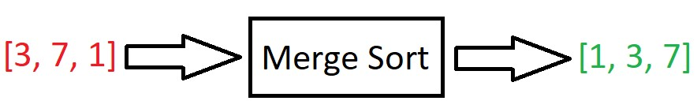
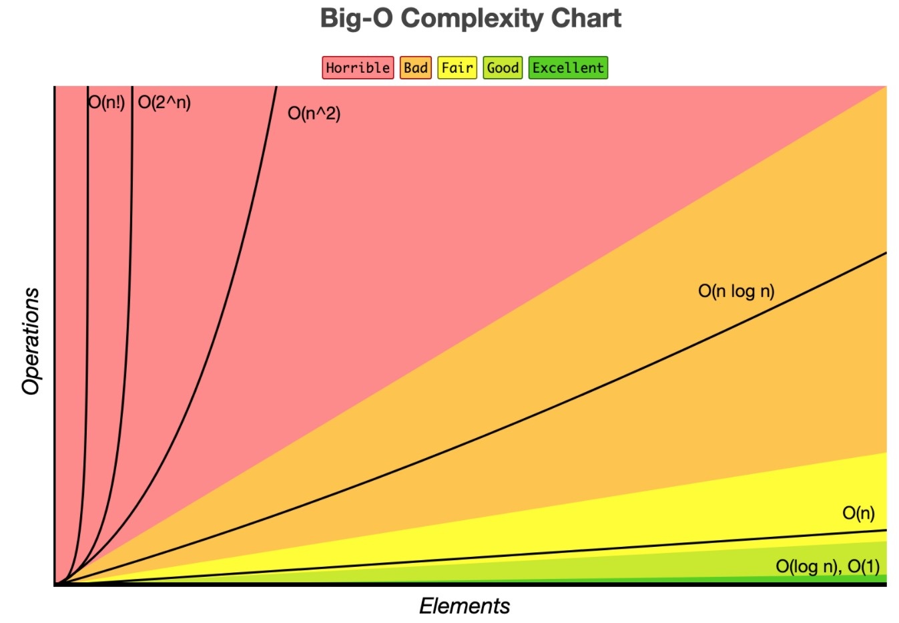
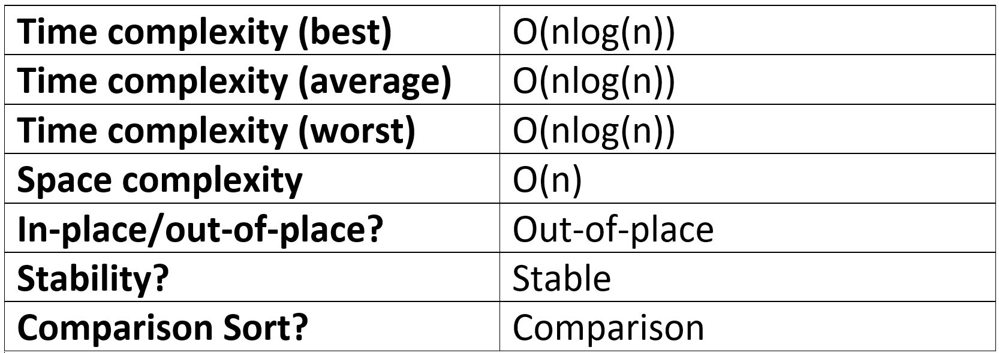

import FigureWithCaption from "../../components/FigureWithCaption.js"

Merge Sort is one of the most popular and efficient sorting algorithms.

In this article we will discuss:

- The logic behind Merge Sort
- How to implement Merge Sort in JavaScript
- The performance of Merge Sort
- The advantages and disadvantages of Merge Sort

_Disclosure: I’m always looking for things I think my readers will value. This article contains some affilate links to products that I have used and found helpful. If you purchase these, then I may see a share of the revenue. This comes at no extra cost to you._

## What is the Merge Sort Algorithm?

Merge Sort is, you guessed it, a sorting algorithm that can be used to order the items of an array from smallest to largest. It takes in an array, sorts it, then spits it out:



Merge Sort is an out-of-place, stable, and comparison-type sorting algorithm

**Out-of-place** means that the algorithm requires additional data structures when sorting. This is opposite to in-place sorting algorithms, where the input is simply overwritten and no extra data structures are required.

**Stable** means that two elements with equal values will appear in the same order in the sorted output as they appear in the unsorted input array.

And finally, a **comparison sort** is a sorting algorithm that only reads the list of elements through a single abstract comparison operation (usually a “less than” or “equal to”) that determines which of the two elements should occur first in the final sorted output array.

Check out my [In-place, stable, comparison article](https://www.doabledanny.com/algorithm-concepts) if you don’t quite understand the above, or don’t know why it’s important to know these properties of an algorithm.

## Merge Sort logic

Merge Sort is a combination of two things: merging and sorting. It exploits the fact that arrays of 0 or 1 item are always sorted e.g.:

- [] is always sorted
- [4] is always sorted
- [5, 4] is not sorted

Merge Sort works by decomposing an array into smaller arrays of 0 or 1 items, then building up a newly sorted array.

First, we divide the array up until we get arrays of 0 or 1 item. This is the “base case” – we know these arrays are sorted because they are 1 or 0 long.

<FigureWithCaption
  src={props.images[1].publicURL}
  alt="Merge sort division into subarrays"
  caption="Dividing the array up into sorted subarrays. Image source: "
  a_text="JavaScript Algorithms and Data Structures Masterclass by Colt Steele"
  href="https://ad.admitad.com/g/05dgete24sfa55577a70b3e3b7aadc/?ulp=https%3A%2F%2Fwww.udemy.com%2Fcourse%2Fjs-algorithms-and-data-structures-masterclass%2F"
/>

Next, we merge these smaller arrays until we get to the final sorted one:

<FigureWithCaption
  src={props.images[2].publicURL}
  alt="Merge sort merging the subarrays back together"
  caption="Merging the subarrays back together. Image source: "
  a_text="JavaScript Algorithms and Data Structures Masterclass by Colt Steele"
  href="https://ad.admitad.com/g/05dgete24sfa55577a70b3e3b7aadc/?ulp=https%3A%2F%2Fwww.udemy.com%2Fcourse%2Fjs-algorithms-and-data-structures-masterclass%2F"
/>

Here’s a good gif of Merge Sort:

<FigureWithCaption
  src={props.images[3].publicURL}
  alt="Merge sort gif"
  caption="Gif source: "
  a_text="Wikipedia"
  href="https://en.wikipedia.org/wiki/Merge_sort"
/>

If that doesn’t quite make sense, check out these [folk dancers demonstrating merge sort](https://www.youtube.com/watch?v=XaqR3G_NVoo&t=133s) then re-read the above - things will then become clear!

Also, check out [Visualgo](https://visualgo.net/en/sorting) for beautiful visualisations of sorting algorithms. It’s a great resource to have bookmarked when studying algorithms.

Now you have an idea for how Merge Sort works, let’s put it into code.

## Merge Sort - JavaScript

### Writing a merge helper function

First, we need to understand how to merge two sorted arrays.

In order to implement Merge Sort, it’s useful to first implement a function responsible for merging two sorted arrays.

Given two arrays which are sorted, this helper function should create a new array which is also sorted, and consists of all the elements in the two input arrays.

Here is our merge helper function. Remember, it accepts two SORTED arrays and merges them into one, larger sorted array.

```js
function merge(left, right) {
  let sortedArr = [] // the sorted items will go here

  while (left.length && right.length) {
    // Insert the smallest item into sortedArr
    if (left[0] < right[0]) {
      sortedArr.push(left.shift())
    } else {
      sortedArr.push(right.shift())
    }
  }

  // Use spread operators to create a new array, combining the three arrays
  return [...sortedArr, ...left, ...right]
}

merge([1, 4], [2, 6, 9]) // [1, 2, 4, 6, 9]
```

Our merge algorithm runs at O(n + m) where n and m are the lengths of the first and second arrays respectively. This is because we iterate over each item in each array once. This just boils down to a [Big O(n)](https://www.doabledanny.com/big-o-notation-in-javascript) => linear time complexity.

### Writing the Merge Sort function

Next we can write a `mergeSort` function that uses recursion to halve the arrays with the `slice()` method. The base case is when the arrays have a length of 1 or 0.

```js
function mergeSort(arr) {
  // Base case
  if (arr.length <= 1) return arr

  let mid = Math.floor(arr.length / 2)

  // Recursive calls
  let left = mergeSort(arr.slice(0, mid))
  let right = mergeSort(arr.slice(mid))

  return merge(left, right)
}

mergeSort([3, 5, 8, 5, 99, 1]) // [1, 3, 5, 5, 8, 99]
```

## Merge Sort – step-by-step

The image below shows the steps that occur when `mergeSort([10, 24, 76, 73])` is called (operation 0). We finish up with a sorted array at step 16.

<FigureWithCaption
  src={props.images[4].publicURL}
  alt="Merge sort step-by-step"
  caption="Merge sort - step-by-step. Image source: "
  a_text="JavaScript Algorithms and Data Structures Masterclass by Colt Steele"
  href="https://ad.admitad.com/g/05dgete24sfa55577a70b3e3b7aadc/?ulp=https%3A%2F%2Fwww.udemy.com%2Fcourse%2Fjs-algorithms-and-data-structures-masterclass%2F"
/>

## Big O of Merge Sort

Unlike some other sorting algorithms, such as Bubble Sort and Insertion Sort, Merge Sort doesn’t care whether the data is almost sorted or not. It will split the array up and merge them back together no matter if the input array is already sorted (best), “random” (average), or in-reverse (worst). For a given length input, the number of operations will always be the same – no matter what order it’s in.

**Best-case Time Complexity of Merge Sort: ** O(nlog(n))

**Average-case Time Complexity of Merge Sort: ** O(nlog(n))

**Worst-case Time Complexity of Merge Sort: ** O(nlog(n))



O(n log(n)) is a combination of linear time, O(n), and logarithmic time, O(log(n)). O(n log(n)) is known as linearithmic time.

But where does this log(n) come from? If the length of the input array is 8, then the array will be divided in half three times:

8 => 4 4 => 2 2 2 2 => 1 1 1 1 1 1 1 1

Each arrow represents a division by 2. We start with one array of 8 items, then two arrays of 4 items, then four arrays of 2 items, and finally eight arrays of 1 item.

This is logarithmic time. Every time we double the size of the input, the number of operations (divisions) increases by just 1.

Now I’ve explained where the log(n) comes from, what about the n? The n comes from the merge helper function. It has to make roughly eight comparisons for an array of 8 items; hence linear time.

So, in total, the worst-case time complexity of Merge Sort is O(n log(n)). The best worst-case we can get from a sorting algorithm.

Merge Sort is one of the most efficient sorting algorithms for sorting large arrays.

However, if you know that the input array will be small, or sorted/almost sorted, you might be better off using an algorithm like insertion sort which is of O(n) at best case (O(n2) worst case).

## Space Complexity of Merge Sort

Merge Sort is very fast for a sorting algorithm, but as with most algorithms, the gains in speed come with the cost of taking up more space in memory. The larger the array, the more arrays that have to be stored in memory (from dividing them up). But in most cases, this isn’t a problem, usually we care more about time than space.

The space complexity of Merge Sort is O(n).

## Performance summary table



If you enjoyed this post, subscribe to [my newsletter](https://www.doabledanny.com/newsletter-signup/). I write on topics such as algorithms, UI design and freelancing. I’ll email you once per week with my latest article and bonus tips and tricks. I like to dive deeply into topics to give you all the information you need in one place!

And if you want to further your knowledge of algorithms and data structures, check out: [JavaScript Algorithms and Data Structures Masterclass by Colt Steele](https://ad.admitad.com/g/05dgete24sfa55577a70b3e3b7aadc/?ulp=https%3A%2F%2Fwww.udemy.com%2Fcourse%2Fjs-algorithms-and-data-structures-masterclass%2F). It’s the best Udemy course I’ve ever taken 👌.

Thanks for reading,

Have a great day!
