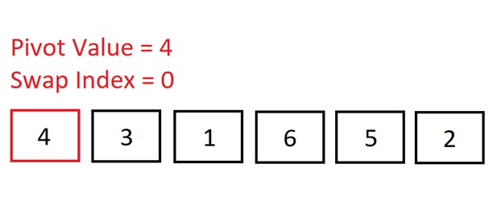

## Intro

Quick Sort one of the most efficient sorting algorithms. However, it is also one of the less intuitive sorting algorithms, which is why in this article I have broken the logic down into easy-to-follow steps.

In this article we'll cover:

1. [What is Quick Sort?](#1)
2. [Quick Sort logic](#2)
3. [Quick Sort steps](#3)
4. [Quick Sort in JavaScript](#4)
5. [What is the time complexity of Quick Sort?](#5)
6. [The space complexity of Quick Sort](#6)
7. [Quick Sort performance summary table](#7)
8. [Quick Sort vs Merge Sort](#8)

_Disclosure: I’m always looking for things I think my readers will value. This article contains some affilate links to products that I have used and found helpful. If you purchase these, then I may see a share of the revenue. This comes at no extra cost to you._

<h2 id="1">What is Quick Sort?</h2>

Quick Sort takes in some data, puts it in order, then spits it out.


Quick Sort is an in-place, unstable, and comparison-type algorithm.

**What’s an in-place algorithm?** Here’s Wikipedia’s answer: “an algorithm which transforms input using no auxiliary data structure. However, a small amount of extra storage space is allowed for auxiliary variables.”

In simple terms, it usually just means that the input is overwritten (via swapping or replacement) by the output as the algorithm executes. The advantage of in-place algorithms is that they take up less space in memory.

**Unstable** means that two elements with equal values can appear in different order in the sorted output compared with their order in the unsorted input array.

For example, if we wanted to sort:

`[“Cherries“, “Blackberries”, “Apples”, “Bananas”]`

into alphabetical order by first letter, the output could be:

`[“Apples”, “Bananas”, “Blackberries”, “Cherries”]`

As you can see, the relative order of “Blackberries” and “Bananas” changed – this wouldn’t be possible if we used a stable algorithm like [Insertion Sort](https://www.doabledanny.com/insertion-sort-in-javascript).

For an example showing why it's important to know the stability of an algorithm, check out [Important Algorithm Concepts | Algorithm Stability, In-place Algorithms, and Comparison Algorithms](https://www.doabledanny.com/algorithm-concepts).

And finally, a **comparison sort** is a sorting algorithm that only reads the list of elements through a single abstract comparison operation (usually a “less than” or “equal to”) that determines which of the two elements should occur first in the final sorted output array.

<h2 id="2">Quick Sort logic</h2>

Since Quick Sort is one of the less intuitive sorting algorithms, we will go over each step slowly to make things easy to follow. If it doesn’t quite make sense after the first run-through, then go over it again and it should begin to sink in – at least that’s what I found. Stick with it!

Before we go over all of the steps, here’s is an overview of how Quick Sort works:


From the top of the image, we start with the first element of the array (known as "the pivot") and place all of the numbers smaller than it to its left, and all the numbers larger than it to its right. The pivot will then be in its correct place.

There is then a left sub-array, [0, 2, 1], and a right sub-array, [4, 9, 8, 7]. We now need to sort these arrays. The pivot is chosen to be the first element of each array. This process is repeated until the left and right sub-arrays are sorted and each number is in its correct place.

Don’t worry if you don’t quite get it, we will now go over Quick Sort step-by-step – things will become clearer!

<h2 id="3">Quick Sort steps</h2>

We will now go through the exact steps that are occurring in Quick Sort when we want to sort the array, [4, 3, 1, 6, 5, 2]:

1. 
   We start out with the pivot as the first element in the array. During this first
   run through the array, we are aiming to get all of the elements smaller than the
   pivot (4) to the left of it, and all the larger values to the right. So, it will
   look like this: [2, 3, 1, <b>4</b>, 6, 4].

   The swap index will keep track of
   all the numbers less than the pivot: it will increment by 1 every time we
   encounter a number smaller than the pivot.

2. 
   We move to the second element and check if 3 < 4 => It is, so we increment the swap index. We don’t need to make a swap here because the swap index is the same as the index of the current element (1) – no point swapping an element into the same position!

3. 
   Move onto the next element. Is 1 < 4? Yes, so increment the swap index. Again, no need to swap as the swap index is the same as the index of the current element.

4. 
   Is 6 < 4? No, so do nothing.

5. 
   Move onto the next element. Is 5 < 4? No, so do nothing.

6. 
   Move onto the next (and final) element. Is 2 < 4? Yes, so increment the swap index.

7. 
   Now we do need to make a swap because the swap index is less than the current element’s index. We will swap the current element (2) into the swap index (position 3). So, we swap 6 and 2.

8. 
   Now, if we place the pivot after 2, then all of the numbers to the left of the pivot will be smaller, and all the numbers to the right will be bigger. The pivot will then be in its correct sorted position in the array.

9. 
   The swap index kept track of all the numbers in the array that were less than the pivot. So, we can now swap the pivot with the element at the swap index.

10. 
    The pivot is now in its correct sorted position! All of the elements to its left are smaller; all of the elements to its right are larger.

    The array has been “partitioned”: there is a left sub-array, [2, 3, 1], and a right sub-array, [5, 6]. We will now begin to sort the left sub-array. Once done, we’ll sort the right sub-array. And once the left and right sub-arrays are sorted, it means that the whole array will be sorted.

11. 
    Now we are sorting the left sub-array: [2, 3, 1]. Once again, we select the pivot to be the first element in this array: 2.

12. 
    Move up to the second element. Is 3 < 2? No, so do nothing.

13. 
    Move up to the third element. Is 1 < 2? Yes, so increment the swap index.

14. 
    The current element’s index is greater than the swap index, so let’s swap it!

15. 
    We have reached the end of this left sub-array, so now we need to swap the pivot into its correct position…

16. 
    The swap index tells us that there was one element less than the pivot, so the pivot has to swap places with index 1.

17. 
    The pivot (2) is now in its correct place. We now have a sub-array to the left ([1]), and a sub-array to the right ([3]). First, the sub-array to the left will be sorted. Then, the right.

18. 
    An array of length one is naturally sorted, so we know 1 is in its correct place.

19. 
    1 turns green - it’s in its correct place!

20. 
    We now sort the sub-array right of 2. Again, it’s of length one so it’s naturally sorted.

21. 
    The left side of the array is sorted. We can now move on to sorting the right side of our original pivot of 4: [5, 6].

22. 
    Our pivot is, again, the first element: 5. Note how the swap index always begins as the index of the pivot.

23. 
    Move up to the second element. Is 6 < 5? Nope, so do nothing.

24. 
    We’ve reached the end of the array. No swaps were required because all the values to the right of our pivot were greater than it. As you can see, the swap index remained unchanged, signifying the pivot is in its correct place.

25. 
    We now know that 5 is in its correct place. Now we just need to sort the sub-array to the right of 5: [6].

26. 
    Array length equals one, so we know it’s sorted.

27. 
    And there we go; the whole array is now sorted!

<h2 id="4">Quick Sort in JavaScript</h2>

**First, we need to implement a “partition” helper function:**

1. This function will accept three arguments: the array to be sorted, a start index, and an end index (these will default to 0 and array length minus 1 respectively).
1. Grab the pivot from the start of the array.
1. Store the current pivot index in a variable called `swapIndex` - this will keep track of where the pivot will end up.
1. Loop through the array from start to end. Inside the loop, check if the pivot is greater than the current element. If so, increment `swapIndex` by one, and then swap the current element with the element at the swap index (providing the swap index doesn’t equal the current element’s index – no point swapping an element into the same place!)
1. After looping through, swap the pivot with the element at the swap index.
1. Return the swap index.

```js
function partition(arr, start, end) {
  const pivotValue = arr[start]
  let swapIndex = start

  for (let i = start + 1; i <= end; i++) {
    if (pivotValue > arr[i]) {
      swapIndex++

      if (i !== swapIndex) {
        // SWAP
        ;[arr[i], arr[swapIndex]] = [arr[swapIndex], arr[i]]
      }
    }
  }

  if (swapIndex !== start) {
    // Swap pivot into correct place
    ;[arr[swapIndex], arr[start]] = [arr[start], arr[swapIndex]]
  }

  return swapIndex
}
```

**Now we can implement Quick Sort using recursion. In this `quicksort` function, we will:**

1. Call the partition helper function on the array.
1. When the helper returns the updated pivot index, recursively call the pivot helper on the subarray to the left of that index, and the subarray to the right of that index.
1. The base case occurs when the array is of length 0 or 1.

```js
function quickSort(arr, start = 0, end = arr.length - 1) {
  // Base case
  if (start >= end) return

  let pivotIndex = partition(arr, start, end)

  // Left
  quickSort(arr, start, pivotIndex - 1)

  // Right
  quickSort(arr, pivotIndex + 1, end)

  return arr
}
```

First the left side of the array is sorted with recursive calls, then the right side is sorted recursively.

I’d strongly suggest going over all of this in debugging mode; it is not the easiest of algorithms to get your head around – it took me a while, but you'll get there if you go over each step slowly!

<h2 id="5">What is the time complexity of Quick Sort?</h2>

There are multiple implementations of Quick Sort, many of which have differing performances, but here we will discuss the performance of the above, recursive, implementation of Quick Sort.

We'll be discussing performance in terms of Big O Notation. If you haven't covered Big O before, or need a refresher, check out this article: [Big O Notation in JavaScript | The Ultimate Beginners Guide with Examples](https://www.doabledanny.com/big-o-notation-in-javascript)

### Best-case time complexity of Quick Sort

The best-case time complexity of Quick Sort is of O(nlog(n)).

The log(n) comes from the number of decompositions (divisions into subarrays) that have to be done. Then we have O(n) comparisons per decomposition.

### Worst-case time complexity of Quick Sort

The worst-case time complexity of Quick Sort is of O(n^2).

The worst case is when we have a sorted array and we start from the smallest or largest value; this requires n decompositions, and with n comparisons per decomposition, this results in O(n^2). So, the Big O of Quick Sort is n^2 – quadratic time complexity.

To prevent this worst case, it is best to pick a middle or random value when selecting the pivot. The first (as in this example) or last element of the array are often chosen for simplicity.

### Average-case time complexity of Quick Sort

On average, Quick Sort runs with O(nlog(n)) time.

<h2 id="6">The space complexity of Quick Sort</h2>

The space complexity of Quick Sort is of O(log(n)).

This is due to the number of recursive calls of the Quick Sort function that have to be stored on the call-stack.

<h2 id="7">Quick Sort performance summary table</h2>


<h2 id="8">Quick Sort vs Merge Sort</h2>

Quick Sort is often compared with [Merge Sort](https://www.doabledanny.com/merge-sort-javascript) – two of the most efficient sorting algorithms. Merge Sort and Quick Sort have the same best-case runtimes – O(nlog(n)), but Merge Sort has a better Big O – O(nlog(n)) compared with Quick Sort’s O(n^2).

Does this mean that Merge Sort is better? No, because Quick Sort’s worst case is very rare, provided the pivot is chosen at random or to be in the middle.

Also, the runtimes of sorting algorithms usually only refer to the number of swaps and comparisons necessary to sort the data - independent of computer architecture. However, other factors - such as locality of reference (do we read lots of elements from cache rather than from memory) - can play an important role.

Quick Sort exhibits good cache locality and requires little additional space in memory, making it faster than Merge Sort in many cases.

Does this mean that Quick Sort is better? No! In fact, there are many considerations that are beyond the scope of this article. For example, Merge Sort is quicker when dealing with linked lists. There are also different tweaks that can be made to Quick Sort to make it better suited to given situations.

Summary: it’s probably best to try them both out and see which performs best. And of course, if your only sorting small data sets, then it isn’t going to matter too much which sorting algorithm you choose.

## If you Want to Master Algorithms...

If you want to further your knowledge of algorithms and data structures, check out: [JavaScript Algorithms and Data Structures Masterclass by Colt Steele](https://ad.admitad.com/g/05dgete24sfa55577a70b3e3b7aadc/?ulp=https%3A%2F%2Fwww.udemy.com%2Fcourse%2Fjs-algorithms-and-data-structures-masterclass%2F). It’s the best Udemy course I’ve ever taken 👌.

If you enjoyed this article, you can say thanks by subscribing to my [YouTube channel](https://www.youtube.com/channel/UC0URylW_U4i26wN231yRqvA) or by signing up to [my blog](https://www.doabledanny.com/blog/) to be notified of new posts 🙏

Also, feel free to connect with me on [Twitter](https://twitter.com/DoableDanny)!

Thanks for reading!
