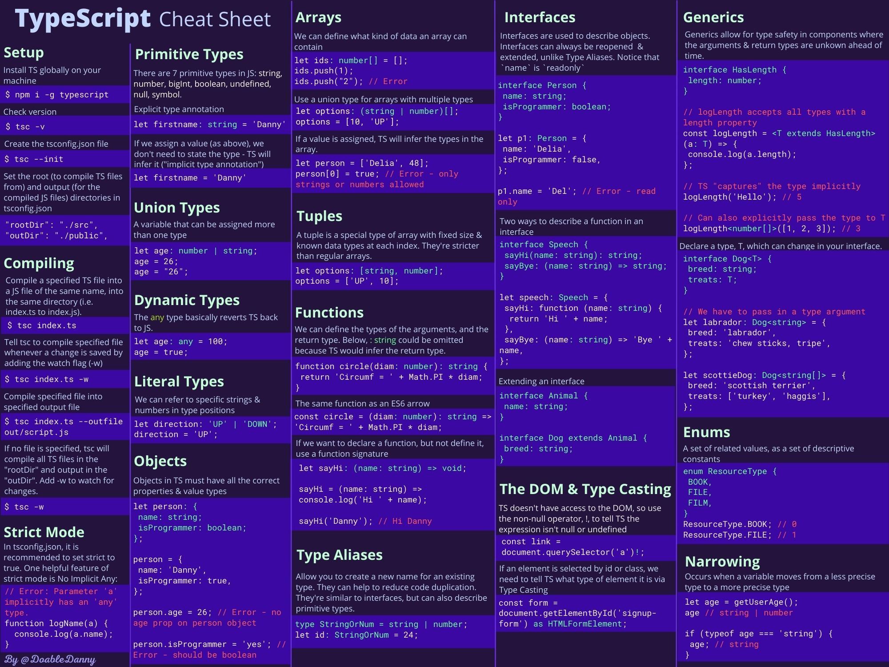
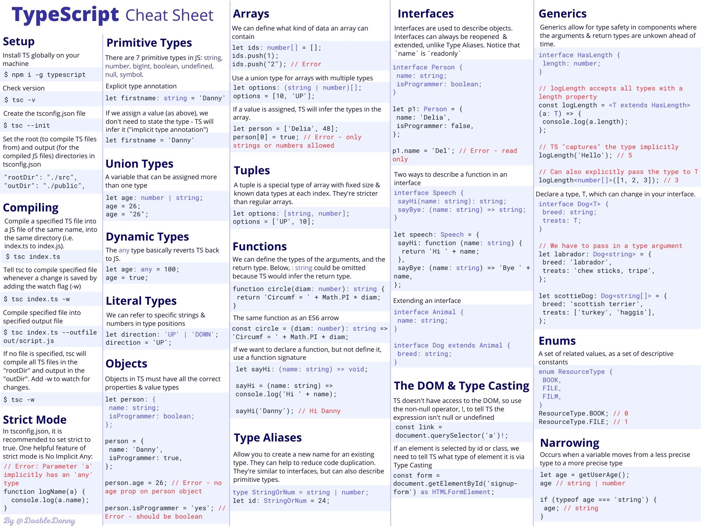

I recently wrote [a comprehensive Beginners Guide to TypeScript](https://www.freecodecamp.org/news/learn-typescript-beginners-guide/) for FreeCodeCamp, but I wanted distil everything from the article into a concise, easy-to-revise-from cheat sheet. So that's what I did.

This cheat sheet explains the following fundamental TypeScript concepts, with code examples:

- Setting up a project
- Compiling TypeScript
- Strict mode
- Primitive types
- Union types
- Dynamic types
- Literal types
- Objects
- Arrays
- Tuples
- Functions
- Type aliases
- Interfaces
- The DOM and type casting
- Generics
- Enums
- Narrowing

## TypeScript Cheat Sheet PDF

One page PDF to make it easy to copy and paste in commands.

[Download the free TypeScript Cheat Sheet JPG here](https://doabledanny.gumroad.com/l/typescript-cheat-sheet-pdf). Or you can support my content by downloading the PDF version for a few dollars.

Cheat sheets are available in Dark Mode and Light Mode:





## TypeScript Cheat Sheet Poster

Order a physical A3 poster for your office wall - so you can quickly look up commands, and keep them at the top of your head.

It comes in thick durable paper, and a matte, light-absorbing finish.

[Order a TypeScript cheat sheet poster here](https://doabledanny.gumroad.com/l/typescript-cheat-sheet-poster)

Here is everything included in the cheat sheet:

## Setup

Install TS globally on your
machine

```bash
$ npm i -g typescript
```

Check version

```bash
$ tsc -v
```

Create the tsconfig.json file

```bash
$ tsc --init
```

Set the root (to compile TS files
from) and output (for the
compiled JS files) directories in
tsconfig.json

```json
"rootDir": "./src",
"outDir": "./public",
```

## Compiling

Compile a specified TS file into
a JS file of the same name, into
the same directory (i.e.
index.ts to index.js).

```bash
$ tsc index.ts
```

Tell tsc to compile specified file
whenever a change is saved by
adding the watch flag (-w)

```bash
$ tsc index.ts -w
```

Compile specified file into
specified output file

```bash
$ tsc index.ts --outfile out/script.js
```

If no file is specified, tsc will
compile all TS files in the "rootDir" and output in the
"outDir". Add -w to watch for changes.

```bash
$ tsc -w
```

## Strict Mode

In tsconfig.json, it is
recommended to set strict to
true. One helpful feature of
strict mode is No Implicit Any:

```ts
// Error: Parameter 'a' implicitly has an 'any' type
function logName(a) {
  console.log(a.name)
}
```

## Primitive Types

There are 7 primitive types in JS:

- string
- number
- bigInt
- boolean
- undefined
- null
- symbol

Explicit type annotation

```ts
let firstname: string = "Danny"
```

If we assign a value (as above), we
don't need to state the type - TS will
infer it ("implicit type annotation")

```ts
let firstname = "Danny"
```

## Union Types

A variable that can be assigned more
than one type

```ts
let age: number | string
age = 26
age = "26"
```

## Dynamic Types

The `any` type basically reverts TS back
to JS.

```ts
let age: any = 100
age = true
```

## Literal Types

We can refer to specific strings &
numbers in type positions

```ts
let direction: "UP" | "DOWN"
direction = "UP"
```

## Objects

Objects in TS must have all the correct
properties & value types

```ts
let person: {
  name: string
  isProgrammer: boolean
}

person = {
  name: "Danny",
  isProgrammer: true,
}

person.age = 26 // Error - no age prop on person object

person.isProgrammer = "yes" // Error - should be boolean
```

## Arrays

We can define what kind of data an array can
contain

```ts
let ids: number[] = []
ids.push(1)
ids.push("2") // Error
```

Use a union type for arrays with multiple types

```ts
let options: (string | number)[]
options = [10, "UP"]
```

If a value is assigned, TS will infer the types in the
array.

```ts
let person = ["Delia", 48]
person[0] = true // Error - only strings or numbers allowed
```

## Tuples

A tuple is a special type of array with fixed size &
known data types at each index. They're stricter
than regular arrays.

```ts
let options: [string, number]
options = ["UP", 10]
```

## Functions

We can define the types of the arguments, and the
return type. Below, `: string` could be omitted
because TS would infer the return type.

```ts
function circle(diam: number): string {
  return "Circumf = " + Math.PI * diam
}
```

The same function as an ES6 arrow

```ts
const circle = (diam: number): string => "Circumf = " + Math.PI * diam
```

If we want to declare a function, but not define it,
use a function signature

```ts
let sayHi: (name: string) => void
sayHi = (name: string) => console.log("Hi " + name)
sayHi("Danny") // Hi Danny
```

## Type Aliases

Allow you to create a new name for an existing
type. They can help to reduce code duplication.
They're similar to interfaces, but can also describe
primitive types.

```ts
type StringOrNum = string | number
let id: StringOrNum = 24
```

## Interfaces

Interfaces are used to describe objects.
Interfaces can always be reopened &
extended, unlike Type Aliases. Notice that
`name` is `readonly`

```ts
interface Person {
  name: string
  isProgrammer: boolean
}

let p1: Person = {
  name: "Delia",
  isProgrammer: false,
}

p1.name = "Del" // Error - read only
```

Two ways to describe a function in an
interface

```ts
interface Speech {
  sayHi(name: string): string
  sayBye: (name: string) => string
}

let speech: Speech = {
  sayHi: function (name: string) {
    return "Hi " + name
  },
  sayBye: (name: string) => "Bye " + name,
}
```

Extending an interface

```ts
interface Animal {
  name: string
}

interface Dog extends Animal {
  breed: string
}
```

## The DOM & Type Casting

TS doesn't have access to the DOM, so use
the non-null operator, !, to tell TS the
expression isn't null or undefined

```ts
const link = document.querySelector("a")!
```

If an element is selected by id or class, we
need to tell TS what type of element it is via
Type Casting

```ts
const form = document.getElementById("signupform") as HTMLFormElement
```

## Generics

Generics allow for type safety in components where
the arguments & return types are unkown ahead of
time.

```ts
interface HasLength {
  length: number
}

// logLength accepts all types with a length property
const logLength = <T extends HasLength>(a: T) => {
  console.log(a.length)
}

// TS "captures" the type implicitly
logLength("Hello") // 5

// Can also explicitly pass the type to T
logLength<number[]>([1, 2, 3]) // 3
```

Declare a type, T, which can change in your interface.

```ts
interface Dog<T> {
  breed: string
  treats: T
}

// We have to pass in a type argument
let labrador: Dog<string> = {
  breed: "labrador",
  treats: "chew sticks, tripe",
}

let scottieDog: Dog<string[]> = {
  breed: "scottish terrier",
  treats: ["turkey", "haggis"],
}
```

## Enums

A set of related values, as a set of descriptive
constants

```ts
enum ResourceType {
  BOOK,
  FILE,
  FILM,
}
ResourceType.BOOK // 0
ResourceType.FILE // 1
```

## Narrowing

Occurs when a variable moves from a less precise
type to a more precise type

```ts
let age = getUserAge()
age // string | number
if (typeof age === "string") {
  age // string
}
```

## Thanks for reading

Hope this cheat sheet is useful!

Again, feel free to download the one-page PDF or order a poster:

[One-page TypeScript cheat sheet PDF](https://doabledanny.gumroad.com/l/typescript-cheat-sheet-pdf)

[Order a physical poster](https://doabledanny.gumroad.com/l/typescript-cheat-sheet-poster)

For more from me, you can [follow me on Twitter](https://twitter.com/DoableDanny), or [subscribe to my YouTube channel](https://www.youtube.com/channel/UC0URylW_U4i26wN231yRqvA).

Cheers!
