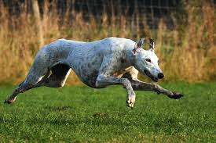

import EmailSubscribeForm from "../../components/EmailSubscribeForm.js"

## Starting Out

You will struggle to find a faster lazy animal on the planet. For an animal bred for high speed and acceleration, they make **wonderful** laid back _companions_.

<EmailSubscribeForm />

 dsjdsjf

  

<h1 style={{ color: "red" }}>ksnvjnsvd</h1>
